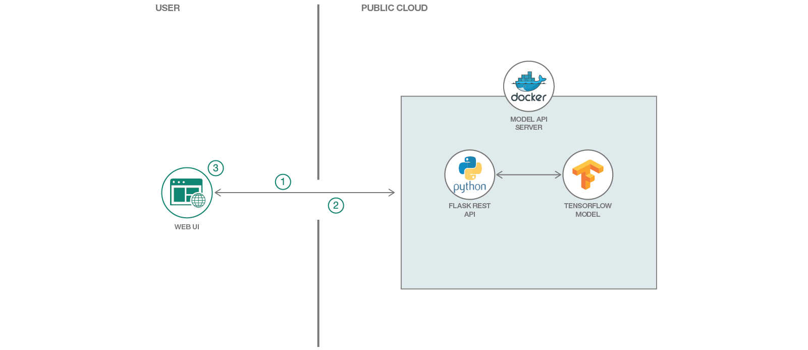

# 機械学習を使用して検出されたオプジェクトを視覚的に操作するための Web アプリを作成する

### Web アプリケーション内でオープンソースのオブジェクト検出器深層学習モデルを使用し、画像から認識されたオブジェクトをフィルタリングする

English version: https://developer.ibm.com/patterns/create-a-web-app-to-interact-with-objects-detected-using-machine-learning
  
ソースコード: https://github.com/IBM/MAX-Object-Detector-Web-App

###### 最新の英語版コンテンツは上記URLを参照してください。
last_updated: 2019-03-28

 
## 概要

[Model Asset eXchange](https://developer.ibm.com/exchanges/models/) (MAX) によって、データ・サイエンスの経験がないアプリケーション開発者が、あらかじめ作成された機械学習モデルに容易にアクセスできるようになっています。このコードに従って、MAX モデルのテキスト出力を視覚化するシンプルな Web アプリケーションを作成する方法を学んでください。この Web アプリでは、MAX から提供されている [Object Detector](https://developer.ibm.com/exchanges/models/all/max-object-detector/) を使用してシンプルな Web UI を作成します。作成する Web UI では、画像内で検出されたオブジェクトを境界ボックスで囲んで表示し、モデルによって指定されたラベルと予測の精度を基準に、オブジェクトをフィルタリングできるようにします。

## 説明

Model Asset eXchange (MAX) では、開発者がオープンソースの深層学習モデルを見つけて実験できるよう、さまざまなモデルを公開しています。このコード・パターンでは、MAX から入手できるモデルのうちの 1 つを使用します。具体的には、Object Detector を使用して、画像内のオブジェクトを認識し、検出されたオブジェクトをそのラベルと予測の精度に基づいてフィルタリングできる Web アプリケーションを作成します。この Web アプリケーションで提供するインタラクティブなユーザー・インターフェースは、Express を使った軽量の Python サーバーによってサポートされています。Python サーバーはクライアント・サイドの Web UI をホストし、モデルに対する API 呼び出しを Web UI からモデルの REST エンドポイントに中継します。Web UI は画像を取り、それをモデルの REST エンドポイントに Python サーバーを介して送信し、モデルによって検出されたオブジェクトを UI 上に表示します。モデルの REST エンドポイントは、MAX 上に用意されている Docker イメージを使用してセットアップします。画像から検出されたオブジェクトを境界ボックスとラベルを使用して表示する Web UI には、表示されたオブジェクトを、それぞれのラベルまたは予測の精度しきい値に応じてフィルタリングできるツールバーが組み込まれています。

このコード・パターンを完了すると、以下の方法がわかるようになります。

* Object Detector MAX モデルの Docker イメージをビルドする 
* REST エンドポイントを使用して深層学習モデルをデプロイする 
* MAX モデルの REST API を使用して、画像内のオブジェクトを認識する
* MAX モデルの REST API を使用する Web アプリケーションを実行する

## フロー

1. ユーザーが Web UI を使用して画像をモデル API に送信します。
1. モデル API が検出したオブジェクトのデータを返し、Web UI にそれらのｆオブジェクトが表示されます。
1. ユーザーが Web UI を操作して、検出されたオブジェクトを表示し、フィルタリングします。

## 手順

このコード・パターンに取り組む準備はできましたか？アプリケーションを起動して使用する方法について詳しくは、[README](https://github.com/IBM/MAX-Object-Detector-Web-App/blob/master/README.md) を参照してください。
