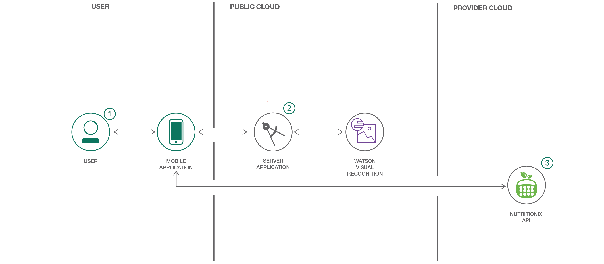

# Android 対応カロリー計算アプリを作成する

### Watson Visual Recognition を利用して、キャプチャーした画像から食品を識別し、その栄養を分析するモバイル・アプリを作成する

English version: https://developer.ibm.com/patterns/create-an-android-calorie-counter-app
  
ソースコード: https://github.com/IBM/watson-calorie-counter

###### 最新の英語版コンテンツは上記URLを参照してください。
last_updated: 2017-10-20

 ## 概要

このコード・パターンは、モバイル・デバイス上のカメラとやり取りするモバイル・アプリを作成することに興味を持つ、JavaScript と Node.js を使い慣れている開発者を対象に作成されています。視覚認識処理に Watson Node.js SDK を利用して、そのようなモバイル・アプリを作成する方法を学んでください。具体的には、キャプチャーした画像から食品を識別して処理し、その食品の栄養に関する情報を生成して表示するモバイル・アプリを作成します。

## 説明

このコード・パターンでは、2 つのアプリをいずれも Node.js を使用して作成します。一方のサーバー・アプリは、IBM Cloud® 上で稼働して Watson Visual Recognition サービスとやり取りします。もう一方の、Cordova モバイル・フレームワークベースに作成する Android モバイル・アプリは、モバイル・デバイス上のカメラで食品の画像をキャプチャーし、それらの画像を識別対象としてサーバーに送信します。画像から識別された食品の栄養に関するデータが Nutritionix API から取得されて、ユーザーのモバイル・デバイスに表示されます。

このコード・パターンを完了すると、以下の方法がわかるようになります。

* 食品の画像をキャプチャーして Watson サービスによって処理する Node.js アプリを作成する
* Cordova モバイル・フレームワークを使用して、Android アプリを作成し、モバイル・デバイスにデプロイする
* キャプチャーされた画像から、Watson Visual Recognition を利用して食品を識別する
* Nutritionix API を使用して食品の栄養データを収集する

## フロー

1. ユーザーがモバイル・アプリを操作して画像をキャプチャーします。
2. 画像がサーバー・アプリケーションに渡されます。サーバー・アプリケーションは Watson Visual Recognition サービスを利用して画像を分析し、Nutritionix API を使用して栄養に関する情報を取得します。
3. データが Android モバイル・アプリに返されて表示されます。

## 手順

Ready to put this code pattern to use? Complete details on how to get started running and using this application are in the README.
