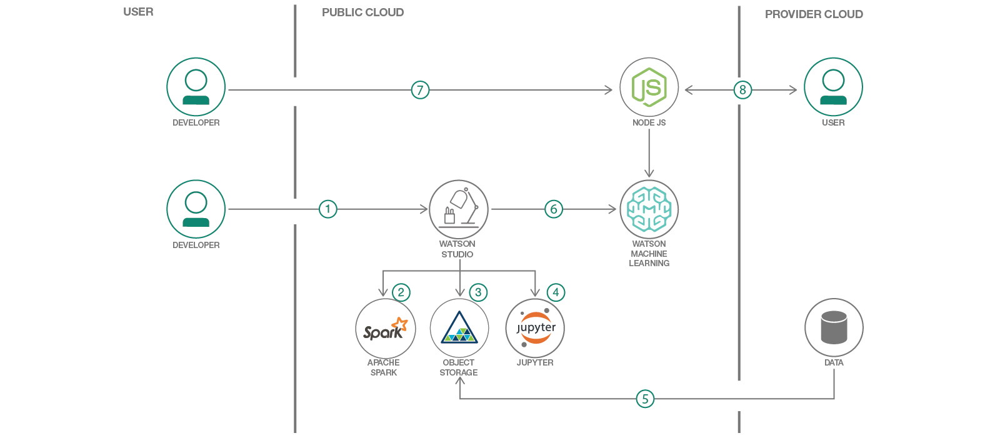

# 心不全を予測するための採点モデルを作成してデプロイする

### Watson Machine Learning を利用した予測モデルを IBM Watson Studio で作成する

English version: https://developer.ibm.com/patterns/create-and-deploy-a-scoring-model-to-predict-heartrate-failure
  
ソースコード: https://github.com/IBM/predictive-model-on-watson-ml/

###### 最新の英語版コンテンツは上記URLを参照してください。
last_updated: 2018-05-18

 
## 概要

機械学習はさまざまな分野に広まっていますが、そのような分野の中でとりわけ興味深いのはヘルスケアです。ヘルスケア分野で考えられる機械学習の使用ケースをデモするために、このコード・パターンでは IBM Watson Studio 上で Jupyter Notebook を使用して予測モデルを作成します。この予測モデルを Watson Machine Learning Service 上の本番環境にデプロイし、IBM Cloud 内の Cloud Foundry Runtime 上で稼働するカスタム Node.js アプリからモデルを呼び出せるようにします。

## 説明

多忙を極める開発者やデータ・サイエンティストは、データから得た洞察を最短経路でユーザーに提供することを目指すものですが、それを実現するには数々のテクノロジー分野での奥深い経験が必要になります。そこで、このサンプルでは予測プロセス全体を網羅し、以下の目的で使用するテクノロジーの数々を紹介します。

* データを取得、クリーニング、探索する
* 予測機械学習モデルを作成する
* 予測する
* モデルを使用できるようホストする
* ホストされたモデルを Node.js アプリケーションから呼び出す

サンプルに沿って、トレーニングされたモデルを IBM Cloud 上でホストするために利用できる IBM Watson Machine Learning Service について学んでください。また、データ・サイエンス・チーム向けの IBM Watson Studio についても学ぶことができます。IBM Watson Studio は、データ・サイエンスと機械学習を目的とした多数のオープンソース・テクノロジーを 1 つに統合した、クラウド・ベースの IDE です。

このコード・パターンでは、ヘルスケア分野で考えられる機械学習の使用ケースをデモするために、IBM Watson Studio 上で Jupyter Notebook を使用して予測モデルを作成します。このコードはデモ専用のコードですが、このコードから、ヘルスケアに関するメトリックからなるデータ・セットを基に、Watson Machine Learning を利用して心不全のリスクを予測するモデルを作成する実際的な方法がわかります。モデルの作成が完了した後は、モデルに入力を取り込んで採点し、個々のケースに関して予測を立てられるようになります。注意する点として、このサンプル・アプリケーションはデモと説明だけを目的としているため、法規制関連のレビューは行われていません。

このコード・パターンをひと通り完了すると、以下の方法がわかるようになります。

* Jupyter Notebook 内で予測モデルを作成する
* 作成したモデルを IBM Watson Machine Learning サービスにデプロイする
* API または Node.js アプリから機械学習モデルにアクセスする

## フロー

1. 開発者が IBM Watson Studio ワークスペースを作成します。
1. IBM Watson Studio は Apache Spark サービスに依存します。
1. IBM Watson Studio は Cloud Object ストレージを使用してデータを管理します。
1. このラボは、Jupyter Notebook 上で構築されています。開発者はここで、データをインポートしてトレーニングし、作成したモデルを評価します。
1. 心不全データをインポートします。
1. IBM Watson Machine Learning サービスを利用して、トレーニング済みデータを本番環境にデプロイします。
1. IBM Cloud 上にデプロイされた Node.js Web アプリが予測モデルを呼び出します。
1. ユーザーが Web アプリにアクセスして、情報を入力すると、予測モデルからレスポンスが返されます。

## 手順

このパターンの詳細な手順については、[README.md](https://github.com/IBM/predictive-model-on-watson-ml/blob/master/README.md) を参照してください。手順の概要は以下のとおりです。

1. テスト・アプリケーションをデプロイします。
1. Watson Machine Learning サービスのインスタンスを作成します。
1. Data Science Experience サービスのインスタンスを作成します。
1. IBM Data Science Experience 内でプロジェクトを作成し、作成したプロジェクトを Watson Machine Learning サービス・インスタンスに統合します。
1. Watson Machine Learning サービスの資格情報を保存します。
1. IBM Data Science Experience 内でノートブックを作成します。
1. IBM Data Science Experience 内でノートブックを実行します。
1. 保存した予測モデルを採点サービスとしてデプロイします。
