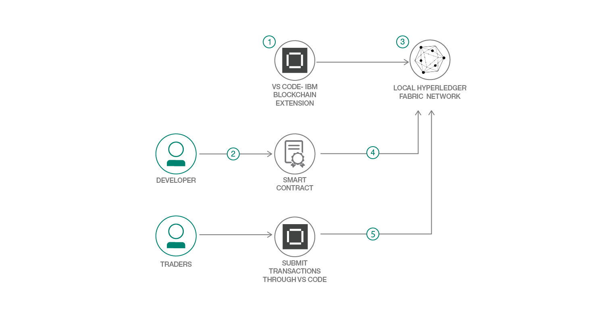

# ブロックチェーン・スマート・コントラクトを作成して実行する

### Hyperledger Fabric と IBM Blockchain Platform Extension の VS Code 拡張機能を使用する

English version: https://developer.ibm.com/patterns/create-and-execute-a-blockchain-smart-contract-ibp-v20
  
ソースコード: https://github.com/IBM/SmartContractTrading-wFabric1-4-VSCodeExt

###### 最新の英語版コンテンツは上記URLを参照してください。
last_updated: 2019-04-16

 ## 概要

ブロックチェーンを使用する組織が、これまで手作業で行われていたプロセスをセキュアな形で自動化するには、信頼できるトランザクションが不可欠です。この開発者向けコード・パターンでは、Hyperledgerフレームワークを使用してスマート・コントラクトを作成し、実行する方法を説明します。作成したスマート・コントラクトは、IBM Blockchain Platform の VS Code 拡張機能で稼働する、ローカル・バージョンの Hyperledger Fabric ネットワーク上で実行されます。

## 説明

_**注:** この開発者向けパターンは、ブロックチェーン入門として意図されているパターン・シリーズの第 2 回です。シリーズの概要については、「[Build your first blockchain application (初めてのブロックチェーン・アプリケーションを構築する)](https://developer.ibm.com/series/code-pattern-series-build-your-first-blockchain-application/)」を参照してください。_

ブロックチェーンは複数の関係者間でのビジネス取引用に設計されており、ブロックチェーンを使用する組織は信頼できる自動トランザクションに依存してビジネスを行うことになります。ブロックチェーンの有用な側面の 1 つは分散化ですブロックチェーン・ネットワークへの参加を許可されたすべての関係者の間にシステムが分散化されることから、仲介者を挟む必要はありません。事実上、中間業者を排除することになるため、時間の節約となるだけでなく、取引に関する潜在的な争いを回避する上でも役立ちます。

ブロックチェーンの作成者たちは、分散化されたブロックチェーン・レジャーを自己執行的契約、つまりスマート・コントラクトに適用できることに気付きました。スマート・コントラクトは、金銭、財産、株の他、価値のあるものを、透明性があって紛争のない形で交換するために使用されます。スマート・コントラクトは従来型の契約と同じように契約に関する規則と罰則を定義するというだけでなく、スマート・コントラクトに定義された義務は当然の成り行きとして執行されることになります。したがって、スマート・コントラクトを締結するために仲介人は必要となりません。

スマート・コントラクトについては、このテクノロジーを自動販売機に例えると理解しやくなります。通常、契約を締結するには、弁護士のところに行って、その弁護士に料金を払い、該当する文書を受け取るまで待つことになります。このプロセスは、エスクロー契約でも離婚判決でも「正式な」文書であれば、すべてに当てはまります。スマート・コントラクト・モデルの場合、自動販売機 (つまり、レジャー) にコインを投入するだけで、チョコレート・バー (つまり、文書) を手にしたり、自分のアカウントに預け入れたりできます。このプロセスは、他者による介入を一切必要としない、単純明快なプロセスです。

この開発者向けコード・パターンでは、IBM Blockchain Platform の VS Code 拡張機能を使用してスマート・コントラクトを作成し、実行する方法を説明します。ブロックチェーンのスキルを次のレベルに引き上げて、スマート・コントラクトに取引条件を埋め込んで実行できるようになってください。このパターンを完了すると、以下の方法がわかるようになります。

* スマート・コントラクトを作成する
* スマート・コントラクトをパッケージ化する
* スマート・コントラクト・パッケージをインストールしてインスタンス化する
* スマート・コントラクトをテストする

## フロー

1. VS Code プラットフォームをセットアップして起動します。
1. Node.js を使用してスマート・コントラクトを開発します。
1. VS Code プラットフォーム内で Fabric ネットワークのローカル・インスタンスを起動します。
1. スマート・コントラクトをインストールしてインスタンス化します。
1. スマート・コントラクトのトランザクションをテストします。

## 手順

このパターンに取り組む準備はできましたか？詳細な手順については、[README](https://github.com/IBM/SmartContractTrading-wFabric1-4-VSCodeExt/blob/master/README.md) ファイルを参照してください。
