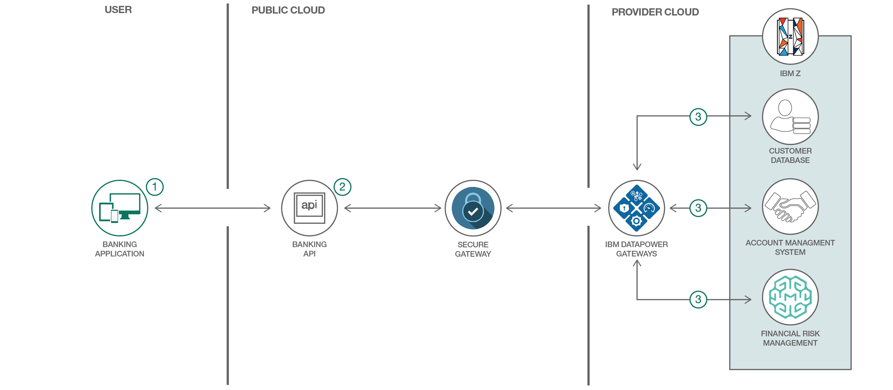

# メインフレーム上で API を使用する金融アプリケーションを作成する

### リテール・バンキング API を利用して、メインフレーム・ハイブリッド・クラウド・アーキテクチャーに従って迅速でアジャイルなイノベーションを推進する

English version: https://developer.ibm.com/patterns/create-financial-applications-using-apis-on-mainframe
  ソースコード: https://github.com/IBM/banking-digitalization-using-hybrid-cloud-with-mainframes

###### 最新の英語版コンテンツは上記URLを参照してください。
last_updated: 2017-08-11

 
## 概要

現在、銀行や金融機関の間では、決済サービス指令 (PSD2) などの進化を続ける銀行規制に準拠するため、デジタル化への顧客の期待を満たすため、そしてテクノロジーにおける新しいイノベーションに適応するために、オープン・バンキング・イニシアチブの導入が進んでいます。これらのイニシアチブの中心となっているのは API です。その目的は、API によって銀行や金融機関が既存の資産を最新のイノベーションと結合させて利用できるようにするとともに、パートナー・エコシステムを使用して新しいアプリケーションを迅速かつ効率的に開発するアジャイルなメカニズムを提供することです。このコード・パターンでは、コアのバンキング・システム上で実行される業務プロセスに対して API 呼び出しを利用します。

## 説明

金融サービス分野に身を置く開発者は、高品質のカスタマー・エクスペリエンスに対する顧客の期待を満たすソフトウェア・イノベーションを、迅速、確実、セキュアな方法で実現するとともに、厳格なコンプライアンス要件にも完全に準拠しなければなりません。大手 50 行の銀行のうち、44 行はミッション・クリティカルなバンキング・アプリケーションを実行するメインフレームとして、IBM Z に信頼を置いています。API は、開発者がこのようなメインフレーム上のコア・ビジネス・サービスを利用して継続的かつ迅速にアプリを構築、改良、デプロイできるようにするセキュアなメカニズムです。

このコード・パターンでは、ハイブリッド・クラウド・アーキテクチャーに従って、IBM Z メインフレーム上でシミュレーションされたリテール・バンキング・アプリケーションに、IBM Cloud® 上で公開されているバンキング API を介してアクセスします。バンキング API は、小売銀行と同じようにアカウント管理システム、顧客管理システム、機械学習にアクセスします。

それぞれ異なるメインフレーム・サブシステムにアクセスする 3 つのバンキング API が、IBM z/OS® Connect EE を使用して設計され、IBM Cloud 内でホストされた IBM API Connect サーバーを使用して公開されています。このコード・パターンで使用するこれら 3 種類のバンキング API は、以下のとおりです。

* 銀行顧客の情報を管理する API
* 銀行口座の情報を管理する API
* 融資の承認を要請する API

## フロー

1. ユーザーがバンキング・アプリケーションを使用して、公開されているバンキング API のいずれかを呼び出します。API の呼び出しに使用される HTTPS リクエストは、URI、アクセスするメソッド、データ、ヘッダーからなります。ヘッダーには認証キーが格納されていて、このキーにより、ユーザーのアプリケーションがバンキング API を使用することが許可されます。これらのバンキング API は、パブリック・クラウド (IBM Cloud) 内でホストされているセキュアな API Connect サーバー内で公開されています。
2. バンキング API が IBM Secure Gateway サービスを介して、プロバイダー・クラウド (メインフレーム) を構成するいずれかのサブシステムを呼び出します。つまり、Secure Gateway サーバーはパブリック・クラウド内にセットアップされていて、Secure Gateway クライアントは、仮想 IBM DataPower® Gateway 内のメインフレームの前に位置するプロバイダー・クラウド内にセットアップされていることを意味します。DataPower Gateway は構成済みのアクセス制御リスト (ACL) ファイルに従って、着信リクエストを承認または拒否します。
3. IBM DataPower Gateway によってリクエストが承認されると、そのリクエストはメインフレームのサブシステムに渡されます。前述の API の説明に従い、それぞれの API は以下のことを行います。
     1. 銀行顧客の情報を管理する API は、メインフレーム上の顧客データベースをリクエストします。
     1. 銀行口座の情報を管理する API は、z/OS Connect Enterprise Edition を介してアカウント管理システムをリクエストします。
     1. 融資承認を申請する API は、IBM Machine Learning for z/OS ベースの信用度採点サービスをリクエストします。

## 手順

1. Discover and test the banking API.
2. Make your own banking application.
3. Extend the banking application in Cloud.
