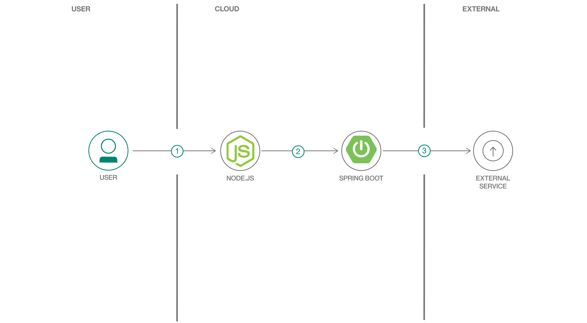

# Appsody を使用して保険見積りアプリケーションを作成する
### Appsody の Node.js スタックと Spring スタックを使用して、フロントエンド Web アプリとバックエンド REST アプリを作成する

English version: https://developer.ibm.com/patterns/create-insurance-quote-application-appsody/

ソースコード: https://github.com/IBM/appsody-sample-quote-app

completed_date:	"2019-10-15"
###### 最新の英語版コンテンツは上記URLを参照してください。
last_updated: "2019-10-15"

## 概要

[Appsody](https://appsody.dev/) は、クラウド・ネイティブ・アプリケーションを作成するための以下のツールを提供するオープンソース・プロジェクトです。

* コマンド・ライン・インターフェース (CLI)。この CLI を使用して、コンテナー化アプリケーションを開発し、ローカルでテストしてアプリケーション・コードをビルドしてから Kubernetes にデプロイできます。
* よく使われているオープンソース・ランタイム (Node.js、Spring Boot など) 対応の一連の事前構成された「スタック」とテンプレート。アプリケーションを作成する出発点として使用できます。

Appsody のスタックによって事前構成された Docker イメージがビルドされます。このイメージは、クラウド環境内にそのままデプロイできる状態になっています。このパターンで、事前構成された Appsody スタックとテンプレートを使用して、サンプルの保険見積りアプリを作成する方法を説明します。

## 説明

このコード・パターンを完了すると、以下の方法がわかるようになります。

* Appsody の Node.js Express スタックを使用してフロントエンド Web アプリケーションを作成する
* Appsody の Spring Boot スタックを使用してバックエンド REST アプリケーションを作成する
* コンテナー化された環境内でアプリをローカルでテストする
* アプリケーションを IBM Cloud Kubernetes サービスにデプロイする

このパターンに従って、Appsody のスタック (具体的には Node.js Express スタックと Spring Boot 2 スタック) の使い方を学ぶことができます。パターンの手順の中で、サンプル・アプリケーションを作成、変更、テストし、ローカルで実行する方法を説明します。

また、Appsody の主要な関数である `appsody deploy` コマンドについて紹介し、このコマンドを使ってコンテナー化アプリケーションを Kubernetes 環境にデプロイする手順も説明します。

## フロー

1. ユーザーがブラウザーにフロントエンド・アプリケーションの URL を入力します。フロントエンド・アプリケーションが保険見積りフォームを表示して応答します。
1. ユーザーがフォームに入力し、ボタンをクリックしてフォームを送信します。フロントエンド・アプリケーションはフォーム・データを検証した上で、REST リクエストをバックエンド・アプリケーションに送信します。
1. バックエンド・アプリケーションが Dacadoo Health Score API を使用して、フォーム・データからヘルス・スコアを算出し、そのヘルス・スコアから保険の見積もりを算出します。

## 手順

このパターンの詳細な手順については、[README](https://github.com/IBM/appsody-sample-quote-app/blob/master/README.md) ファイルを参照してください。手順の概要は以下のとおりです。

* Appsody の Node.js Express スタックを使用してフロントエンド Web アプリケーションを作成し、ローカルで実行します。
* Appsody の Spring Boot 2 スタックを使用してバックエンド REST アプリケーションを作成し、ローカルで実行します。
* バックエンド・アプリケーションを IBM Cloud にデプロイします。
* フロントエンド・アプリケーションを IBM Cloud にデプロイします。
