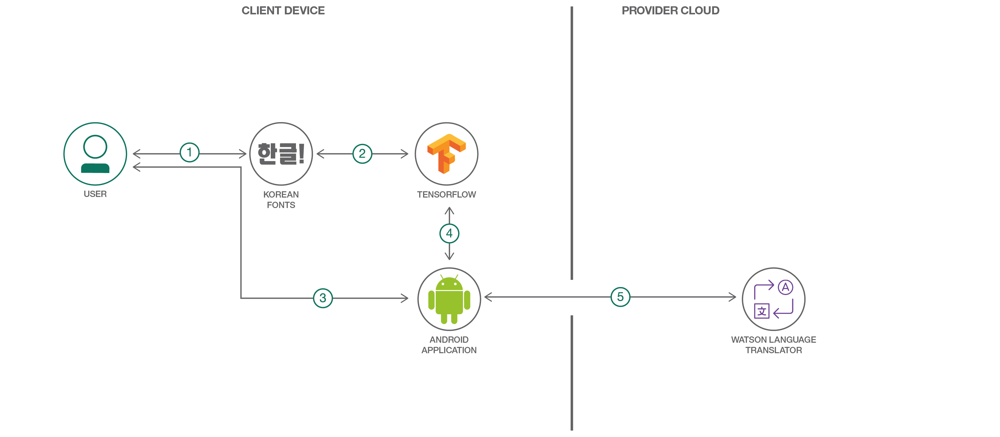

# 手書きのハングル文字を翻訳するモバイル・アプリを作成する

### TensorFlow を利用して手書きの韓国語の文字を認識して翻訳するモバイル・アプリケーションを作成する

English version: https://developer.ibm.com/patterns/./create-mobile-handwritten-hangul-translation-app
  ソースコード: 'https://github.com/IBM/tensorflow-hangul-recognition'

###### 最新の英語版コンテンツは上記URLを参照してください。
last_updated: '2017-11-03'

 ## 概要

韓国語の書き言葉には、単語を構成する何千もの固有の文字があります。このパターンでは、TensorFlow と Watson Language Translator を利用して、デバイス上で書かれた韓国語の単語を認識して翻訳できる Android アプリを作成する方法を説明します。

## 説明

アルファベットに相当する韓国語のハングル文字には、19 個の子音と 21 個の母音があります。これらの子音と母音を組み合わせて構成できるハングルの音節と文字は合計で 11,172 個にも上ります。ただし、通常使われているのは、そのほんの一部です。

このパターンでは、独自の韓国語トレーニング・データを生成するプロセスを説明した後、TensorFlow モデルをトレーニングして、手書きの、一般的なハングル文字を分類できるようにします。次に、ユーザーがモバイル・デバイス上で書いた韓国語の文字を、トレーニング済みモデルを使って認識する Android アプリケーションを作成し、実行します。このアプリケーション内で韓国語の単語または文を書くと、Watson Language Translator サービスによってそれを翻訳することができます。

## フロー

1. データを生成するために使用する韓国語のフォントをいくつかダウンロードします。
1. フォントから生成された画像が、トレーニング対象の TensorFlow モデルに取り込まれます。
1. ユーザーが Android デバイス上で韓国語の文字を書きます。
1. トレーニング済み TensorFlow モデルと Android TensorFlow Inference インターフェースを使用して、手書きの文字が識別されます。
1. 分類された韓国語の文字列が Watson Language Translator サービスに送信されて、英語に翻訳されます。

## 手順

このコードパターンを利用する準備はできていますか？このアプリケーションの実行と使用をはじめる方法については [README](https://github.com/IBM/tensorflow-hangul-recognition/blob/master/README.md) をお読みください。
