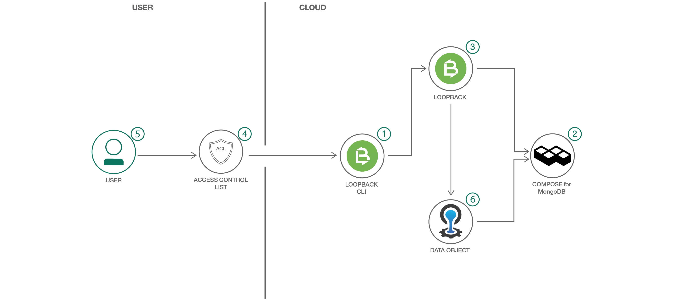

# LoopBack を使用して REST API を作成する

### LoopBack を使用して、5 分で REST API を作成して公開する

English version: https://developer.ibm.com/patterns/create-rest-apis-using-loopback
  ソースコード: https://github.com/IBM/loopback-in-five

###### 最新の英語版コンテンツは上記URLを参照してください。
last_updated: 2018-05-07

 
## 概要

REST API を作成するのは決まって難易度の高いジョブとなりますが、このジョブを容易にするよう意図されているのが、LoopBack という極めて拡張性に優れたオープンソースの Node.js API フレームワークです。IBM API Connect には、LoopBack プロジェクトで使用するためのツールが用意されています。この開発者向けパターンでは、LoopBack を使用して REST API を作成し、公開するまでの基本的なフローを紹介します。

## 説明

Web サービス用の REST API を作成するとしたら、真っ先に頭に浮かんでくるツールは何ですか？その答えはまちまちだと思いますが、私は LoopBack 程簡単に使えるツールはないと断言します。これは、特に、JavaScript と Node.js を使用する場合に言えることです。まだ試したことがなければ、この機会に LoopBack を使い始めてください。

このコード・パターンでは、AnimalsDemo というサンプル・サービス用の REST API を作成します。サービス自体は架空のものですが、ここで説明する作成手順は、実在のどのサービスにも適用されます。具体的には、まず、API を作成して、その API をデータ・ソースにリンクします。次に、データ・モデルを定義し、アクセス制御をセットアップします。そして最後にアプリを IBM Cloud にプッシュします。この手順は、実際の本番環境対応のサービスであっても同じです。LoopBack の利点は、重複する機能をコーディングする際の多大な労力を節約できるところにあります。結局のところ、ほとんどの REST API は CRUD 処理に関するものだからです。

## フロー

1. ユーザーが LoopBack CLI を使用して API の雛形 (scaffold) を生成します。
1. ユーザーが Compose for MongoDB データ・ソースにリンクします。
1. ユーザーがモデル・オブジェクトを生成します。
1. ユーザーが ACL を構成します。
1. ユーザーがデプロイ用のマニフェストを準備します。
1. ユーザーがアプリを IBM Cloud® Foundry にプッシュします。
