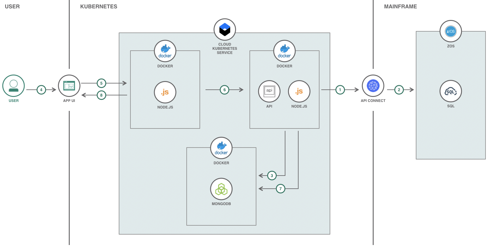
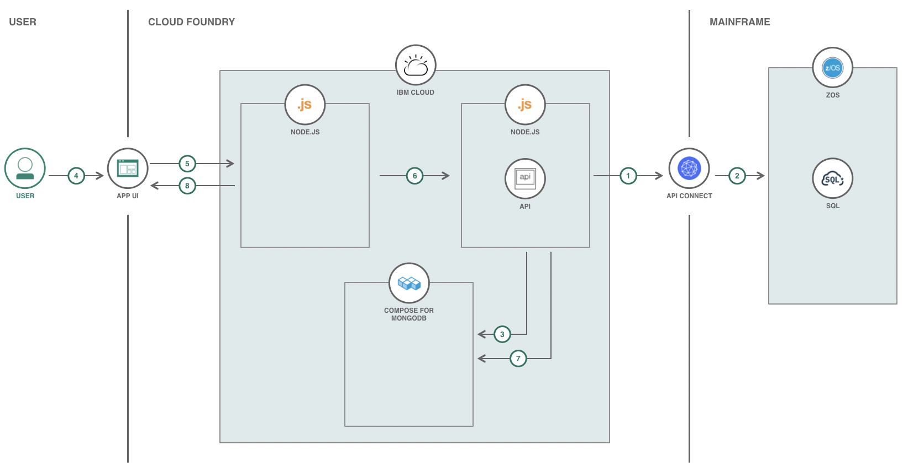

# レガシー・メインフレーム・コードとクラウドを使用して健康データ・アナリティクス・アプリを作成する

### z/OS で稼働するメインフレームに接続する Node.js アナリティクス Web アプリケーションを作成する

English version: https://developer.ibm.com/patterns/creating-a-health-data-analytics-app-with-legacy-mainframe-code-and-cloud
  ソースコード: https://github.com/IBM/example-health-analytics

###### 最新の英語版コンテンツは上記URLを参照してください。
last_updated:	2019-04-27

 ## 概要

[Example Health](https://developer.ibm.com/series/systems-example-health-series/) という架空の健康保険会社では、電子健康記録システムの一部として Node.js ベースのアナリティクス Web アプリケーションを使用しています。この Web アプリケーションは、レガシー・メインフレーム・コードと連携する最新型のクラウド・テクノロジーを統合する場合の最良のソリューションを紹介するために設計されたものです。

## 説明

前提として、Example Health 社は長年続いている会社であり、z/OS で稼働するメインフレーム上の SQL データベース内には何十万件もの患者記録が保管されています。Example Health 社が保管している記録は、現在のほとんどの保険会社が扱っている健康記録と同様です。

最近、Example Health 社では、患者記録にデータ・サイエンスとアナリティクスを適用すると、興味深い洞察を引き出せる可能性があることがわかってきました。Example Health 社はクラウド・コンピューティングについても十分な情報を入手していたので、アプリのモダナイゼーションを実装したいと思い立ちました。メインフレーム内ではレガシー・コードが大量に使われていて、今のところ問題なく機能していますが、Example Health 社はこれを機に、クラウド内でのデータ・サイエンスとアナリティクスの詳細を調査しようと考えています。

## フロー

### Kubernetes を使用したフロー

### Cloud Foundry を使用したフロー

1. z/OS メインフレームに関連付けられた API Connect API の呼び出しによって、Data Service API がトリガーされます。これにより、データ・パイプラインとして機能する Data Service API が更新後の健康記録をデータレイクに反映させます。
1. API Connect の API が、z/OS メインフレームのデータウェアハウスに保管されている関連する健康記録のデータを処理し、データ・パイプラインを介して処理後のデータを送信します。
1. Data Service データ・パイプラインが z/OS メインフレーム内のデータを処理し、MongoDB データレイクを更新します。
1. ユーザーが UI を操作してアナリティクスを表示し、分析します。
1. ユーザーがアプリを操作すると、Node.js によって UI が処理されて API 呼び出しが初期化されます。
1. API 呼び出しが Node.js データ・サービス内で必要に応じて処理されます。
1. API 呼び出しにより、MongoDB データレイクからデータが収集されます。
1. API 呼び出しからのレスポンスがアプリケーションの UI によって処理されます。

## 手順

このコード・パターンに取り組む準備はできましたか？詳細な手順については、[README](https://github.com/IBM/example-health-analytics/blob/master/README.md) ファイルを参照してください。手順の概要は以下のとおりです。

1. API を呼び出すための Mapbox アクセス・トークンを取得します。
1. z/OS 内に保管されているデータ、または生成したデータを使用してアプリケーションを実行します。
1. Kubernetes または Cloud Foundry を使用してアプリケーションをクラウドにデプロイします。
