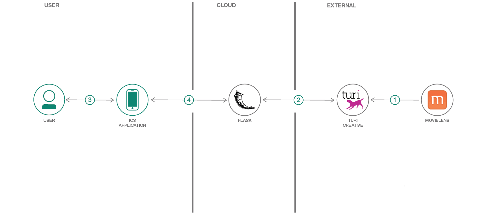

# Turi Create を使用して iOS 対応の映画レコメンデーション・システムを作成する

### Apple の Turi Create を使用して、マシン上で迅速にレコメンデーション・システムを作成する

English version: https://developer.ibm.com/patterns/creating-a-movie-recommendation-with-turi-create-on-watson-studio-coreml
  ソースコード: https://github.com/IBM/turi-create-movie-recommender

###### 最新の英語版コンテンツは上記URLを参照してください。
last_updated: 2018-07-31

 
## 概要

この開発者コード・パターンで作成するのは、面白そうな新しい映画を見つけるのに役立つ iOS アプリケーションです！この iOS アプリケーションは、Turi Create という Apple の新しい深層学習フレームワークを使用して、マシン上でローカルに、強力なレコメンデーション・システムを極めて迅速に作成する方法を紹介するために作成されています。どれだけ迅速かと言うと、わずか 2 分未満でモデルをトレーニングできます。

## 説明

この開発者コード・パターンで作成するのは、面白そうな新しい映画を見つけるのに役立つ iOS アプリケーションです！この iOS アプリケーションは、Turi Create という Apple の新しい深層学習フレームワークを使用して、マシン上でローカルに強力なレコメンデーション・システムを極めて迅速に作成する方法を紹介するために作成されています。どれだけ迅速かと言うと、わずか 2 分未満でモデルをトレーニングできます。

このコード・パターンを完了すると、以下の方法がわかるようになります。

* Turi Create 内で「類似アイテム」レコメンダー・モデルを作成する
* Flask を使用して、ユーザーの過去のレーティングに基づいてレコメンデーションを提供する REST API を公開する
*  Swift からこの REST API を呼び出して、レコメンダーを中心とした GUI を作成する

## フロー

1. 最新の MovieLens データセットをダウンロードします (このコードを作成している時点で、データセットには 26,000,000 行のデータが含まれています)。
2. Turi Create を使用して、MovieLens に対して類似アイテム・レコメンダーをトレーニングします。
3. Flask を使用して、REST API を介してトレーニング済みモデルを公開します。
4. ngrok を使用して、REST API へのトンネルを開きます。
5. ユーザーが iOS アプリ上で映画を検索し、その映画を観て評価します。
6. iOS アプリが映画レーティング・データを REST API に送信します。
7. REST API が映画とそのスコアのリストを iOS アプリに送信します。
8. iOS アプリが、REST API から返された映画とスコアを表示します。
9. ユーザーがリストアップされている映画を観て評価すると、ステップ 6 からのフローが繰り返されます。ユーザーが映画を観て評価するごとに、ますます的確なレコメンデーションになっていきます。

