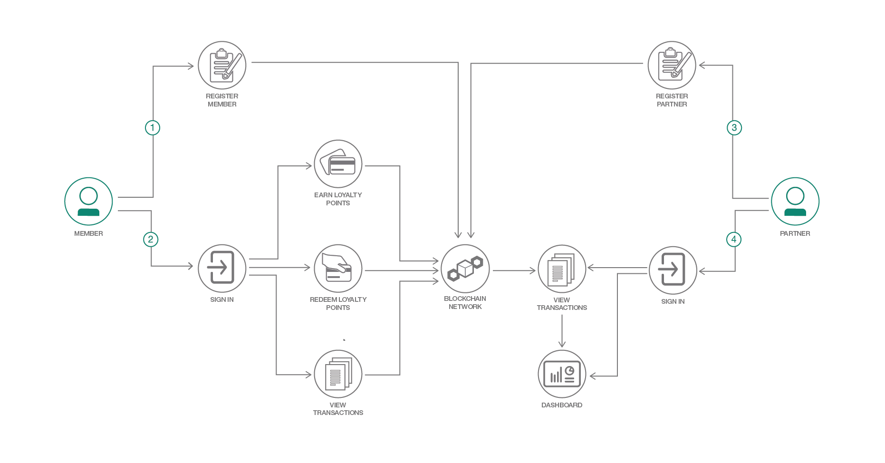

# ブロックチェーン対応のカスタマー・ロイヤルティー・プログラムを作成する

### Hyperledger Composer API、Hyperledger Composer フレームワーク、Node.js を使用してブロックチェーン対応の Web アプリとネットワークを作成する

English version: https://developer.ibm.com/patterns/customer-loyalty-program-with-blockchain
  
ソースコード: https://github.com/IBM/customer-loyalty-program?cm_sp=Developer-_-customer-loyalty-program-with-blockchain-_-Get-the-code

###### 最新の英語版コンテンツは上記URLを参照してください。
last_updated: 2018-05-26

 
_**Note:** This pattern focuses on older technology (e.g. Hyperledger Fabric APIs prior to Fabric 1.4). Therefore, there is no support for this pattern and it will be archived on May 1, 2019. You are welcome to use up to that date, but we recommend that you begin working with the updated release found at https://developer.ibm.com/jp/patterns/customer-loyalty-program-with-iks-saas-v2-fabric/._

## 概要

カスタマー・ロイヤルティー・プログラムによって特別なサービスや割引を提供することで、企業は新規顧客を引き込めると同時に既存の顧客を維持できます。一般に、こうしたプログラムはポイント・システムに基づいています。つまり、プログラムのメンバーは商品の購入時にポイントを獲得し、たまったポイントを特典と交換できるという仕組みです。ロイヤルティー・プログラムに複数の企業がパートナーとして関与していて、それらの企業が顧客ベースにサービスを提供する場合もあります。また、消費者が複数の異なるロイヤルティー・プログラムに参加している場合もあります。このような場合、ブロックチェーンを使用すれば、単一のプラットフォーム上で各種のロイヤルティー・ポイント通貨をすぐにサービスと交換できます。さまざまなプログラムのポイントを 1 つの共通したデジタル・ウォレットにためられるようにすれば、消費者がプログラムごとにポイント交換の選択肢、制約事項、規則について探し回る必要がなくなります。

## 説明

この開発者コード・パターンでは、Hyperledger Composer 0.19.5 API を使用したブロックチェーン対応のカスタマー・ロイヤルティー・プログラムと、Node.js Web アプリケーションを作成します。Web アプリケーションは、プログラムのメンバーがブロックチェーン・ネットワークに登録したり、サインインしてトランザクションを行ったりするためのものです。メンバーはネットワーク上のパートナーを確認して、パートナーとのトランザクションを行うことができます。トランザクションには、購入時のポイント獲得、ポイントとサービスの引き換えが含まれます。トランザクションはブロックチェーン・レジャー内に記録されるため、メンバーは自分が行ったトランザクションをすべて表示できます。

パートナーもこのアプリケーションを使用してネットワークに登録できます。登録済みのパートナーは、アプリケーションにサインインし、メンバーとの間のトランザクションを表示できます。ただし、トランザクションを行う場合を除き、パートナーがプログラムのメンバーにアクセスすることはできません。このアプリケーションはパートナー用の基本的なダッシュボードのデモとして、メンバーとの間で行われたトランザクションを分析し、ポイントの獲得数と交換数の合計を表示します。

このコード・パターンは、Hyperledger Composer を使用してブロックチェーン・ネットワークの構築を開始したいと思っている開発者を対象にしています。このパターンを完了すると、以下の方法がわかるようになります。

* Hyperledger Composer を使用して基本的なブロックチェーン・ネットワークを作成する
* ブロックチェーン・ネットワークをローカルの Hyperledger Fabric インスタンスおよび IBM Blockchain にデプロイする
*  Composer API を使用してブロックチェーン・ネットワークと相互作用する Node.js Web アプリケーションを構築する

## フロー

1. メンバーがネットワークに登録します。
2. メンバーはアプリケーションにサインインして、ポイントの獲得や交換のためのトランザクションを行ったり、トランザクションを確認したりできます。
3. パートナーがネットワークに登録します。
4. パートナーはアプリケーションにサインインして、トランザクションを確認したり、ダッシュボードを表示したりできます。

## 手順

このパターンの詳細な手順については、[README](https://github.com/IBM/customer-loyalty-program) を参照してください。
