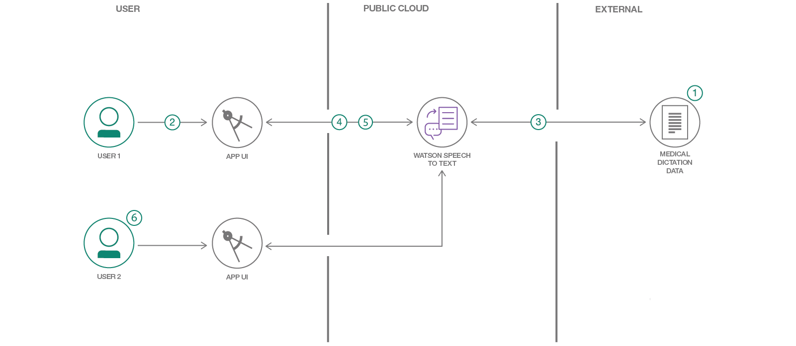

# 音声テキスト変換モデルをトレーニングする

### 特化されたドメイン・データを使用してカスタムの Watson Speech to Text モデルを作成する

English version: https://developer.ibm.com/patterns/customize-and-continuously-train-your-own-watson-speech-service
  ソースコード: https://github.com/IBM/Train-Custom-Speech-Model

###### 最新の英語版コンテンツは上記URLを参照してください。
last_updated: '2019-03-12'

 
## 概要

このコード・パターンでは、特化されたドメイン・データを処理するカスタムの Watson Speech to Text モデルを作成する方法を説明します。Watson Speech to Text サービスの精度を向上させる方法として、このコード・パターンでは転移学習を使用して、既存のモデルを医療業界の新しいデータでトレーニングします。

## 説明

Watson Speech to Text は業界トップ・レベルの音声テキスト変換サービスです。けれども他のクラウド音声サービスと同じく、事前トレーニングに使用されているのは、一般に向けた普通の会話の音声です。そのため、医療、法律、スポーツといった特化されたドメインにおいては優れたパフォーマンスを発揮しない場合があります。Watson Speech to Text サービスの精度を向上させるには、転移学習を使用して、既存の AI モデルを特定のドメインの新しいデータでトレーニングするという方法があります。

このコード・パターンでは転移学習のプロセスを説明するために、例として医療関連の音声データ・セットを使用します。このデータは ezDI が提供しているもので、16 時間分の医療に関するディクテーションが音声ファイル形式とテキスト・ファイル形式の両方で含まれています。

このコード・パターンをひと通り完了すると、以下の方法がわかるようになります。

* 音声テキスト変換モデルのトレーニングに使用する、音声データとその書き起こしテキストを準備する
* API 呼び出しを使用して Watson Speech to Text サービスを操作する
* データ・セットを使用してカスタム音声テキスト変換モデルをトレーニングする
* 継続的なユーザー・フィードバックを反映させてモデルを拡張する

## フロー

1. ユーザーがカスタム・データ・セットをダウンロードして、トレーニング用の音声データとテキスト・データを準備します。
1. ユーザーが資格情報を構成して、Watson Speech to Text サービスへのアクセスをセットアップします。
1. ユーザーがアプリケーションの GUI またはコマンド・ラインで、準備したデータを使用してモデルのトレーニングを実行します。
1. ユーザーが新しいカスタム音声モデルを対話式でテストするために、コンピューターのマイクに向かってフレーズを話し、モデルから返されたテキスト書き起こしを確認します。
1. テキスト書き起こしが正しくない場合、ユーザーは誤りを修正してから、更新したデータを再送信してトレーニングに使用します。
1. 複数のユーザーが同時に同じカスタム・モデルで作業できます。

## 手順

このパターンの詳細な手順については、[readme](https://github.com/IBM/Train-Custom-Speech-Model/blob/master/README.md) ファイルを参照してください。手順の概要は以下のとおりです。

1. リポジトリーを複製します。
1. IBM Cloud サービス・インスタンスを作成します。
1. 資格情報を構成します。
1. データをダウンロードして準備します。
1. モデルをトレーニングします。
1. ディクテーションの書き起こしを行います。
1. 書き起こしを修正します。
