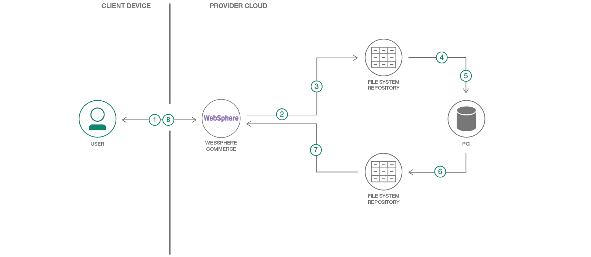

# 個人に合わせて最適化された検索結果を表示する

### WebSphere Commerce を使用して検索パーソナライズ機能を開発し、顧客の嗜好に応じて検索結果を最適化する

English version: https://developer.ibm.com/patterns/./deliver-optimized-personalized-search-results
  ソースコード: https://github.com/IBM/context-driven-personalization-websphere

###### 最新の英語版コンテンツは上記URLを参照してください。
last_updated: 2018-05-22

 ## 概要

検索は、コンテンツからコマースに至るまで、ほとんどの Web サイトに欠かせない部分です。製品化されて一般的に実装されている検索パーソナライズ機能は、まだ、基本的なルール・ベースの動作によって多数のユーザーに対処しているため、パーソナライズ機能が欠けています。この開発者パターンに従うことで、ユーザーの状況と意図を判断して個人に合わせて検索結果を最適化し、ユーザーがコンテンツや製品に辿り着くまでのクリック数を減らすことができるようになります。

## 説明

コマース・システムが個人の嗜好と選択行動を理解し、それに応じて個人ごとに異なる検索結果を提示するとしたらどうでしょう？検索条件が同じだというだけで同じ検索結果を提示するのは公平なことでしょうか？顧客の状況と意図を検索結果のパーソナライズに適用するにはどうすればよいでしょうか？このパターンでは、顧客がこれまでに注文した商品の各種カテゴリーにわたり、明確なアフィニティー/嗜好を特定して検索結果をパーソナライズする例を紹介します。

このパターンの対象読者には、製品やコンテンツ検索結果をパーソナライズすることを目指しているアーキテクトと上級開発者も含まれます。このパターンを完了すると、IBM WebSphere&reg; Commerce と IBM Predictive Customer Intelligence を利用して検索パーソナライズ機能を開発し、各顧客の嗜好に応じて検索結果を最適化する方法がわかるようになります。

## フロー

1. ユーザーが WebSphere Commerce ストアフロント内で検索を開始します。
1. WebSphere Commerce からファイル・リポジトリーにユーザー・プロファイル・データがエクスポートされます。
1. WebSphere Commerce からファイル・リポジトリーに注文データがエクスポートされます。
1. ファイル・リポジトリーから IBM Predictive Customer Intelligence にユーザー・プロファイル・データがインポートされて分析されます。
1. ファイル・リポジトリーから IBM Predictive Customer Intelligence に注文データがインポートされて分析されます。
1. Predictive Customer Intelligence モデルにより、WebSphere Commerce に保管されている注文データに基づき、各種カテゴリーにわたって各ユーザーのアフィニティーが確定されます。Predictive Customer Intelligence から、スコアとアフィニティー属性でエンリッチされたユーザー・データが生成されます。
1. Predictive Customer Intelligence のユーザー・アフィニティー・データが WebSphere Commerce に取り込まれ、そのデータを使用して既存の検索がエンリッチされるとともに、検索結果がフィルタリングされます。

## 手順

このコード・パターンに取り組む準備はできましたか？アプリケーションを起動して使用する方法について詳しくは、[README](https://github.com/IBM/context-driven-personalization-websphere/blob/master/README.md) を参照してください。
