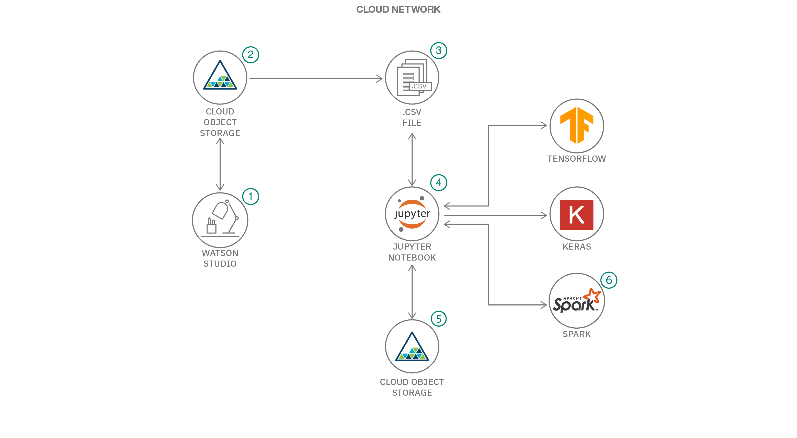

# 深層学習を使用した需要の予測

### IBM Watson を利用して ATM の需要を予測する

English version: https://developer.ibm.com/patterns/./demand-forecasting-for-cash-vending-machines-using-deep-learning
  ソースコード: https://github.com/IBM/forecast-demand-for-vending-machines

###### 最新の英語版コンテンツは上記URLを参照してください。
last_updated: 2020-02-11

 
## 概要

このコード・パターンでは、深層学習を使用して ATM の需要を予測します。金融機関にとって、収益を上げるとともに顧客満足度を高められるよう、ATM の現金が不足しないようにすることは重要です。

## 説明

ATM の需要の増減を予測するには多大な努力を要します。それは、平日、週末、場所、月初めと月末、休日などのさまざまな理由によって需要が左右されるためです。中でも最大の課題は、これらの理由に関連付けて現金引き出しのパターンを記憶することです。そのために必要となる深層学習は、再帰型ニューラル・ネットワーク (RNN) と呼ばれます。RNN の 1 つのタイプとしては、長期記憶 (LSTM) があります。RNN は、シーケンス問題を処理するように設計された、特殊なタイプのニューラル・ネットワークです。このコード・パターンでは、入力シーケンスを基に次の値を予測する、シーケンス予測 LSTM モデルを作成します。

そもそも、シーケンスの予測に深層学習を使用する理由は何でしょうか？現金を引き出すという人間の行動を模倣するためには、最近の行動を記録して、そこから学習したことを踏まえて将来を予測する必要があります。このコード・パターンで作成するニューラル・ネットワーク・モデルでは、再帰層でループ・アーキテクチャーのネットワークを使用して情報を処理し、その結果を出力します。これによって現金の需要を正確に予測し、この予測に基づいて ATM の現金補充を最適化します。

このコード・パターンを完了すると、以下の方法がわかるようになります。

* LSTM を使用した深層学習モデルを作成する
* モデルのハイパーパラメーターを調整する
* LSTM による転移学習を使用する
* 同じモデルと重みを使用して、新しいデータに対する新しい予測を生成する
* 相互検証手法に従って精度を評価する
* グリッド検索手法に従って、さまざまなパラメーターを使用した適合とスコアに対応する

## フロー

1. 最初の入力 .csv ファイルをオブジェクト・ストレージにアップロードします。
1. 深層学習モデルを作成して予測を生成する Notebook を実行します。
1. 2 番目の入力ファイルをオブジェクト・ストレージにアップロードします。
1. 深層学習モデルの転移学習を使用して再度 Notebook を実行し、予測を生成します。
1. さまざまなデータ・セットに対して使用する深層学習モデルの作成方法と精度を上げる方法を学びます。

## 手順

このパターンの詳細な手順については、[readme](https://github.com/IBM/forecast-demand-for-vending-machines/blob/master/README.md) ファイルを参照してください。手順の概要は以下のとおりです。

1. LSTM を使用した深層学習モデルを作成します。
1. モデルのハイパーパラメーターを理解して調整します。
1. LSTM を使用した深層学習を行います。
1. 同じモデルと重みを使用して、新しいデータに対する新しい予測を生成します。
1. 相互検証手法に従って精度を評価します。
1. グリッド検索手法に従って、さまざまなパラメーターを使用した適合とスコアに対応します。
