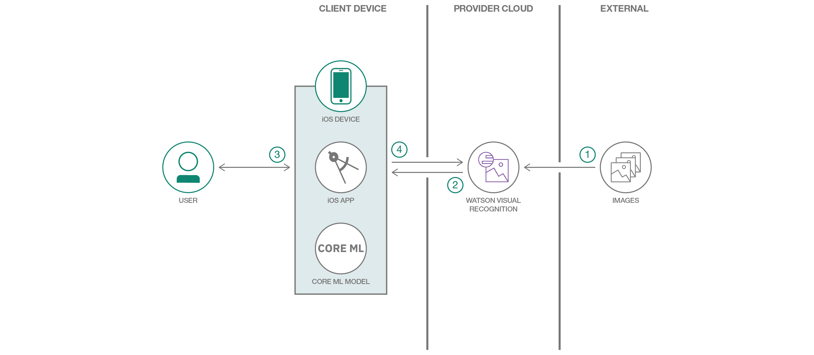

# Watson Visual Recognition を使用して作成した Core ML モデルをデプロイする

### Watson Visual Recognition と Core ML を利用して、画像をオフラインで分類する

English version: https://developer.ibm.com/patterns/./deploy-a-core-ml-model-with-watson-visual-recognition
  ソースコード: https://github.com/watson-developer-cloud/visual-recognition-coreml/

###### 最新の英語版コンテンツは上記URLを参照してください。
last_updated:    2018-03-13       # REQUIRED - Note: date format is YYYY-MM-DD

 ## 概要

Core ML を使用すると、開発者はトレーニング済みの機械学習モデルをアプリケーションに統合することができます。この Core ML モデルが、Watson Visual Recognition でサポートされるようになりました。今回紹介するコード・パターンでは、Watson Visual Recognition を使用して Core ML モデルを作成し、そのモデルを iOS アプリケーションにデプロイする方法を説明します。

## 説明

想像してみてください。あなたは航空会社に勤める技術者で、目の前にある何千個ものパーツの中から特定の 1 つのパーツを識別する必要に迫られています。しかも、インターネットに接続できる環境もないとしたら、どのようにして識別しますか？また、どこから手を付けますか？識別作業に使用できるアプリさえあれば、何も悩む必要はありません。それならば、そのようなアプリを構築すれば良いのです！

ほとんどの視覚認識オファリングでは、HTTP を介してサーバーに対する API 呼び出しを行う必要がありますが、[Core ML](https://developer.apple.com/documentation/coreml) を使用すれば、トレーニング済みのモデルをアプリとともにデプロイすることができます。Watson Visual Recognition を利用することで、モデルをトレーニングするためのコードを作成する必要がなくなります。この場合、[Watson Studio](https://dataplatform.cloud.ibm.com/?cm_sp=ibmdev-_-developer-patterns-_-cloudreg) ツールを使って画像をアップロードして、トレーニング済みの Core ML モデルを iOS アプリケーションにデプロイすればよいだけです。

今回紹介するコード・パターンでは、カスタム・モデルをトレーニングします。数回クリックするだけで、そのモデルをテストし、iOS アプリケーションにエクスポートして使用できるようになります。このパターンには、ケーブルのタイプ (HDMI、USB) を検出可能なアプリケーションを構築する際に役立つサンプル・データ・セットが含まれていますが、独自のデータを使用することもできます。

このコード・パターンをひと通り完了することで、以下の作業をどのようにして行うのかを把握できます。

* Watson Studio を使用してデータ・セットを作成する
* データ・セットに基づいて Watson Visual Recognition 分類子をトレーニングする
* トレーニングした分類子を Core ML モデルとして iOS アプリケーションにデプロイする
* Watson Swift SDK を使用してトレーニング済みモデルをダウンロード、管理、実行する

このコード・パターンに従って、Core ML と Watson Visual Recognition を導入してください。また、本番環境にアプリをデプロイする準備が整ったら、[IBM Cloud Developer Console for Apple](https://cloud.ibm.com/developer/appledevelopment/starter-kits?cm_sp=ibmdev-_-developer-patterns-_-cloudreg) を試してください。このコンソールでは、Core ML を使用して本番対応のアプリケーションを迅速に作成できます。

## フロー

1. 画像をインポートしてタグを付けます。
1. Core ML 対応の Watson Visual Recognition モデルをトレーニング、テスト、デプロイします。
1. デバイス上で、Core ML モデルを使用してアプリケーションを実行し、画像を分類します。
1. Watson での対話式トレーニングについて、ユーザー/デバイスからフィードバックを収集します。

## 手順

Ready to put this code pattern to use? Complete details on how to get started running and using this application are in the [README](https://github.com/watson-developer-cloud/visual-recognition-coreml/blob/master/README.md).
