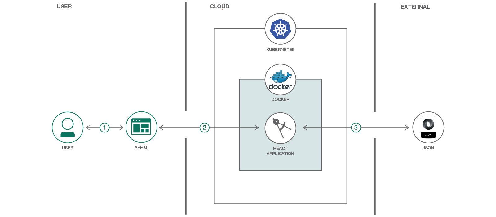

# React アプリケーションを Kubernetes 上にデプロイする

### React アプリケーションを、Docker を使用して構築し、Kubernetes を使用してデプロイする

English version: https://developer.ibm.com/patterns/deploy-a-react-application-on-kubernetes
  
ソースコード: https://github.com/IBM/deploy-react-kubernetes/

###### 最新の英語版コンテンツは上記URLを参照してください。
last_updated: 2018-07-10

 ## 概要

React アプリケーションを Kubernetes 上にデプロイする方法を学びたいと思っている開発者を対象に、このパターンでは React と Redux フレームワークを使用して、ユーザー入力に応じた映画情報を検索するために OMDb API を呼び出します。このパターンは、Docker と Kubernetes の両方をベースに作成して実行できます。

## 説明

かなりの重複が含まれるフロントエンドのアプリケーションで、複雑な状態を処理し、膨大な量のデータを扱っていませんか？

アプリケーションが上記のような状態だとしたら、React と Redux は理想的な JavaScript ライブラリーです。アプリケーションに含まれるあらゆる要素をコンポーネントごとに構造化する React では、重複を抑えなければならない場合は抽象化を使用できます。すべての状態は Redux によって処理されるため、アプリケーション内のデータを簡単に管理することができます。

開発が完了した後、世界中でそのアプリケーションを使えるようにするためには、アプリケーションをデプロイする必要があります。アプリケーションを管理してデプロイするのにふさわしいソリューションを調べると、さまざまな選択肢が出てくるはずです。選択肢があまりにも多くて、どれを選べばよいのか途方に暮れてしまうこともよくありますが、デプロイしたアプリケーションの自動化、スケーラビリティー、管理に対応できるデプロイメント・ツールを探しているとしたら、Kubernetes はまさにぴったりのツールです。

Kubernetes 上にデプロイするアプリケーションは、コンテナーにパッケージ化されていなければなりません。アプリケーションをコンテナーにパッケージ化するには、オープンソース・ツールの Docker を使用できます。Docker でコンテナー化したアプリケーションを Kubernetes 上にデプロイして公開した後は、Kubernetes がデプロイ済みアプリケーションの管理、スケーラビリティー、自動化を引き受けてくれます。

このコード・パターンをひと通り完了すると、以下の方法がわかるようになります。

* Docker を使用して React アプリケーションをコンテナー化する
* Kubernetes を使用してアプリケーションをデプロイおよび管理する

## フロー

1. ユーザーが Web インターフェースを使用して React アプリケーションにアクセスし、映画のタイトルを入力します。
1. アクセス中のユーザーに React アプリケーションがレンダリングされます。
1. React アプリケーションが OMDb API を呼び出し、レスポンスの JSON オブジェクトを受け取って、ユーザーに表示します。

## 手順

このパターンの詳細な手順については、[README](https://github.com/IBM/deploy-react-kubernetes/blob/master/README.md) を参照してください。手順の概要は以下のとおりです。

1. OMDb API に API キーを挿入します。 
1. Docker を使用してアプリケーションをコンテナー化します。 
1. Kubernetes クラスターを作成します。 
1. クラウド内で Docker イメージをビルドします。 
1. 作成した Docker イメージを Kubernetes にデプロイします。 
