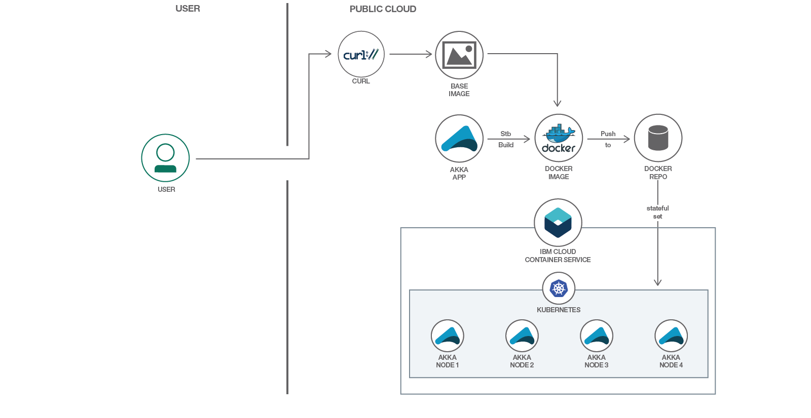

# Kubernetes 上に Akka Cluster をデプロイする

### Kubernetes をベースに稼働する Akka Cluster アプリケーションをデプロイして構成する

English version: https://developer.ibm.com/patterns/deploy-akka-clusters-on-kubernetes
  ソースコード: https://github.com/IBM/Akka-cluster-deploy-kubernetes

###### 最新の英語版コンテンツは上記URLを参照してください。
last_updated: 2018-02-24

 
## 概要

Akka Cluster は、耐障害性を備えたピアツーピアのクラスター・メンバーシップ・サービスです。Kubernetes は、Akka Cluster を利用して作成されたアプリケーションを実行するのに最適な機能をいくつも備えています。このコード・パターンでは、Kubernetes に標準で備わっている多数の機能を利用するために、Kubernetes 上で稼働するように Akka Cluster アプリケーションを構成する方法を説明します。

## 説明

Akka は、Java と Scala 向けに分散型かつメッセージ駆動型のアプリケーションを構築するためのツールキットです。開発者たちの間では、並行処理、弾性、回復力を管理する手段として Akka が注目されていて、Play や Lagom などのフレームワークを採用するよりも先に、このアクター・ベースのシステムが使われるようになっています。

Kubernetes は、コンテナー化されたアプリケーションのデプロイと管理を自動化するオーケストレーション・ツールです。Akka Cluster が管理するのはコンテナーではなくアプリケーションであるため、コンテナーのオーケストレーション・ツールが必要になります。そこで Kubernetes は合理的な選択と言えますが、設計観点が異なることから、Akka Cluster を Kubernetes 上にデプロイするのはそう簡単なことではありません。Akka Cluster は弾性と分散処理を特徴とするサービスです。Kubernetes も同じく弾性を備えています。この 2 つをシームレスに結合して、それぞれのメリットを得るにはどうすればよいでしょうか？

このコード・パターンでは、Akka Cluster を Kubernetes 上にデプロイする手順を案内するなかで、デプロイに伴う課題と、それらの課題を克服する方法を説明します。このデプロイ手順を完了すると、Kubernetes が組み込み Akka 機能を使用して Akka Cluster のスケーリングをシームレスに管理する仕組みを理解できるはずです。さらに、Akka にはノード要件、Kubernetes にはポッド要件がありますが、その間にあるギャップを StatefulSet によって埋め合わせる方法も発見できます。

Akka のライブラリーを利用してスケーラブルで回復力のあるシステムを設計しようとしている場合、サービスとワークロードの管理にコンテナー・オーケストレーションのメリットを生かしたいのなら、このパターンは絶好の出発点です！

## フロー

1. Docker ベース・イメージにツールを追加します。
1. sbt ビルド・ツールを使用して、Docker イメージ内にサンプル・アプリをビルドします。
1. Docker イメージを Docker リポジトリーにプッシュします。
1. StatefulSet を使用して Akka Cluster を Kubernetes 上にデプロイします。
1. Akka Cluster のスケーリングを試します。

## 手順

このパターンの詳細な技術的手順については、GitHub リポジトリーの README ファイルを参照してください。手順の概要は以下のとおりです。

1. リポジトリーを複製します。
1. 前提条件を満たします。
1. Docker ベース・イメージをビルドします。
1. サンプル・アプリをビルドします。
1. クラスターを Kubernetes 上にデプロイします。
1. サンプル・アプリが機能していることを確認します。
