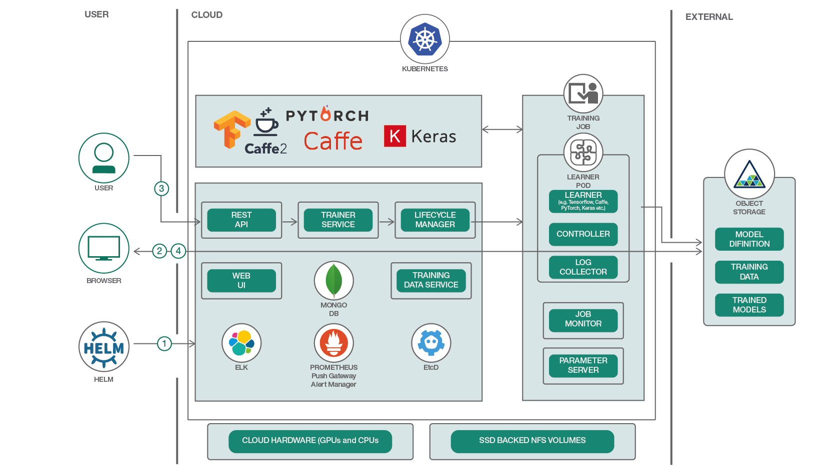

# 複数のフレームワークからなる深層学習プラットフォームを Kubernetes 上にデプロイする

### TensorFlow、Caffe、PyTorch その他多くのフレームワークからなる深層学習プラットフォームを Kubernetes にインストールして使用する     

English version: https://developer.ibm.com/patterns/deploy-and-use-a-multi-framework-deep-learning-platform-on-kubernetes
  ソースコード: https://github.com/IBM/FfDL

###### 最新の英語版コンテンツは上記URLを参照してください。
last_updated: 2019-03-28

 
## 概要

深層学習の実践者は、信頼性とスケーラビリティーを確保しつつ、トレーニング・ジョブのオーケストレーションを行う必要があります。しかも、ジョブのオーケストレーションは複数のライブラリーをまたがって一貫したやり方で行わなければならないことがあります。この目標を達成するには、Kubernetes 上の Fabric for Deep Learning (FfDL) というプラットフォームを利用できます。FfDL を使用すれば、最小限の作業で、Caffe、Torch、TensorFlow といったクラウド内の深層学習ライブラリーを回復力のある形で利用することができます。このプラットフォームでは分散およびオーケストレーション層という手段により、大量のデータを使用した機械学習でも、複数の計算ノードにわたって比較的短時間で行えるようにしています。また、リソース・プロビジョニング層により、Infrastructure as a Service (IaaS) クラウド内のグラフィックス・プロセッシング・ユニット (GPU) や中央処理装置 (CPU) などの異種のリソースに関するジョブ管理を柔軟に行うことができます。

## 説明

深層学習 (機械学習手法の一部) として知られる深層ニューラル・ネットワークのトレーニングは、極めて複雑なコンピューター集約型のタスクです。一般的なユーザーが必ずしも深層学習の基礎となるハードウェアとソフトウェアのインフラストラクチャーの詳細 (高価な GPU マシンを構成し、深層学習ライブラリーをインストールし、実行中のジョブを管理して障害と回復に対処するなど) を扱わなければならないわけではありません。時間単位の料金を支払って IaaS クラウド内のハードウェアを利用できるからです。ただし、便利とは言え、これらのマシンを管理し、必要なライブラリーをインストールし、深層学習トレーニング・ジョブの回復力を確保するための作業は、ユーザーが行わなければならないことに変わりはありません。

ここに、サービスとしての機械学習を活用するチャンスがあります。このコード・パターンでは、深層学習ファブリックを Kubernetes 上にデプロイする方法を説明します。この方法では、Kubernetes、マイクロサービス、Helm チャート、オブジェクト・ストレージなどのクラウド・ネイティブのアーキテクチャー成果物を使用して、深層学習ファブリックをデプロイし、使用できるようにします。このファブリックは、TensorFlow、Caffe、PyTorch などの複数の深層学習エンジンにまたがっており、クラウド・サービスの柔軟性、使いやすさ、経済性と、深層学習の力を結合したものになっています。このコード・パターンから、このような深層学習ファブリックがいかに使いやすいかがわかるはずです。さらに、REST API を使用して、ユーザーの要件や予算に応じて異なるリソースを選んでトレーニングをカスタマイズすることもできます。したがって、ユーザーはエラーにフォーカスするのではなく、深層学習とアプリケーションにフォーカスできます。

## フロー

1. FfDL デプロイ担当者が FfDL コード・ベースを Kubernetes クラスターにデプロイします。Kubernetes クラスターは、GPU、CPU、またはこの両方を使用するように構成されています。また、S3 対応オブジェクト・ストレージにもアクセスできます。ストレージが指定されていない場合は、シミュレーションされたローカルの S3 ポッドが作成されます。
1. デプロイが完了すると、データ・サイエンティストがモデルのトレーニング用データを S3 対応オブジェクト・ストアにアップロードします。FfDL では、データがすでに各種の深層学習フレームワークで規定された形式になっていることを前提とします。
1. ユーザーが FfDL モデルのマニフェスト・ファイルを作成します。マニフェスト・ファイルにはさまざまなフィールドが含まれていて、これらのフィールドで、FfDL 内のモデル、オブジェクト・ストア情報、リソース要件、モデルのトレーニングとテストの実行中に必要な一連の引数 (ハイパーパラメーターを含む) を指定します。FfDL モデルのマニフェスト・ファイルを作成した後、ユーザーは FfDL とやり取りするために、CLI/SDK または UI を使用して、作成したマニフェスト・ファイルをモデル定義ファイルと一緒にデプロイします。デプロイが完了したら、ユーザーはトレーニング・ジョブを開始し、その進捗状況をモニターします。
1. トレーニング・ジョブが完了した時点で、ユーザーがトレーニング済みのモデルと、そのモデルに関連付けられたログをダウンロードします。

## 手順

このパターンの詳細な手順については、[README](https://github.com/IBM/FfDL/blob/master/README.md) を参照してください。手順の概要は以下のとおりです。

1. Docker イメージをコンパイルおよびコーディングして、ビルドします。 
1. helm install コマンドを使用して FfDL コンポーネントをインストールします。 
1. FfDL をモニターする Grafana を構成するためのスクリプトを実行します。 
1. Grafana、FfDL Web UI、および FfDL の REST API エンドポイントを取得します。
1. TensorFlow と Caffe を使用して、畳み込みニューラル・ネットワーク・モデルをトレーニングする単純なジョブを実行します。
