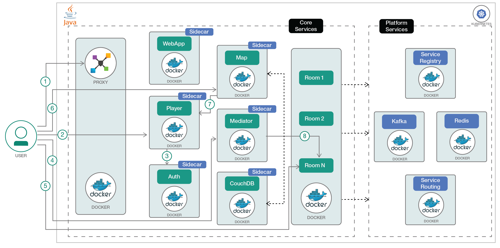

# Kubernetes 上に Java マイクロサービスをデプロイして多言語に対応する

### 多言語エコシステム内の Kubernetes 上に Java マイクロサービスをデプロイする

English version: https://developer.ibm.com/patterns/deploy-java-microservices-on-kubernetes-with-polyglot-support
  ソースコード: https://github.com/IBM/GameOn-Java-Microservices-on-Kubernetes?cm_sp=IBMCode-_-deploy-java-microservices-on-kubernetes-with-polyglot-support-_-Get-the-Code

###### 最新の英語版コンテンツは上記URLを参照してください。
last_updated: 2018-09-03

 
## 概要

孤立したアプリケーションなどというものは 1 つもありません。最近の開発者たちの間では、統合マイクロサービス・アーキテクチャーやクラウド・ネイティブ・マイクロサービス・アーキテクチャーの採用が広がっています。けれども、こうした最新のアプリケーション・アーキテクチャーでは、さまざまなマイクロサービスが多言語環境内に共存せざるを得ません。このコード・パターンを通して、Java マイクロサービス・アプリケーションをデプロイして他の言語のマイクロサービスと並行して実行し、サービス・ディスカバリー、登録、ルーティングを利用する方法を学んでください。

## 説明

多言語の世界では、さまざまな言語で作成された複数のマイクロサービスを一緒にデプロイしなければならないため、言語固有のフレームワークだけに依存するのでは、サービス・ディスカバリーやルーティングなどのタスクに対応できません。このパターンでは、Java ベースの「GameOn!」というマイクロサービス・アプリケーションを多言語エコシステム内にデプロイする方法を説明します。

このアプリケーションは、皆さんがマイクロサービス・アーキテクチャーとこれに関連する概念を探れるように作成された、テキストでやり取りするアドベンチャー・ゲームです。Kubernetes クラスター上で実行されるこのアプリが使用するマイクロサービスのタイプには、「コア」と「プラットフォーム」の 2 つがあります。コア・マイクロサービスは Java で作成されていて、サポートに多言語サービスを使用します。この類のパターンを使用する場合、マイクロサービスは同じマイクロサービス・コンテナー内のプロセスとしてサイドカーを使用するか、サービス・ディスカバリー、登録、ルーティングを目的に別個のコンテナーのサイドカーを使用するかのいずれかになります。すべてのマイクロサービスは、Kubernetes クラスターで管理された Docker コンテナー内で稼動します。

## フロー

1. ユーザーがプロキシーを介して、Kubernetes 上にデプロイされた GameOn! アプリにアクセスします。この HAProxy ベースのプロキシーは、API の集合をアプリケーション全体の単一の API であるかのように見せ掛けます。WebApp は、Web フロントエンドをクライアント・デバイスに提供する単純な NGINX プロセスです。
2. ユーザーが Player マイクロサービスを操作してゲームをプレイします。このマイクロサービスーは CRUD 操作および API トークンの管理を行うためのパブリック API を提供します。
3. Player マイクロサービスは Auth Java マイクロサービスを利用して、ユーザーが選択するソーシャル・サインオン サービスによってユーザーを認証し、認証済みプレイヤーのプロファイルと進捗データを返してクライアントに応答します。
4. フロントエンド・クライアントが Mediator サービスに対して WebSocket を確立し、ゲームを開始します。WebSphere Liberty を使用して Java で実装された Mediator サービスは、WebSocket を介してプレイヤーをゲーム・ルームに接続します。
5. ユーザーがサンプル・ウォークスルーのいずれかでボタンをクリックしてルームを作成します。
6. 開発者はルーム実装内で Map マイクロサービスを利用することで、ルームが確実に最新の接続情報で登録されるようにします。WebSphere Liberty 上で稼動するこの Map サービスは、JAX-RS を使用してパブリック REST API を提供する Java EE アプリケーションです。
7. Map サービスは Player サービスをチェックして、開発者に関連付けられている API トークンに基づき、その開発者にルーム関連の情報を更新することが許可されていることを確認します。
8. ユーザーがルームにアクセスすると、Mediator サービスがライブ・ルーム・サービスへの WebSocket 接続を確立します。

## 手順

このコード・パターンに取り組む準備はできましたか？アプリケーションを起動して使用する方法について詳しくは、[README.md](https://github.com/IBM/GameOn-Java-Microservices-on-Kubernetes/blob/master/README.md) ファイルを参照してください。
