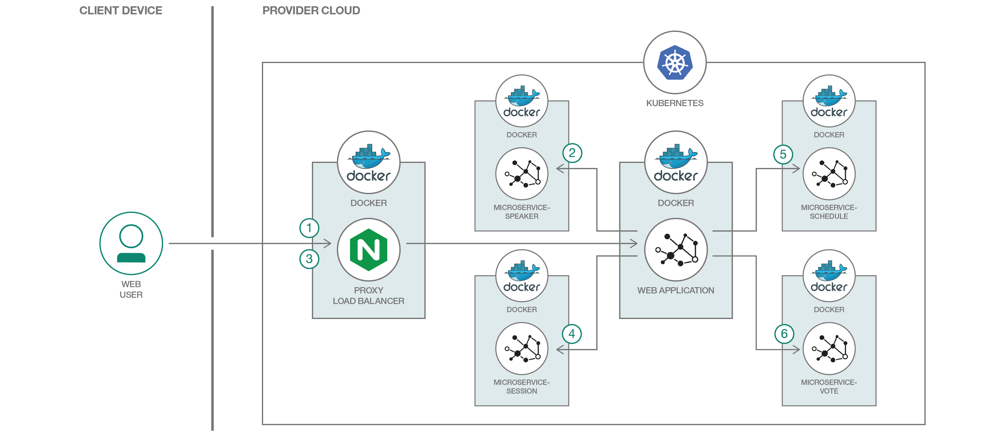

# MicroProfile ベースの Java マイクロサービスを Kubernetes 上にデプロイする

### MicroProfile を使用してJava マイクロサービスを作成し、Kubernetes 上にデプロイする

English version: https://developer.ibm.com/patterns/deploy-microprofile-java-microservices-on-kubernetes
  
ソースコード: https://github.com/IBM/Java-MicroProfile-on-Kubernetes

###### 最新の英語版コンテンツは上記URLを参照してください。
last_updated: 2018-08-27

 ## 概要

最近のペースの速い開発環境で成功を収めるには、コンテナー・テクノロジーと DevOps 手法を適用してマイクロサービスを作成し、継続的デリバリーを実践することが不可欠です。MicroProfile と Kubernetes を使用すれば、すでに持っているスキルと経験を生かして簡単に Java 8 ベースのマイクロサービスを作成してデプロイすることができます。それがいかに簡単なことなのか、このコード・パターンを通して確かめてください。

## 説明

Java 開発者としての皆さんは、Java 言語の力を利用すると同時に、最新のツールと開発手法も取り込んでいかなければなりません。この開発者コード・パターンでは、MicroProfile を使用して Java ベースのマイクロサービス・アプリケーションを作成し、そのアプリケーションを Kubernetes クラスターにデプロイする方法を説明します。

[MicroProfile](https://microprofile.io/) が策定された目的は、Java EE 開発者向けの標準として、エンタープライズ Java をマイクロサービス・アーキテクチャーに最適化して各種の MicroProfile ランタイムにアプリケーションを移植可能にするベースライン・プラットフォームを定義するためです。Kubernetes は、コンテナー化されたアプリケーションのデプロイ、スケーリング、管理を自動化できるシステムです。Kubernetes に馴染みがないとしたら、入門編として[このリンク先の動画](https://developer.ibm.com/tv/introduction-to-kubernetes/)を見てください。

この開発者向けパターンでは、MicroProfile を使用して Java ベースのマイクロサービス・アプリケーションを作成し、そのアプリケーションを Kubernetes クラスターにデプロイする方法を説明します。具体的には、カンファレンスの管理に対応する、複数の異なるマイクロサービスをベースにしたサンプル Web アプリケーションを扱うシナリオに取り組みます。アプリケーションのフロントエンドは Angular で作成されている一方、基礎となるマイクロサービスは Java で作成されています。すべてのアプリとサービスは、Kubernetes クラスターによって管理される Docker コンテナー内の [Open Liberty](https://openliberty.io/) 上で稼動します。

## フロー

1.  Conference マイクロサービス・アプリケーションのユーザーが講演者のリストを表示するために Web アプリケーションにアクセスします。
1.  Web アプリケーション・マイクロサービスは、講演者マイクロサービスに接続して、講演者のリストを取得します。
1.  ユーザーが講演者を選択し、セッションの詳細を確認するために、その講演者の名前をクリックします。
1.  Web アプリケーション・マイクロサービスは、セッション・マイクロサービスに接続して、講演者のセッション詳細を取得します。
1.  また、Web アプリケーション・マイクロサービスはスケジュール・マイクロサービスにも接続して、講演者のスケジュールを取得します。
1.  ユーザーは投票セクションを検索して、セッションの評価を確認することもできます。

## 手順

このコード・パターンに取り組む準備はできましたか？アプリケーションを起動して使用する方法について詳しくは、[README](https://github.com/IBM/Java-MicroProfile-on-Kubernetes/blob/master/README.md) ファイルを参照してください。
