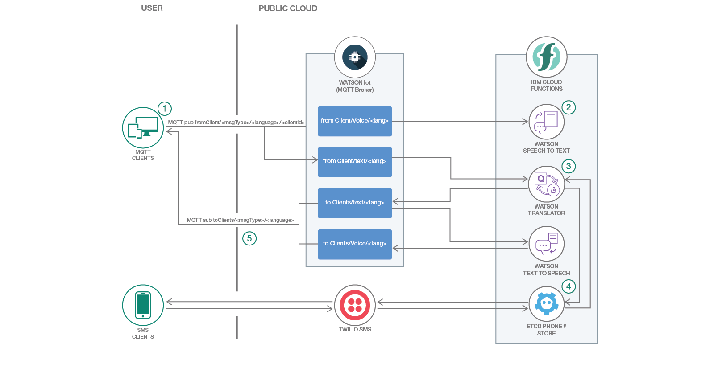

# サーバーレスの多言語対応会議室をデプロイする

### 異なる国の言葉を話すクライアントが互いに途切れなく意思疎通できる通信チャネルを作成する

English version: https://developer.ibm.com/patterns/./deploy-serverless-multilingual-conference-room
 ソースコード: https://github.com/IBM/serverless-language-translation

###### 最新の英語版コンテンツは上記URLを参照してください。
last_updated: 2018-06-27

 
## 概要

この開発者向けパターンでは、異なる国の言語を話すクライアントが互いに途切れなく意思疎通できる通信チャネルを作成する方法を提案します。翻訳された字幕や音声を生成してリアルタイムで配信できる通信チャネルは、さまざまな国の参加者が出席する会議室や電話会議の際にとりわけ役立ちます。

## 説明

オンライン・ゲームで、さまざまな国の言葉を話すチームメイト同士が効率的に意思疎通できる手段があったら良いのにと思ったことはありませんか？あるいは、Slack/Sametime/Zoom チャット・グループといった多数のクライアントを持つチャット・ルーム、YouTube や Twitch などのライブ・ブロードキャスト、またはオンライン・クラスや Web セミナーなどで、そのような手段の必要性を感じたことはありませんか？この開発者向けパターンではその手段として、異なる国の言語を話すクライアントが互いに途切れなく意思疎通できる通信チャネルを作成する方法を提案します。

このパターンは MQTT メッセージング・プロトコルを使用して、各クライアントが 1 つ以上のチャネルを「パブリッシュ」および「サブスクライブ」できるようにします。各クライアントがリクエストで使用した言語とペイロードのタイプは、チャネルの構成によって判別されます (例えば、fromClient/french/audio)。

呼び出されるクラウド関数の順序は、メッセージの送信先チャネルによって判別されます。例えば、メッセージを fromClient/english/audio に送信すると、Watson® Speech to Text サービスを通じて音声ペイロードが実行されて、その結果が翻訳サービスに転送されます。そして翻訳サービスによる結果が、すべての参加クライアントに配信されるという仕組みです。

このコード・パターンをひと通り完了すると、以下の方法に関する理解が深まります。

* IBM Cloud Functions のアクション/トリガーをデプロイする
* Watson IoT Platform とやり取りする
* Cloud Foundry アプリケーションをセットアップする

## フロー

1. クライアントからメッセージを受信します。クライアントは Web ブラウザー、CLI、OpenWhisk アクション、SMS テキストなどです。
1. メッセージのペイロードに音声ファイルが含まれている場合は、音声がテキストに変換されます。
1. 変換されたテキストが、サポートされている他の言語に翻訳されます。
1. SMS からメッセージが送信された場合は、送信者の電話番号が etcd キー・バリュー型ストアに追加されます。この例では etcd を使用して、サブスクライバーの電話番号と言語のリストを保持します。また、調整可能な TTL 値を使用して、サブスクライバーが 300 秒以上会話に参加していない場合、そのサブスクライバーの電話番号を削除します。
1. 翻訳されたメッセージ/音声ストリームが MQTT ブローカー上のさまざまなチャネルにパブリッシュされると、MQTT ブローカーによってサブスクライブ済みクライアントにメッセージが配信されます。

## 手順

Ready to put this code pattern to use? Complete details on how to get started running and using this application are in the [README](https://github.com/IBM/serverless-language-translation/blob/master/README.md).
