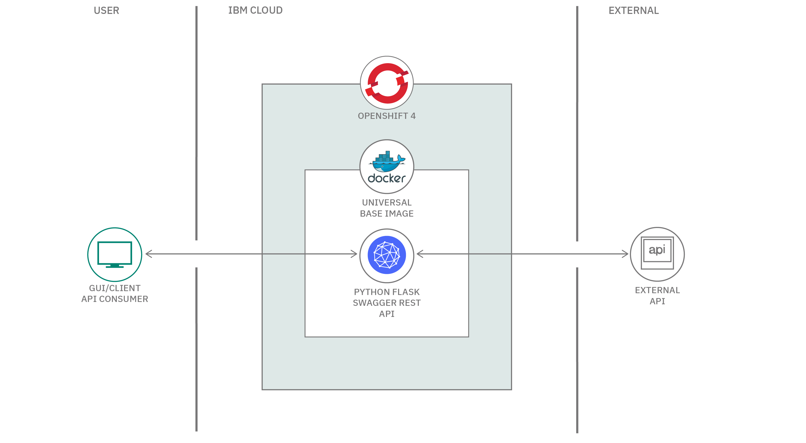

# Red Hat Universal Base Image を使用して、サンプル為替アプリを OpenShift にデプロイする

### Python アプリを IBM Cloud 上の Red Hat OpenShift にデプロイし、セキュリティー、応答性、復元力を強化するためのサンプル・コード

English version: https://developer.ibm.com/patterns/deploy-to-openshift-4-redhat-universal-base-image

ソースコード: https://github.com/IBM/python-ubi-openshift

###### 最新の英語版コンテンツは上記URLを参照してください。
last_updated: 2020-04-24

 
## 概要

このコード・パターンは、[Bee Travels](https://github.com/bee-travels) サンプル・プロジェクトの一部です。このプロジェクトは、Red Hat Universal Base Image を使用して Python で作成された為替アプリケーションを、OpenShift 4.3 と互換性がある Red Hat&reg; OpenShift&reg; on IBM Cloud&trade; 上にデプロイすることに関心を集中しています。

[Universal Base Image](https://www.redhat.com/ja/blog/introducing-red-hat-universal-base-image) は Red Hat Enterprise Linux (RHEL) を中核とするオペレーティング・システムのベース・イメージであるため、RHEL を利用する利点のすべてを備えたイメージを構築できます。つまり、応答性に優れ、極めてセキュアで回復力の高いイメージを構築できるということです。しかも、その名が示唆するように、このイメージは対象が何であれ、普遍的に使用できます。 任意のプラットフォーム上でイメージをビルドして、任意の場所にそのイメージを配布して実行できます。

Universal Base Image を使用すると、使い慣れた yum コマンドを使って、標準的な rpm リポジトリーおよびパッケージをインストールできます。例えば、Apache Web サーバーをセットアップするのも、(Python バージョン 3.7.5 のように) バージョン管理された言語固有の環境を立ち上げるのも簡単です。また、任意のプラットフォーム上でイメージをビルドして、の任意の場所で実行できます。例えば Mac、Linux、Windows などのオペレーティング・システムの別を問わずに、いずれも無料でビルドして実行できます。有料の Red Hat サブスクリプションは必要ありません。

## 説明

このコード・パターンとサンプルを使用して、Red Hat OpenShift on IBM Cloud で Universal Base Image を試すことができます。.

このコード・パターンに従うと、以下のスキルを身に着けることができます。

* REST インターフェースと Swagger テスト・ハーネスを備えた、各種の API ポイントを手動で検査、発見、実行できる Python マイクロサービスを設計して作成する
* Red Hat Universal Base Image を使用して、マイクロサービスの Docker イメージをビルドする
* OpenShift 4.3 との互換性がある Red Hat OpenShift on IBM Cloud 上にマイクロサービスをデプロイして実行する

このコード・パターンの手順に従うには、以下のコードとツールを用意しておく必要があります。

* [Docker](https://www.docker.com/products/docker-desktop)
* [IBM Cloud アカウント](https://cloud.ibm.com/registration?cm_sp=ibmdev-_-developer-patterns-_-cloudreg)
* [Red Hat OpenShift on IBM Cloud](https://cloud.ibm.com/kubernetes/catalog/openshiftcluster?cm_sp=ibmdev-_-developer-patterns-_-cloudreg) 上の RedHat OpenShift 4 クラスター
* [OpenShift Origin CLI ツール (oc)](https://cloud.ibm.com/docs/openshift?topic=openshift-openshift-cli#cli_oc)

## フロー

1. サンプルの為替マイクロサービス内で、クライアント API のコンシューマーがインターネットを介してマイクロサービスを呼び出します (http/s リクエスト)。
1. Python Flask プロセスが Web サーバーとして機能し、REST リクエスト (例えば、`GET /convertCurrency/ZAR/USD/600.66`) を受け入れます。
1. Flask 内のリクエストをルーティングするコードによってリクエストがサービス・モジュールに渡され、このモジュールによって [External European Currency Exchange API](http://api.exchangeratesapi.io) が呼び出されます。
1. 南アフリカ・ランド (ZAR) の為替レートが取得されて保管されます。ZAR の値 `600.66` が米国ドル (USD) に換算されます。
1. Flask が応答として、ドルの金額 (この例の場合、$40.59) を呼び出し側コンシューマーに送信します。

## 手順

このコード・パターンを試すには、GitHub リポジトリー内の [README.md](https://github.com/IBM/python-ubi-openshift/blob/master/README.md) ファイルに記載されている詳細な手順を参照してください。手順の概要は以下のとおりです。

1. GitHub リポジトリーのクローンをローカルで作成します。
1. Docker イメージをビルドしてローカルで実行します。
1. IBM Red Hat OpenShift 4 クラスターにマイクロサービスをデプロイします。
