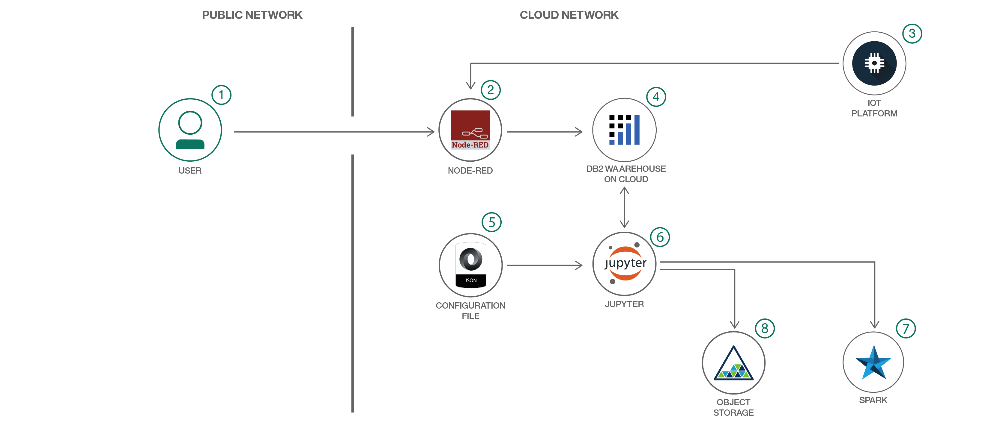

# IoT センサー・データから変化点を検出する

### IoT センサー・データを分析し、R 統計計算プロジェクトを使用して時系列データから変更点を検出する

English version: https://developer.ibm.com/patterns/./detect-change-points-in-iot-sensor-data
  ソースコード: https://github.com/IBM/detect-timeseriesdata-change

###### 最新の英語版コンテンツは上記URLを参照してください。
last_updated: 2017-09-11

 
<!--
_**Note: This pattern is part of a composite pattern.** These are code patterns that can be stand-alone applications or might be a continuation of another code pattern. This composite pattern consists of:_

* [Take corrective actions at the edge based on predictive analytics of IoT sensor data](https://developer.ibm.com/patterns/iot-edge-predictive-analytics-corrective-actions/)
* [Detect change points in IoT sensor data](https://developer.ibm.com/patterns/detect-change-points-in-iot-sensor-data) (this pattern)
* [Predict equipment failure using IoT sensor data](https://developer.ibm.com/patterns/predict-equipment-failure-using-iot-sensor-data)
-->

## 概要

統計分析では、時系列データに含まれる一連のデータ・ポイント (株価終値、1 日の最高気温と最低気温、ソーシャル・メディアの投稿数など) を一定の期間にわたってモニターし、分析することができます。このコード・パターンで、IoT センサー・データ、IBM Watson Studio、そして統計計算用の R ソフトウェアを使用して、データ分析によって変更点を検出する方法を説明します。

## 説明

世界はデータで溢れています。社会的交流やリモート監視管理など、あらゆる目的でインターネットに接続されたデバイスの数は増加の一途をたどっています。自動製造、天気予報、送電網をはじめ、私たちの生活でモノのインターネットが関与していない側面はもう残されていません。技術者が現場に赴き、屋上の空調設備を検査して物理的に問題を識別しなければならなかった時代は遠い昔です。手作業による品質テストで完成部品に欠陥がないことが確認されるまで、製造業者が待たなければならないこともなくなりました。

けれども、遠く離れた店舗内の故障しつつある機器を予測しなければならない場合を考えてみてください。機能停止という結果になる前に、機器の故障を予測して是正処置に着手するには、どうしたらよいでしょうか？さらに、このような先を見越した対応をリアルタイムで行うことはできないでしょうか？地理的な分布に伴う課題を克服して、仕事と個人の生活の質を向上させることは可能でしょうか？その答えは、もちろん「イエス」です。

けれどもそれには、機器故障に関する洞察をデータからどのようにして引き出すのかを開発者が把握していなければなりません。そこで、このコード・パターンでは、IoT センサーからの時系列データで変更点が発生した場合に、それを認識する方法を説明します。具体的には、時系列データから統計パラメーターを計算し、前の時間枠のデータ・セットを現在の時間枠のデータ・セットと比較するという方法です。この 2 つのデータ・セットの統計比較により、すべての変更点を検出することが可能になります。統計比較には R 統計分析プロジェクトを使用し、サンプル・センサー・データを BM Watson Studio クラウドにロードします。

このコード・パターンをひと通り完了すると、以下の方法がわかるようになります。

* 単一のセンサーのセンサー・データを読み取る
* 2つの時系列データ・セット (過去のものと現在のもの) を抽出する
* 2つのデータ・セットを比較するために、それぞれの特性を正確に表現する統計に変換する
* 統計を比較して定量化し、比較結果を分析してデータの変更点を検出する

## フロー

1. IBM Watson Studio にサインアップします。
2. IBM Cloud サービスを作成します。
3. Node-RED アプリを作成して IoT データを注入します。
4. Jupyter Notebook を作成します。
5. データ・ファイルと構成ファイルを追加します。
6. Jupyter Notebook を更新してサービス資格情報を反映します。
7. Jupyter Notebook を実行します。
8. 結果をダウンロードします。

## 手順

Ready to put this code pattern to use? Complete details on how to get started running and using this application are in the [README](https://github.com/IBM/detect-timeseriesdata-change/blob/master/README.md).

1. Log into IBM Cloud and create IBM Cloud services.
2. Create Node-RED Application to load IoT data into DB2 table.
3. Read IoT data from the sample csv file.
4. Import the sample data into a DB2 table using the Node-RED flow.
5. Configure the parameters in .json dsx configuration file.
6. In R notebook flow, update credentials to read relevant Sensor data subset from the DB2 table.
7. In Data science experience, R runs on Spark engine to ensure scalability and performance.
8. Store the configuration file in Object storage.
