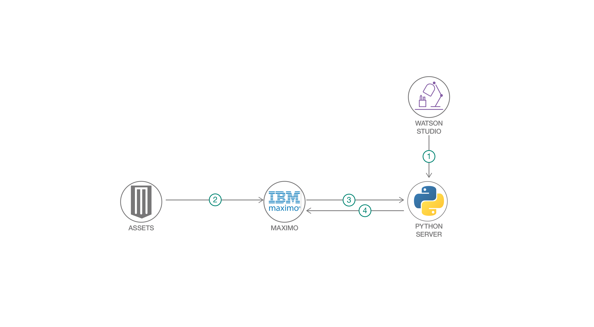

#	装置が故障するリスクを検出する予知保全モデルを作成する
### カスタム機械学習モデルを IBM Maximo に統合する

Englilsh version: https://developer.ibm.com/patterns/detect-equipment-breakdowns-using-predictive-maintenance-models/
ソースコード: https://github.com/IBM/maximo-predictive-maintenance

###### 最新の英語版コンテンツは上記URLを参照してください。
last_updated:		"2019-06-25"

## 概要

このコード・パターンでは、カスタム機械学習モデルを IBM Maximo に統合する方法を見ていきます。対象とするモデルは、登録済みアセットそれぞれの残りの耐用期間を推定するようにトレーニングされたものです。カスタム機械学習モデルを IBM Maximo に統合すれば、アセットが近い将来に故障すると予期される場合は自動的に作業指示書を生成できます。

## 説明

インスツルメンテーションされて接続されたアセットは、構造化データと非構造化データの両方を含む大量の運用データを生成します。このデータを使用すれば、装置が故障するリスクを特定できます。さらに、組織にアナリティクス・ツールがあれば、この分析情報をアセットの運用担当者に伝えることができます。

このコード・パターンでは、サービス中断を避けるために、リスクを特定して先行保全を提案するカスタム機械学習モデルを作成し、適用する方法を説明します。作成するモデルは、保守または交換が必要になるまで所定の機械設備を使用できる期間も推定します。

このコード・パターンではカスタム・モデルを Maximo インスタンスにインポートする方法も説明します。IBM Maximo は、アセットとワークフロー・プロセスを管理するために使用するシステムです。Maximo を使用して作業指示書作成、通知、異常検出などのプロセスを自動化することで、業務を効率化できます。

## フロー

1.  Watson Studio 内でカスタム機械学習モデルを作成し、そのモデルを Python パッケージとしてエクスポートします。
2.  現場のアセットからのセンサー・データを IBM Maximo にパブリッシュします。
3.  定期的に Maximo から Python サーバーにアセット・データをプルし、パッケージ化されたカスタム・モデルに基づいて予測を生成します。
4.  予測された `Remaining Useful Life` の値を Maximo にパブリッシュします。
5.  Maximo 内で、`Remaining Useful Life` の値が更新されるたびに実行する「自動化スクリプト」を作成します。値が X 日間を下回った場合は、Maximo により、アセットを交換または更新するための作業指示書が作成されます。

## 手順

このパターンの詳細な手順については、[README](https://github.com/IBM/maximo-predictive-maintenance/blob/master/README.md) を参照してください。手順の概要は以下のとおりです。

1.  Git リポジトリーを複製します。
2.  Python パッケージをインストールします。
3.  機械学習モデルを作成してパッケージ化します。
4.  アセットを Maximo に登録します。
5.  定期的に Maximo アセットを照会してステータスを確認するスクリプトをセットアップします。
