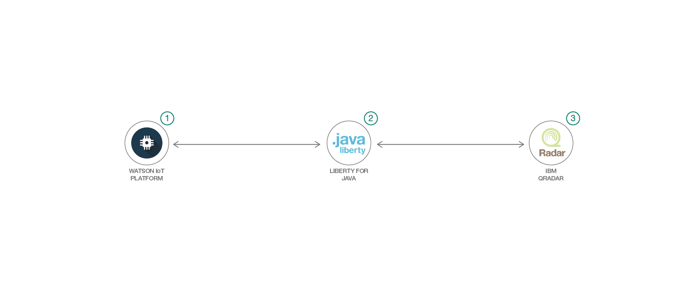

# QRadar を使用してデバイス・イベントをモニタリングする

### イベントをセキュアに登録、送信するために QRadar と Watson IoT Platform を統合する

English version: https://developer.ibm.com/patterns/detect-security-offenses-for-iot-devices-using-qradar/

ソースコード: "https://github.com/IBM/qradar-monitor-device-events/"

###### 最新の英語版コンテンツは上記URLを参照してください。
last_updated: '2018-10-01'

## 概要

組織はさまざまなソースを使用してセキュリティーおよびポリシー関連のイベントをモニタリングするものです。Security Information and Event Management (SIEM) ツールを使用して各種ソースからのログやイベントをモニタリングすれば、脅威をモニタリングしてイベントを相互に関連付け、インシデントに対応できます。モノのインターネット (IoT) が普及する中、セキュリティー関連のインシデントの発生件数は上昇傾向にあります。組み込み IoT デバイスによって生成されるデータから脅威を検出することで、脅威の一歩先を行くことができます。IoT Platform と SIEM ツールを統合すれば、かなりの数のデバイスを SIEM ツールのモニタリング対象にすることができます。

## 説明

このコード・パターンでは、Watson&trade; IoT Platform に IBM QRadarB を統合する方法を説明します。

このコード・パターンを完了すると、以下の方法がわかるようになります。

* QRadar 内でユニバーサル DSM ログ・ソースを作成する
* QRadar 内で攻撃の検出ルールを作成する
* Watson IoT Platform でのデバイス・イベントにサブスクライブし、[Syslog クライアント](https://github.com/CloudBees-community/syslog-java-client) を使用して、これらのイベントを RFC_3164 または RFC_5424 形式で QRadar に送信する
* QRadar ログ・アクティビティー上で、デバイスからの攻撃の有無をモニタリングする

## フロー

1. Watson IoT Platform でのデバイス・イベントにサブスクライブします。
1. Syslog クライアントを使用して RFC_3164 または RFC_5424 形式のメッセージを作成します。
1. メッセージを QRadar に送信します。事前に作成されたルールがメッセージに対して自動的に実行され、違反している場合は攻撃イベントが生成されます。

## 手順

1. QRadar コミュニティー・エディションをインストールします。
1. IBM Cloud サービス・インスタンスを作成します。
1. デバイスを Watson IoT platform に登録します。
1. QRadar 上でログ・ソースとルールを作成します。
1. Web アプリケーションをデプロイします。

このパターンに取り組む準備はできましたか？アプリケーションを起動して使用する方法について詳しくは、[README](https://github.com/IBM/qradar-monitor-device-events/blob/master/README.md) を参照してください。
