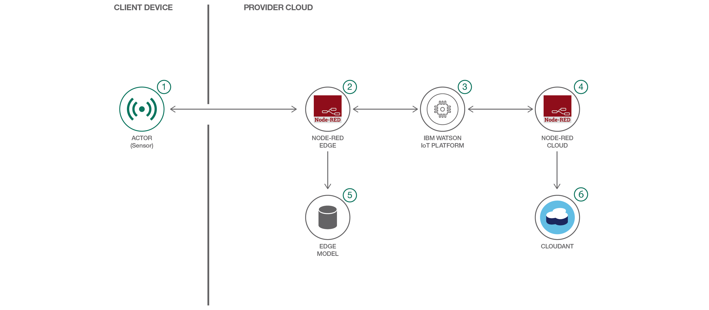

# 家庭用 IoT デバイスの電圧異常を検出する

### Node-RED と Watson IoT を使用して、センサー・データから異常を検出するアプリを構築する

English version: https://developer.ibm.com/patterns/detect-voltage-anomalies-in-household-iot-devices
  
ソースコード: https://github.com/IBM/CognitiveIoT

###### 最新の英語版コンテンツは上記URLを参照してください。
last_updated: 2017-08-29

 
## 概要

専門家たちは、2020 年までに世界中の IoT デバイスの数は 200 億台に達し、その大部分が家庭内に配置されるだろうと予測しています。このコード・パターンで、ひと足早く、家庭内の接続されたデバイスの開発に乗り出してください。このコード・パターンでは、Node-RED と Watson IoT API を使用して、接続された家庭用デバイスの電圧異常を検出するコグニティブ IoT アプリケーションを構築する方法を説明します。

## 説明

モノのインターネットは今や現実のものになっています。Google で検索するとすぐにわかりますが、専門家たちは 2020 年までに世界中で 200 億台のデバイスがインターネットに接続されるようになるだろうと予測しています。開発対象がエンタープライズ・システムなのかモバイル・ゲームなのかを問わず、どのようなタイプの開発でも、広がり続ける IoT エコシステムにデバイス (しかも、あらゆるデバイス) を接続する方法を把握する必要が出てくるはずです。

IoT 開発者は接続された非常に多くのデバイスに加え、コグニティブ・コンピューティングについても理解する必要があります。皆さんが開発するアプリは、渡された入力を取って、そのデータから学習できるようでなければなりません。

コグニティブ・コンピューティングに初めて取り組むには、このコード・パターンがまさにぴったりです。このコード・パターンでは、コグニティブ IoT アプリケーションを構築するプロセスを案内します。このプロセスに従えば、ネットワークのエッジで学習するアプリを構築できます。つまり、クラウドやデータ・センター内で計算するのではなく、入力データの送信元センサーの近くに計算場所を移せるということです。計算は、センサーやアクターの近くにあるゲートウェイで行われます (あるいは、ゲートウェイとセンター/アクターの間にあるマイクロコントローラー上で行って、エッジとの距離をさらに縮めることもできます)。

このコード・パターンでは、クラウドを使用して、誰にとってもお馴染みのデバイスである洗濯機の異常を検出します。洗濯機をモニターするのはそれほど面白そうではないと思うかもしれませんが、誤って熱湯で洗濯した場合を想像してみてください。赤いタオルによって衣服がピンクに染まったら、少しは動揺するでしょう。さらに悪いことに、洗濯機の回転速度が速すぎたためにモーターが焼きついて交換しなければならなくなったら、かなり動揺するはずです。出費にもなります。

洗濯機には、以下の 3 つのセンサーが搭載されていることを前提とします。

* 水温センサー
* 水の硬度センサー
* モーター速度センサー

これらのセンサーと通信するアプリを構築するのは簡単です。センサーによってパラメーターの不安定性が見つかると、アプリが停止コマンドを送信します。さらに、データを保存して、データのバッチ・アナリティクスを夜間に実行することもできます。バッチ・アナリティクスの結果は、エッジ・ゲートウェイ上の機械学習アルゴリズムによって最適化し、先を見越して通知することができます (たとえば、急速な温度上昇など)。異常の通知に対して洗濯機を停止し、大惨事になる前にサービスを手配することもできます。

このようなアプリケーションによってもたらされる結果はおわかりでしょう。家の持ち主が大金を節約することになるコードを作成できる開発者は、ひっぱりだこになるはずです。このコード・パターンを完了して、価値のあるコグニティブ IoT アプリケーションを作成する方法を学び、新しいスキル (そしてきちんと洗われた洗濯物) を身に着けてください。

## フロー

1. 洗濯機に取り付けられているセンサーは、水温センサー、水の硬度センサー、モーター速度センサーの 3 つです。
1. Node-RED エッジ・デバイス・シミュレーターがデバイス・データをシミュレーションします。この例で Node-RED エッジ・デバイスに該当するのは、シミュレーションされた Raspberry Pi です。Raspberry Pi は洗濯機に取り付けられていて、センサーからのデータが常時 Raspberry Pi に送られます。シミュレーションされた Raspberry Pi (つまり、Node-RED エッジ・デバイス) はイーサネットを介してインターネットに接続され、Watson IoT Platform にデータをストリーム配信します。
1. Watson IoT Platform は MQTT メッセージ・ブローカーを使用して、IoT 運用モデルに含まれるすべてのコンポーネント間を非同期で接続する役割を果たします。Watson IoT Platform はデータを Node-RED エッジ・デバイスにパブリッシュします (実際には、デバイスが異常を検出すると、モーターを停止するために洗濯機にメッセージを送信します)。また、Watson IoT Platform はデータを Node-RED クラウドにもストリーム配信し、データはそこからストレージに送信されます。
1. Node-RED クラウドは Watson IoT Platform から送信されるデータにサブスクライブします。これによって、IoT センサー・データがクラウド・ストレージにストリーミング配信されるため、後でバッチ・アナリティクスを実行することが可能になります。
1. エッジ・モデルは、移動 z-score というリアルタイム異常検出アルゴリズムで構成されています。このアルゴリズムにより、センサーの時系列データで異常な動作パターンな検出されます。
1. Cloudant リポジトリーを使用してバッチ・アナリティクス処理を行い、傾向を識別します。

## 手順

Ready to put this code pattern to use? Complete details on how to get started running and using this application are in the [README](https://github.com/IBM/CognitiveIoT/blob/master/README.md).
