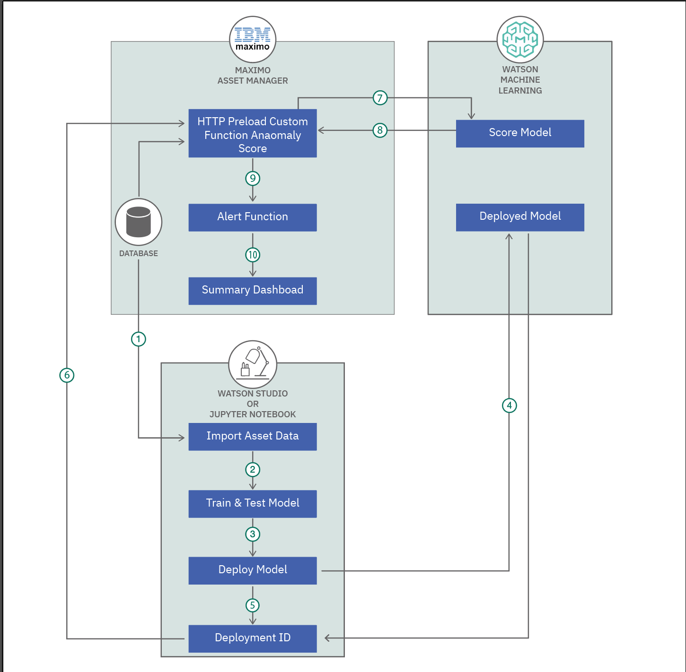

# IoT データ・セット内の外れ値を検出する
### Watson Machine Learning サービス内でホストされた scikit-learn モデルを使用する

English version: https://developer.ibm.com/patterns/detecting-anomalies-in-iot-data-with-maximo-monitor/

ソースコード: https://github.com/IBM/iot-analytics-anomaly/

###### 最新の英語版コンテンツは上記URLを参照してください。
last_updated:	"2020-05-08"

## 概要

このコード・パターンでは、Watson Machine Learning サービス内でホストされた scikit-learn モデルを使用して、IBM Maximo Asset Monitor データ・セットに含まれる外れ値を検出する方法を説明します。また、外れ値の間の相関を時系列グラフで視覚化する方法も説明します。

## 説明

このコード・パターンの対象読者は、外部でホストされたカスタム機械学習モデルを使用して、Watson IoT Platform Analytics 内でデータを分析しようと考えている開発者とデータ・サイエンティストです。

このコード・パターンを完了すると、以下の作業を行えるようになります。

* アセット・データを Watson IoT Platform Analytics にロードする
* REST HTTP 呼び出しによってデータを外部サービスに転送する
* Maximo Asset Monitor を使用して、IOT アセット・データをモニタリング、視覚化、分析するためのダッシュボードを作成する
* 特定の結果を受け取った場合にアラートを生成する

## フロー

## 手順

このコード・パターンをセットアップして実行するには、以下の手順に従います。

1. [クラウド・サービスをプロビジョニングする](https://github.com/IBM/iot-analytics-anomaly/#1-provision-cloud-services)
1. [Python 開発環境をセットアップする](https://github.com/IBM/iot-analytics-anomaly/#2-setup-your-python-development-environment)
1. [Python スクリプトを使用して、エンティティー、関数、ML モデルを登録する](https://github.com/IBM/iot-analytics-anomaly/#3-Leverage-python-scripts-to-register-entity-model-and-function)
1. [関数をデプロイする](https://github.com/IBM/iot-analytics-anomaly/#4-deploy-function)
1. [アラートを追加する](https://github.com/IBM/iot-analytics-anomaly/#5-add-alerts)
1. [ダッシュボード視覚化を追加する](https://github.com/IBM/iot-analytics-anomaly/#6-add-dashboard-visualizations)

詳細については、[GitHub 上に用意されているコード・パターンの README ファイル](https://github.com/IBM/iot-analytics-anomaly/blob/master/README.md)を参照してください。
