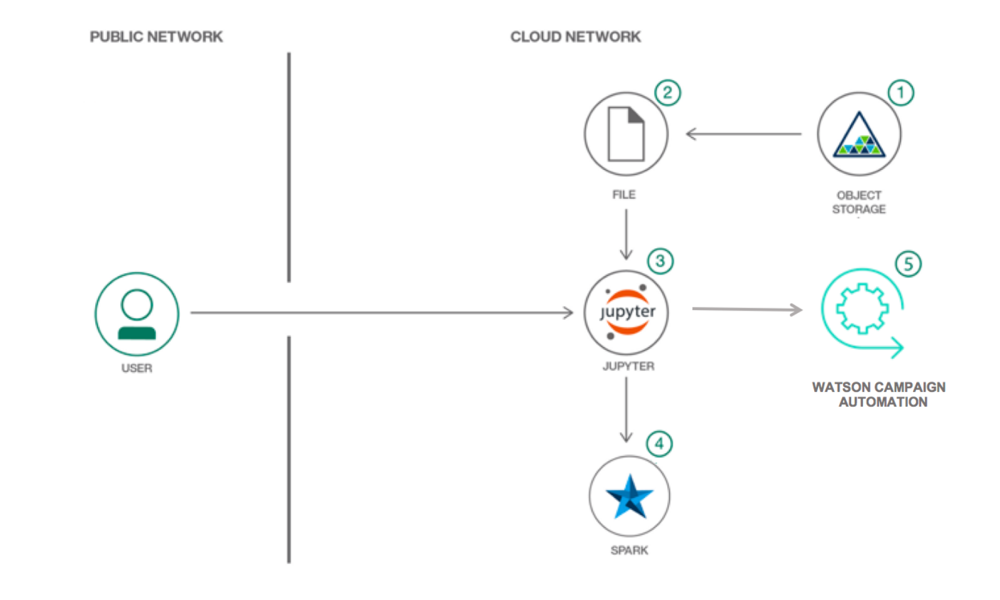

# ターゲット・オーディエンスを決定してマーケティング・キャンペーンを実施する

### Watson Studio と Watson Campaign Automation を統合して、ターゲット・オーディエンスを調整した効果的なキャンペーンを繰り広げる

English version: https://developer.ibm.com/patterns/determine-target-audience-and-run-marketing-campaigns
  
ソースコード: https://github.com/IBM/run-campaigns-target-customers

###### 最新の英語版コンテンツは上記URLを参照してください。
last_updated: 2018-06-26

 ## 概要

企業は収益を上げることを目的に、マーケティング・キャンペーンを実施して製品の販売促進を行います。キャンペーンによって最大の効果を挙げるためには、適切なチャネル上で適切なオーディエンスに働きかけなければなりません。製品に興味を持たない消費者は、キャンペーンが提示している特典を無視するだけです。キャンペーンを効率化するには、ターゲット・オーディエンスを特定するアナリティクス・ツールと、キャンペーンを実施するキャンペーン・オートメーション・ツールとの統合が必要になります。

この開発者パターンでは、Watson&trade; Studio と Watson Campaign Automation を統合して効果的なマーケティング・キャンペーンを実施する方法をデモンストレーションします。

## 説明

e-メールや SMS を通じて、あるいは電話によって、これまでに何回、興味のない製品についての特典を提示されたか考えてみてください。見込み客に対してこうした無駄な時間を費やす裏で、その特典に真に興味を持つかもしれない顧客を逃している可能性があります。

どのマーケティング・キャンペーンでも例外なく、最大限の効果を挙げるためには適切なオーディエンスを対象にしなければなりません。それには、各種のデータ・ソース (顧客の購入履歴、閲覧履歴、カスタマー・レビューなど) に対して高度なアナリティクスを実行する必要があります。また、見込み客とつながりを持つには多数のチャネルがありますが、キャンペーン・オートメーション・ツールを使用すれば、さまざまなチャネル上でマーケティング・キャンペーンを実施する際の負担を軽減することができます。

このパターンでは、Watson Studio を利用して顧客の注文履歴を分析することで、キャンペーンのターゲット・オーディエンスを特定します。そのターゲット・オーディエンスに対し、Watson Campaign Automation ツールを利用して e-メール・キャンペーンを実施する方法をデモンストレーションします。

この開発者パターンでは、完全なソリューションを作成するために Watson Studio と Watson Campaign Automation を統合するという側面について取り上げます。

## フロー

1. Object Storage にデータを保管します。
1. データを CSV ファイルとして使用します。
1. Jupyter Notebook でデータを処理し、ターゲット・オーディエンスを生成します。
1. Jupyter Notebook では Spark を活用します。
1. キャンペーンを実施する Watson Campaign Automation にターゲット・オーディエンス情報が送信されます。

## 手順

このコード・パターンに取り組む準備はできましたか？このパターンの詳細な手順については、[README](https://github.com/IBM/run-campaigns-target-customers/blob/master/README.md) を参照してください。
