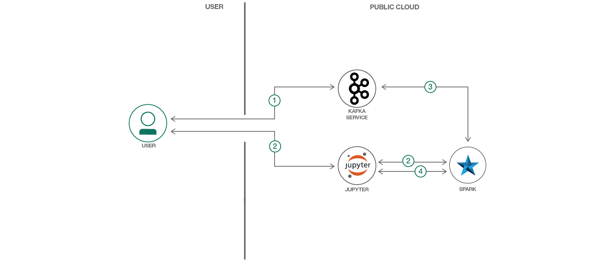

# クリックストリーム分析によってトレンディング・トピックを判断する

### Apache Spark と Kafka を使って Web サイトの閲覧者に関するデータを収集、分析、レポートする

English version: https://developer.ibm.com/patterns/determine-trending-topics-with-clickstream-analysis
  ソースコード: https://github.com/IBM/kafka-streaming-click-analysis

###### 最新の英語版コンテンツは上記URLを参照してください。
last_updated: 2019-03-28

 
## 概要

クリックストリーム分析とは、ユーザーがどの Web ページを閲覧したかに関するデータを収集して分析し、その分析をレポートするプロセスのことです。このプロセスによって、Web サイトの使用状況の特性について有用な情報を得ることができます。このコード・パターンでは、クリックストリーム分析を利用する例として、Wikipedia Web サイト上でのトレンディング・トピックをリアルタイムで検出する方法を紹介します。

## 説明

クリックストリーム分析とは、ユーザーがどの Web ページを閲覧したかに関するデータを収集して分析し、その分析結果をレポートするプロセスのことです。このプロセスによって、Web サイトの使用状況の特性について有用な情報を得ることができます。

クリックストリーム分析のよくある使用パターンとしては、以下が挙げられます。

* A/B テスト: Web サイトをバージョン A からバージョン B に変更するとユーザーにどのような影響があるかについて、統計的に調査します。
* ショッピング・ポータル上でのレコメンデーション生成: ショッピング・ポータル上でユーザーが行うクリック操作のパターンを基に、ユーザーがどのような影響を受けて商品の購入に至ったのかを明らかにします。そしてこの情報を、以降の同様のクリック・パターンに適用してレコメンデーションを生成します。
* ターゲット広告: レコメンデーション生成と似ていますが、複数の Web サイトにわたってユーザーのクリック操作を追跡し、この情報を基に、リアルタイムでより的確に広告のターゲットを絞ります。
* トレンディング・トピック: クリックストリーム分析を利用して、リアルタイムでトレンディング・トピックを調査したりレポートしたりします。一定の期間について、ユーザーのクリック数がとりわけ多かった上位アイテムを表示します。

このコード・パターンでは、Wikipedia Web サイト上でのトレンディング・トピックをリアルタイムで検出する例を紹介します。クリックストリーム分析のタスクを実行できるよう、Apache Kafka をメッセージ・キューとして使用し、Apache Spark 構造化ストリーミング・エンジンを使用してアナリティクスを行います。この 2 つの組み合わせは、有用性、ハイスループット、そして低レイテンシーという特性を持つことでよく知られています。

このコード・パターンをひと通り完了すると、以下の方法がわかるようになります。

* [Jupyter Notebooks](https://jupyter.org/) を使用してデータをロード、視覚化、分析する
* [IBM Watson Studio](https://www.ibm.com/cloud/watson-studio) 内で Jupyter Notebook を実行する
* Apache Spark 構造化ストリーミングを使用してクリックストリーム分析を行う
* Apache Kafka を使用して低レイテンシーの処理ストリームを作成する

## フロー

1. ユーザーが Apache Kafka サービスと接続して、実行中のクリックストリーム・インスタンスをセットアップします。
2. IBM Data Science Experience 内で、基礎となる Apache Spark サービスとやりとりする Jupyter Notebook を実行します。別の方法として、Spark Shell を実行してローカルでこのサービスとやり取りすることもできます。
3. Apache Spark サービスが Apache Kafka サービスから送信されるデータを読み取って処理します。
4. 処理された Kafka データが Jupyter Notebook (ローカルで実行している場合はコンソール・シンク) を介してユーザーに返されます。

## 手順

Find the detailed steps for this pattern in the [README](https://github.com/IBM/kafka-streaming-click-analysis/blob/master/README.md). There are two modes of exercising this code pattern:

* Run locally using the Spark shell.
* Run using a Jupyter notebook in the IBM Watson Studio. *Note: Running in this mode requires a Message Hub service, which charges a nominal fee.*
