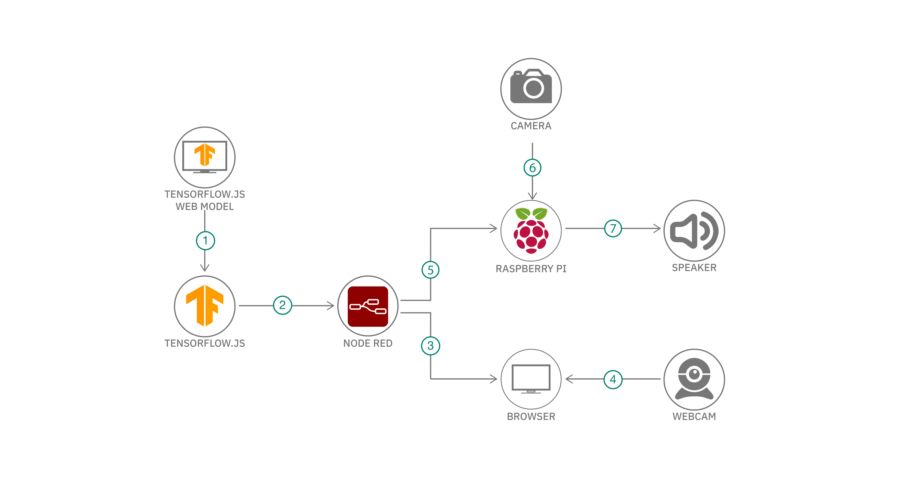

# Node-RED と TensorFlow.js を使用して機械学習 IoT アプリを開発する

### わずかなコードで簡単に AI 機能をデバイスに統合する方法を学んでください

English version: https://developer.ibm.com/patterns/develop-a-machine-learning-iot-app-with-node-red-and-tensorflowjs
  
ソースコード: https://github.com/IBM/node-red-tensorflowjs

###### 最新の英語版コンテンツは上記URLを参照してください。
last_updated: 2020-01-10

 ## 概要

このコード・パターンでは、オフラインのデバイス (ここでは例として Raspberry Pi を使用) 上で直接実行できる機械学習アプリを作成してデプロイする方法を説明します。TensorFlow.js で Node-RED を使用すると、わずかなコードで簡単に機械学習をデバイスに統合できます。

## 説明

IoT デバイスで AI 機能を使用するには、ほとんどの場合、デバイスからサーバーにデータを送信しなければなりません。サーバー上で機械学習の計算を行ってから、その結果をデバイスに返して、必要に応じたアクションを実行するという手法です。けれども、データ・セキュリティーやネットワーク接続が懸念事項となる場合、この手法は理想的なものでも実現可能なものでもありません。

Node-RED と TensorFlow.js を結合すれば、より簡単に機械学習の機能をデバイスに追加できます。

* [Node-RED](https://nodered.org/) は、ブラウザー・ベースのフロー・エディターを使ってデバイス、API、オンライン・サービスを接続できる、オープンソースのビジュアル・プログラミング・ツールです。Node.js をベースに作成された Node-RED の機能を拡張するには、独自のノードを作成するか、JavaScript および NPM エコシステムを利用することで対処できます。
* [TensorFlow.js](https://www.tensorflow.org/js/) は、ブラウザーや Node.js などの JavaScript 環境内で機械学習モデルを作成、トレーニング、実行するためのオープンソース JavaScript ライブラリーです。

このコード・パターンを完了すると、以下の方法がわかるようになります。

* TensorFlow.js モデルを組み込んだ Node-RED ノードを作成する
* TensorFlow.js ノードを使用する Node-RED アプリケーションを作成してデプロイする

## フロー

1. TensorFlow.js 形式の機械学習モデルを使用 (またはダウンロード) します。
1. TensorFlow.js モデル用の Node-RED ノードを作成し、TensorFlow.js ノードを Node-RED アプリケーションに接続します。
1. Node-RED アプリケーションをローカルにデプロイします。
1. ブラウザーから Node-RED アプリケーションにアクセスして、ウェブカムで撮影した画像に対して推論をトリガーします。
1. あるいは、Node-RED アプリケーションを Raspberry Pi デバイスにデプロイすることもできます。
1. デバイスが Node-RED アプリケーションを実行し、ウェブカムから取得した画像に対する推論を行います。
1. デバイスが接続されたスピーカーに結果を出力するか、推論結果に応じて他のアクションを実行します。

## 手順

詳しい手順については、[README](https://github.com/IBM/node-red-tensorflowjs/blob/master/README.md) ファイルを参照してください。手順の概要は以下のとおりです。

1. リポジトリーのクローンを作成します。
1. Node-RED をインストールします。
1. TensorFlow.js ノードをインストールします。
1. Node-RED フローをインポートします。
1. Node-RED フローをデプロイします。
