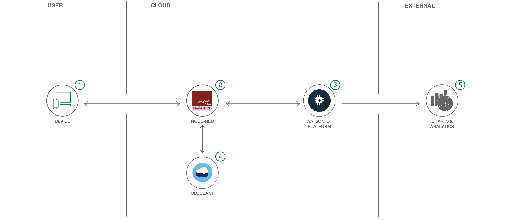

# Node-RED と Watson を利用して IoT アプリを開発する

### ビジュアル・プログラミング・ツール、PaaS サービス、Watson を利用して、IoT 製品を完全に機能するビジネス・アプリケーションに変換する

English version: https://developer.ibm.com/patterns/./develop-an-iot-app-with-node-red-and-watson
  ソースコード: https://github.com/IBM/manage-control-device-node-red

###### 最新の英語版コンテンツは上記URLを参照してください。
last_updated: 2017-10-27

 
## 概要

IoT プロジェクトを作成して、それを完全に機能するビジネス・アプリケーションに拡張します。さらに、PaaS サービスと Watson IoT プラットフォームを利用して、ビジネス・アプリケーションをプロアクティブに保守します。このコード・パターンでは、シミュレーションされたモーターを作成し、Watson IoT Platform を使用して、ユーザーがモーターに送信するコマンドをモニターして、起動、停止、加速化などのコマンドを処理します。また、IoT Platform ダッシュボードを使用して継続的にデバイス・データをモニターし、Cloudant データベースを使用してデータを維持します。

## 説明

所属する企業が大企業または新興企業のどちらであるかを問わず、開発チームはこの [manage-control-device-node-red](https://developer.ibm.com/patterns/build-monitor-iot-driven-conveyor-belt/) リポジトリー・パターンのような概念検証に着手する機会を見つけられるはずです。

Node-Red Web ページ・アプリケーションを使用すると、任意のデバイスからの着信データを視覚化することができます。このパターンでは、Watson IoT Platform に接続されたデバイスをシミュレーションするプロセスを段階的に説明します。

センサー、ゲートウェイ、マイクロコントローラーなどから、実際のデバイスを任意に選んでアプリに接続してみてください。デバイスからプラットフォームにデータがストリーミングされるはずです。IBM Cloud 内のチャートを調べてリアルタイムのデータ・ストリーミングを確認した後は、アナリティクスのサンプリングを行って傾向と異常を識別することができます。これは、デバイスを保守するには理想的な手法です。

このアプリケーションは、Node-RED 外部に複製することもできます。その方法については、[関連パターン](https://developer.ibm.com/patterns/build-monitor-iot-driven-conveyor-belt/)を参照してください

## フロー

1. IBM Cloud 上で Node-RED インスタンスを作成してデプロイした後、Cloud Foundry CLI を使用して、そのインスタンスを Watson IoT Platform に接続します。
1. simulate-iot サンプル・アプリをビルドしてデプロイします ([JSON フロー](https://raw.githubusercontent.com/IBM/manage-control-device-node-red/master/flow/flow.json)をアプリ・エディターにコピー・アンド・ペーストします)。
1. Watson IoT Platform ダッシュボードと Cloudant を使用して、デバイス・データを保存します。
1. IoT データを IoT Platform に注入します。
1. Watson IoT Platform ダッシュボードを使用して、デバイス・データをモニターし、視覚化します。
