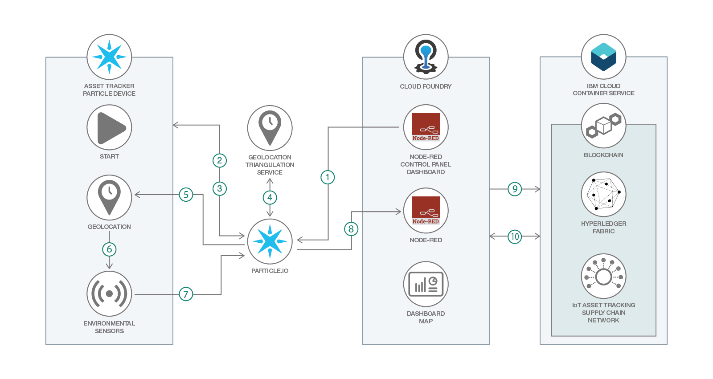

# ブロックチェーンを使用して IoT 資産追跡アプリを開発する

### ブロックチェーン、IoT デバイス、Node-RED と、IoT 資産追跡デバイスを使用してサプライ・チェーンを改善する

English version: https://developer.ibm.com/patterns/develop-an-iot-asset-tracking-app-using-blockchain
  ソースコード: https://github.com/IBM/IoT-AssetTracking-Perishable-Network-Blockchain

###### 最新の英語版コンテンツは上記URLを参照してください。
last_updated: 2018-04-22

 
_**Note:** This code pattern is currently being updated to focus on IBM Blockchain Platform V2.0._

## 概要

このパターンでは、配送中の環境条件に影響されやすい生鮮品 (食物、医薬品、家畜など) を安全に配送するという実際的な問題に取り組みます。このような生鮮品の配送には例外なく、汚染や損傷から守るためのしきい値 (冷却要件、衝撃や振動の回避など) があります。配送中にこれらのしきい値を超えた場合、その生鮮品は痛むことになり、健康を害する原因になりかねません。生鮮品が正常に配送されたこと (あるいは、そうでなかったこと) を確認できるようにするために開発者がとれる方法は、極端な環境条件 (スマート・コントラクト内で指定されたしきい値) にさらされた配送の詳細 (場所、配送品、時間) を記録することです。こうすることで、安全な配送を前提として支払いが行われることになります。複数の参加者間をまたぐ配送条件を、ブロックチェーンを使用して追跡すると、配送プロセスにおける検証が可能になり、信頼がもたらされます。この IBM Code パターンは、このようなブロックチェーンによる IoT 資産追跡ソリューションの見本になります。

## 説明

温度、湿度、振動、または時間に影響されやすい生鮮品 (食品サプライ・チェーン、冷却保管された医薬品、園芸植物など) の配送に関連する環境条件を追跡するには、このコード・パターンを使用できます。貨物を安全な環境パラメーターの範囲内で安全な時間内に配送しなければならないとしたら、環境センサーを結合した IoT 資産追跡デバイスを使用して、GPS、三角測量、またはビーコンによって現在位置を計算して、その位置をセルラー、5G、Sub1GHz、SigFox、または WiFi のネットワークを介して報告することには極めて大きな価値があります。安全な配送と貨物の決済に、農場、製造業者、処理工場、トラック、港湾、船、流通センター、消費者向け小売店などの複数の参加者が関与する場合、Hyperledger ブロックチェーンを使用すれば、IoT 資産追跡デバイスから報告される配送の進捗を、不変のトランザクションとして記録することができます。

## フロー

1. Node-RED コントロール・パネル・ダッシュボード内で、資産追跡デバイスを選択し、ジオロケーション報告機能を有効にして Particle.io を呼び出します。
1. Particle.io がセルラー・ネットワークを介して資産追跡デバイスを呼び出し、アクティブ化します。
1. ジオロケーション・データは Particle.io に定期的に送信されます (送信間隔は Node-RED コントロール・パネル・ダッシュボード内で設定します)。
1. Particle.io が Google Geolocation 三角測量サービスを呼び出し、携帯電話の中継塔と信号強度を、ジオロケーション情報 (緯度/経度) に変換します。
1. Particle.io が緯度/経度の座標を Asset Tracker デバイスに送信します。
1. Asset Tracker デバイスが温度データのクエリー、続いて振動データのクエリーを実行します。
1. Asset Tracker デバイスが収集したセンサー・データのすべてを Particle.io に送信します。
1. Node-RED は、Particle.io に着信する温度と振動のデータを listen します。
1. Node-RED が温度および振動データを Hyperledger Fabric トランザクション履歴に書き込みます。
1. Node-RED ダッシュボードが Hyperledger Fabric ブロックチェーンに対し、トランザクション履歴のクエリーを実行し、緯度/経度、時間、センサー・データを地図上に描画します。

## 手順

このパターンの詳細な手順については、[README](https://github.com/IBM/IoT-AssetTracking-Perishable-Network-Blockchain/blob/master/README.md) を参照してください。手順の概要は以下のとおりです。

1. [ハードウェアを構成します。](https://github.com/IBM/IoT-AssetTracking-Perishable-Network-Blockchain/blob/master/ParticleElectron/README.md)

   * Particle Electron Asset Tracker の基板を構成します。
   * Particle Electron ツールチェーンをセットアップします。
   * Watson IoT Asset Tracker プログラムをセットアップします。

1. [IBM Blockchain テクノロジーを実装します。](https://github.com/IBM/IoT-AssetTracking-Perishable-Network-Blockchain/blob/master/Blockchain/README.md)

 * 基本的な IBM Blockchain Hyperledger ネットワークを構築します。
 * 生鮮品ビジネス・ネットワークを実装します。

1. [IoT データを視覚化して分析する IoT アプリを作成します。](https://github.com/IBM/IoT-AssetTracking-Perishable-Network-Blockchain/blob/master/Node-RED/README.md)

   * IBM Cloud 内で IoT スターター・アプリを作成します。
   * Node-RED を開いて、追加のノードをインストールします。
   * ビルド前のフローをインポーします。
   * フローを初期化します。
   * Particle.io からのイベントを制御して受信します。
   * イベントを生鮮品ビジネス・ネットワークのブロックチェーンに書き込みます。
   * ブロックチェーンのトランザクション履歴をロードします。
   * 資産追跡ダッシュボードを作成します。
