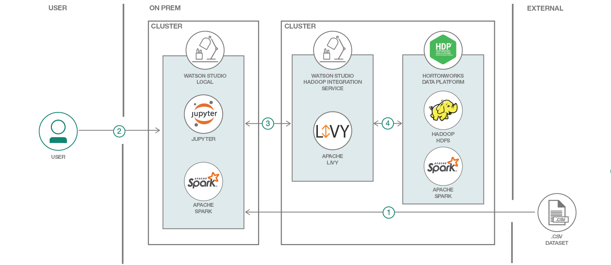

# 'Watson Studio Local を利用して Hortonworks Data Platform 上でスパム・フィルター・モデルを開発、トレーニング、デプロイする'

###  自然言語処理と機械学習を使用してスパムを識別する

English version: https://developer.ibm.com/patterns/develop-and-deploy-a-sms-spam-filter-with-hortonworks-data-platform
  ソースコード: 'https://github.com/IBM/sms-spam-filter-using-hortonworks'

###### 最新の英語版コンテンツは上記URLを参照してください。
last_updated: '2018-10-30'

 ## 概要

このコード・パターンでは、データ・サイエンティストがリモートの Spark クラスターとコンピューティング環境を使用してスパム・フィルター・モデルをトレーニングし、デプロイする方法を説明します。自然言語処理と機械学習アルゴリズムを使用して作成したモデルを使って、特定のテキスト・メッセージがスパムであるかどうかを分類します。

## 説明

このコード・パターンでは、Watson Studio Local を利用することで、データ・サイエンティストが Hortonworks Data Platform (HDP) からリモートの Spark クラスターとコンピューティング環境を使用してスパム・フィルター・モデルをトレーニングし、デプロイすることが可能になる仕組みを説明します。

スパム・フィルターとは、自然言語処理と機械学習アルゴリズムを使用して作成される分類モデルのことです。このモデルを、スパムを収集した SMS データ・セットに対してトレーニングし、特定のテキスト・メッセージがスパムまたはハム (非スパム) のどちらであるかを分類できるようにします。

このコード・パターンでは、この分類問題に対処する方法として、ローカル (Watson Studio Local) リソースを使用する場合の例と、リモート (HDP クラスター) リソースを使用する場合の例を紹介します。

このコード・パターンを完了すると、以下の方法がわかるようになります。

* データを Spark DataFrames にロードし、Spark の機械学習ライブラリー (MLlib) を使用してスパム・フィルター・モデルを開発、トレーニング、デプロイする
* データを pandas DataFrames にロードし、Scikit-learn 機械学習ライブラリー (MLlib) を使用してスパム・フィルター・モデルを開発、トレーニング、デプロイする
* sparkmagics ライブラリーを使用して、HDP クラスター内のリモート Spark サービスに Hadoop Integration サービスを介して接続する
* sparkmagics ライブラリーを使用して、Scikit-learn ライブラリーが含まれる Python 仮想環境をリモート HDP クラスターに Hadoop Integration サービスを介してプッシュする
* スパム・フィルター・モデルを Python egg としてパッケージ化し、その egg をリモート HDP クラスターに Hadoop Integration サービスを介して配布する
* IBM Watson Studio Local 内からリモートの Spark コンテキストとリモートの Python 仮想環境のそれぞれを使用して、スパム・フィルター・モデル (PySpark バージョンと Scikit-learn バージョンの両方) をリモート HDP クラスター内で実行する
* スパム・フィルター・モデルをリモート HDP クラスター内に保存して Watson Studio Local にインポートし、スコアをまとめてモデルを評価する

## フロー

1. Watson Studio Local に、スパムを収集したデータ・セットをアセットとしてロードします。
1. ユーザーが Watson Studio Local 内で Jupyter Notebook を実行して操作します。
1. Watson Studio Local では、ローカルで利用可能なリソースを使用することも、Hadoop Integration サービスに含まれる Apache Livy に接続して HDP クラスターのリソースを使用することもできます。
1. Livy は HDP クラスターに接続して Apache Spark を実行するか、HDFS ファイルにアクセスします。

## 手順

詳細な手順については、[README](https://github.com/IBM/sms-spam-filter-using-hortonworks/blob/master/README.md) ファイルを参照してください。手順の概要は以下のとおりです。

1. リポジトリーを複製します。
1. IBM Watson Studio Local 内でプロジェクトを作成します。
1. プロジェクトのアセットを作成します。
1. Watson Studio Local マスター・リポジトリーに変更をコミットします。
1. それぞれの例にリストアップされているノートブックを実行します。
