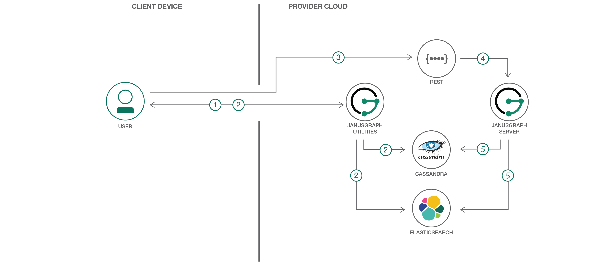

# JanusGraph を使用してグラフ・データベース・アプリを開発する

### Twitter 風アプリケーションを作成する手順を通して、カスタム・グラフ・アプリケーションを作成して操作する方法を理解する

English version: https://developer.ibm.com/patterns/develop-graph-database-app-using-janusgraph
  
ソースコード: https://github.com/IBM/janusgraph-utils

###### 最新の英語版コンテンツは上記URLを参照してください。
last_updated: 2017-10-26

 
## 概要

このコード・パターンには、JanusGraph 内で Twitter 風アプリケーションを実行するためのユーティリティー・コードとサンプル・データが用意されています。このコード・パターンのいくつかの簡単なステップに従うことで、グラフ・アプリケーションに不可欠な要素となるスキーマとデータについて、そしてグラフ・データを取り込んでクエリーを実行するために使用する API について、理解できるようになります。スキーマ・ローダーとデータ・インポーターのコードは、使用ケースに合わせてカスタマイズできます。さらに、サンプル・データ・ジェネレーターは、さまざまな規模と形のテスト・データを作成する便利な手段となります。このデータ・ジェネレーターを使用すれば、実際のデータを簡単にシミュレーションしてシステム・パフォーマンスを検証できるので、開発時間を短縮できます。

## 説明

グラフ・データベースや JanusGraph について耳にしたことはあっても、グラフ・データベース・アプリケーションを開発するために必要な知識や、データをリレーショナル・データベースからグラフ・データベースに移行する方法、あるいはグラフ・データベースに期待できるパフォーマンスがわからないという場合は、このコード・パターンで答えを見つけてください。このコード・パターンは、このような質問の答えを明らかにするとともに、その他の課題に対処するためのツールを提供することを目的に作成されています。

まず、いくつかのステップに従って、JanusGraph 内で Twitter アプリケーションを開発する方法を理解してください。その後は、スキーマ・ローダーとデータ・インポーターのコードを調べて Java&trade; 管理 API の実際的な使用法を学びます。最終的には、カスタム・スキーマとデータ処理に応じてコードを拡張または変更できるようになるはずです。例えば、カスタム・グラフ・データを SQL データベースから CSV ファイルにエクスポートして、データ・インポーターを使用して CSV ファイルから JanusGraph にロードするようにコードを拡張できます。

グラフ・データベースのパフォーマンスについてはどうでしょう？グラフ・データ・ジェネレーターを使用すれば、実際のデータをさまざまなサイズでシミュレーションするテスト・データを生成して、システム・パフォーマンスの動作を簡単に検証できます。

Gremlin のクエリーと REST API がどのように連動して OLTP タスクを実行するかを把握した後は、特定のグラフ・データ・シナリオを説明する興味深いフロントエンドのアプリケーションを開発することができます。

## フロー

1. ユーザーが JanusGraph ユーティリティーを使用して、Twitter のサンプル・スキーマとデータを生成します。
1. ユーザーが JanusGraph ユーティリティーを使用して、バックエンド・サーバーにスキーマをロードし、データをインポートします。
1. ユーザーが REST/カスタム・クライアント内で、検索および更新リクエストを実行します。
1. クライアント・アプリが REST リクエストを JanusGraph サーバーに送信します。
1. JanusGraph サーバーがバックエンドとやり取りしてグラフ・データを処理し、その結果を返します。

## 手順

Ready to put this code pattern to use? Complete details on how to get started running and using this application are in the [README](https://github.com/IBM/janusgraph-utils/blob/master/README.md).
