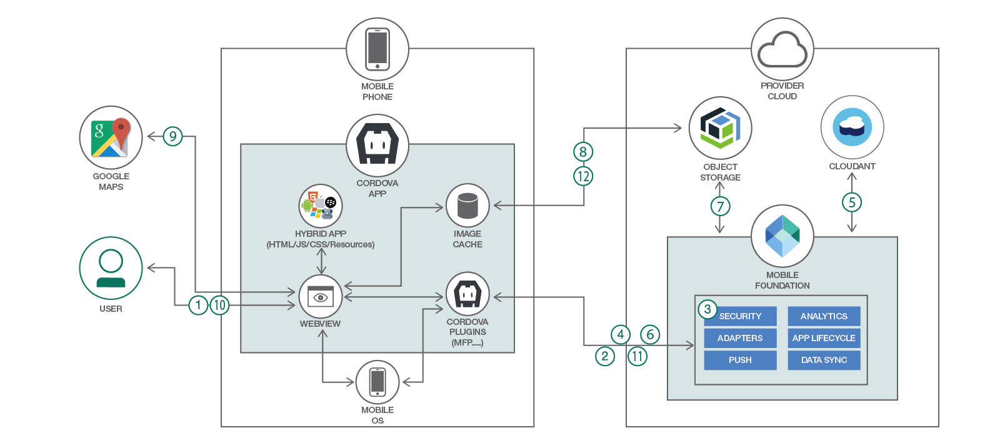

# クラウド・ネイティブのバックエンドを使用したハイブリッド・モバイル・アプリを開発する

### IBM Mobile Foundation を介して Cloudant および IBM Cloud Object Storage に接続する、エンタープライズ対応のセキュアな Ionic/Cordova アプリを開発する

English version: https://developer.ibm.com/patterns/./develop-hybrid-mobile-app-with-cloud-native-back-end
  ソースコード: https://github.com/IBM/Ionic-MFP-App/

###### 最新の英語版コンテンツは上記URLを参照してください。
last_updated: 2018-02-08

 
<!--
_**Note: This pattern is part of a composite pattern.** These are code patterns that can be stand-alone applications or might be a continuation of another code pattern. This composite pattern consists of:_

* [Develop a hybrid mobile app with a cloud-native back end](https://developer.ibm.com/patterns/develop-hybrid-mobile-app-with-cloud-native-back-end/) (this pattern)
* [Implementing mobile user authentication](https://developer.ibm.com/patterns/implementing-mobile-user-authentication)
* [Secure mobile offline synchronization](https://developer.ibm.com/patterns/secure-offline-synchronization-ibm-mobile-foundation)
* [Add push notifications to your hybrid mobile apps](https://developer.ibm.com/patterns/tag-based-push-notifications-for-hybrid-mobile-applications)
-->

## 概要

あなたとあなたの組織が、顧客/従業員にとって重要なビジネス問題を解決するものになると予測しているエンタープライズ・モバイル・アプリを開発する場合、製品化までの時間が決定的に重要な意味を持ちます。このようなアプリは、可能な限り短時間で開発して本番環境に移さなければなりません。それと同時に、組織のデータ、API、モバイル・アプリのセキュリティーを確保して、モバイル・バックエンドがモバイル・ユーザーの数に応じてシームレスにスケーリングできるようにする必要もあります。この開発者向けコード・パターンでは、Apache Cordova や Ionic Framework などのオープンソース・テクノロジーと、Cloudant&reg; NoSQL データベース、IBM Cloud Object Storage、IBM Mobile Foundation などのクラウド・サービスを利用して、セキュアでスケーラブルなエンタープライズ・アプリを迅速に開発し、ホストする方法を説明します。

## 説明

データを中央に集めてホストする必要があるエンタープライズ・モバイル・アプリを開発する際は、例えば Cloudant NoSQL データベースにテキスト・データを保管し、IBM Cloud Object Storage に画像/動画/音声を保管するといったように、クラウド・ネイティブのサービスを使用すると、迅速にアプリの構想を現実化することができます。さらに、IBM Mobile Foundation サービスが提供するスケーラブルなモバイル・アクセス・ゲートウェイを利用すれば、これらのバックエンドのサービスにセキュアにアクセスできるだけでなく、モバイル・バックエンドに必須となる他の機能 (プッシュ通知、アプリのライフサイクル管理、アプリのアナリティクスなど) を揃えることもできます。

このコード・パターンをひととおり完了すると、以下のことを理解できるようになります。

* IBM Mobile Foundation セキュリティー・アダプターを使用して (プリエンプティブなログインを通じて) ユーザーを認証する方法
* IBM Cloud Object Storage サービスを利用して認証を行う IBM Mobile Foundation アダプターを作成し、認証トークンをモバイル・アプリに渡す方法
* モバイル・アプリと IBM Cloud Object Storage サービスとの相互作用をコーディングする際に推奨されるアーキテクチャー・パターン
* Ionic アプリ内で [imgcache.js](https://github.com/chrisben/imgcache.js) を使用して、IBM Cloud Object Storage サービスからフェッチした画像をキャッシュに入れる方法
* Ionic アプリ内で Google マップを表示すると同時に、ユーザーの地理位置情報とカメラの画像をキャプチャーする方法
* キャプチャーした画像をモバイル・アプリから IBM Cloud Object Storage にアップロードする方法
* IBM Mobile Foundation アダプターを介して Cloudant 内のデータをモバイル・アプリに渡すとともに、新しいデータを Cloudant に送信する方法
* Ionic アプリのロゴとスプラッシュをカスタマイズし、パブリック/プライベート・アプリ・ストアにアップロードするリリース APK を作成する方法

## フロー

1. ユーザーがモバイル・アプリを起動して、ログイン画面に自分の資格情報を入力し、*「Login (ログイン)」*をクリックします。
1. モバイル・アプリから Mobile Foundation サーバーにユーザー資格情報が送信されて、検証されます。
1. Mobile Foundation サーバーがセキュリティー・アダプター・ロジックを呼び出して、ユーザー資格情報を検証し、検証結果に応じたレスポンスをモバイル・アプリに返します。この例では、パスワードとユーザー名が一致すると成功メッセージを返す、単純なセキュリティー・アダプターを使用します。
1. 認証が成功すると、モバイル・アプリのホーム・ページが表示されます。その一環として、モバイル・アプリは Cloudant NoSQL データベース内にある必要なデータを取得するために Mobile Foundation アダプターを呼び出します。
1. Mobile Foundation アダプターが Cloudant からデータをフェッチして、モバイル・アプリに返します。フェッチされるデータには、IBM Cloud Object Storage 内に保管されている画像への参照が含まれています。
1. モバイル・アプリが Mobile Foundation アダプターを呼び出して、Cloud Object Storage とやり取りするために必要になる認証トークンを取得します。
1. Mobile Foundation アダプターが Cloud Object Storage トークン・マネージャー・エンドポイントを呼び出して認証トークンを取得し、モバイル・アプリに返します。
1. モバイル・アプリが画像キャッシング・プラグインを初期化して、画像をフェッチする際に HTTP ヘッダーとして「Authorization=the value returned from Mobile Foundation adapter」を使用するよう、このプラグインに対して指示します。モバイル・アプリが、Mobile Foundation アダプターから取得したデータを項目のリストとして表示します。モバイル・アプリ上で稼働する画像キャッシング・プラグインが、IBM Cloud Object Storage から画像をダウンロードしてキャッシュに入れます。
1. ユーザーがリスト内のいずれかの項目をクリックして、その詳細を表示します。詳細ページに表示される Google マップ内に、画像とマーク付きの地理位置情報が示されます。
1. ホーム・ページ上で、ユーザーが新たな都市問題を報告するために「*+*」ボタンをクリックします。これにより、新しいページが表示されます。このページで、ユーザーは新たな都市問題の説明を入力するとともに、問題箇所の画像と地理位置情報をキャプチャーできます。最後にユーザーが *「Submit (送信)」*をクリックします。
1. モバイル・アプリが Mobile Foundation アダプターを介して Cloudant NoSQL データベースにテキスト・データをアップロードします。
1. モバイル・アプリがキャプチャーされた画像のサイズを変更してサムネイルを作成し、キャプチャーされた画像とサムネイルの両方を IBM Cloud Object Storage サービスにアップロードします。
1. 他の (新たにログインした) ユーザーがホーム・ページ上で画面の更新ボタンをクリックすると、更新された問題レポートのリストが表示されます。

## 手順

Ready to put this code pattern to use? Complete details on how to get started running and using this application are in the [README](https://github.com/IBM/Ionic-MFP-App/blob/master/README.md).
