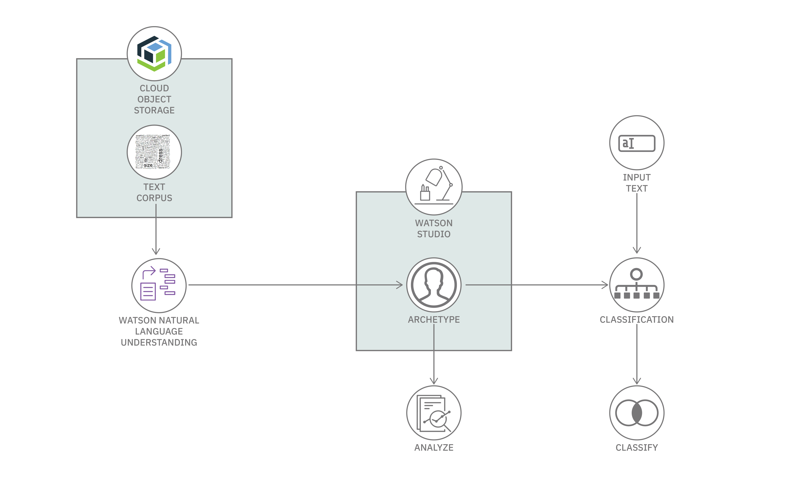

# データ・レコードからアーキタイプを発見する

### Watson サービスと Jupyter Notebook を利用してレコードから有意のアーキタイプを発見し、発見された一連のアーキタイプに新しいレコードを分類する

English version: https://developer.ibm.com/patterns/./discover-archetypes-and-topics-using-watson-natural-language-understanding
  ソースコード: https://github.com/IBM/discover-archetype

###### 最新の英語版コンテンツは上記URLを参照してください。
last_updated: 2020-01-13

 
## 概要

このコード・パターンに従って、IBM&reg; Watson&trade; サービスと Jupyter Notebook を利用してレコードから意味のあるアーキタイプを発見し、発見された一連のアーキタイプに新しいレコードを分類する方法を学んでください。

## 説明

音楽プレイ・リストから求人案内、医療記録、カスタマー・サービス・コール、GitHub issue に至るまで、定型業務処理システム (SoR: Systems of Record) は世界中に遍在しています。アーキタイプは正式には、同じタイプのすべてのものが反映されている 1 つのパターン (モデル) として定義されています。非公式には、アーキタイプはカテゴリー、クラス、トピックとして考えることができます。

一連のレコードに目を通すとき、私たちは無意識に、アーキタイプ別にレコードをグループ化します。例えば一連の曲があるとすると、イージー・リスニング、クラシック、ロックなどに分類するといった具合です。レコードの数が少なければ、こうした手作業のプロセスでも実際に役立ちます。けれども、大規模なシステムではレコードの件数が数百万にも上る可能性があることを考えると、自動的にレコードを処理する方法が必要です。また、レコードに関する予備知識がなければ、レコードに内在するアーキタイプをあらかじめ把握できないため、意味のあるアーキタイプを発見する方法も必要になります。多くの場合、レコードは非構造化テキストの形式になっていることから、自然言語を理解できるような自動化された処理にしなければなりません。Watson Natural Language Understanding と統計手法を組み合わせれば、次の目的を達成するのに役立ちます。

* レコードから意味のあるアーキタイプを発見する
* 発見された一連のアーキタイプに新しいレコードを分類する

このコード・パターンでは、プロセスを紹介するために医療分野でのディクテーション・データ・セットを使用します。ezDI が提供しているこのデータには、匿名化された 249 件の実際の医療ディクテーションが含まれています。

このコード・パターンを完了すると、以下の方法がわかるようになります。

* API 呼び出しによって Watson Natural Language Understanding サービスを操作する
* SDK を使用して、データと結果を保持する IBM Cloud Object Store サービスを操作する
* Watson Natural Language Understanding からの結果に対して統計分析を行う
* Jupyter Notebook または Web インターフェース内にグラフィカルに表示されたデータを通じてアーキタイプを探索する

## フロー

1. カスタム医療ディクテーション・データ・セットを ezDI からダウンロードし、処理対象のテキスト・データを用意します。
1. 提供されているアプリケーション・ユーザー・インターフェースまたは Jupyter Notebook を使用して Watson Natural Language Understanding サービスを操作します。
1. Watson Natural Language Understanding からの結果に対して一連の統計分析を実行します。
1. 分析結果をグラフに表示して、分析によって発見されたアーキタイプを探索します。
1. 新しいディクテーションを入力として渡して分類し、ディクテーションのマッピング先アーキテクトを確認します。

## 手順

このパターンの詳細な手順については、[README](https://github.com/IBM/discover-archetype/blob/master/README.md) ファイルを参照してください。手順の概要は以下のとおりです。

1. リポジトリーのクローンを作成します。
1. IBM Cloud でサービス・インスタンスを作成します。
1. データをダウンロードして準備します。
1. Jupyter Notebook を実行します。
1. Web ユーザー・インターフェースを実行します。
