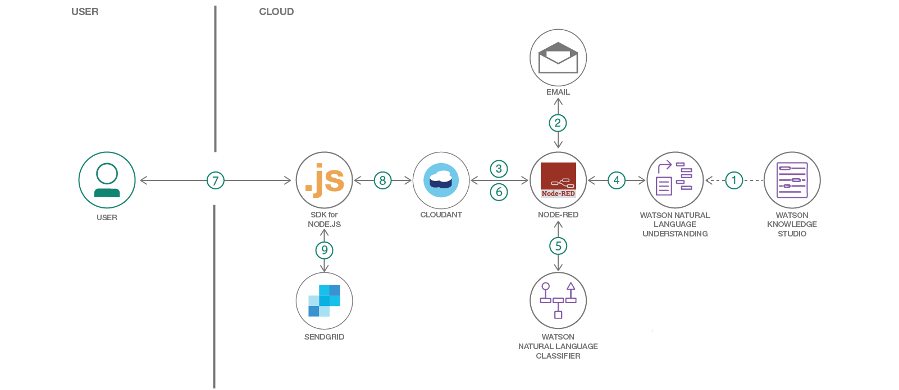

# e-メール対応の自動カスタマー・サポートを提供する

### Watson の自然言語処理機能を使用して、インテリジェントなカスタマー・サポート・システムを開発する

English version: https://developer.ibm.com/patterns/./email-support-automation-for-telco
  ソースコード: https://github.com/IBM/smart-email-support

###### 最新の英語版コンテンツは上記URLを参照してください。
last_updated: 2018-10-03

 
## 概要

このコード・パターンでは、自動化されたカスタマー・サポート・システムを作成して、コグニティブな手法でサポートを提供するプロセスを紹介します。電気通信のドメインを例にさまざまなカスタマー・サポートのシナリオを取り上げて、サービスを有効または無効にする手順、プランを変更する手順、ファミリー・メンバーをプランに追加する手順を説明します。

## 説明

組織は毎日、e-メールや電話、求職申し込みなどの各種のチャネルを通して顧客から連絡を受けます。カスタマー・サポートの質を高めるためには、顧客からの連絡に迅速、正確に対応することが重要です。けれども何千件もの e-メールを手作業で処理するとなると、時間がかかり、間違いも起こりやすくなります。そこで必要となるのが、顧客からの連絡を自動的に処理するインテリジェントなシステムを構築することです。このコード・パターンではその参考となるよう、e-メールの意図と内容を理解し、リクエストを処理するために必要な情報が e-メール内にすべて揃っているかどうかを確認し、情報が欠けている場合はその情報を提供するよう求める e-メールを作成するシステムを作成します。

このコード・パターンでは自然言語処理を使用して e-メールの意図を理解し、応答を自動的に作成して、ダッシュボードに e-メールの意図と内容の概要を表示します。ここでは例として電気通信のドメインを取り上げていますが、この手法はどのドメインに対しても適用できます。具体的には、カスタム・ドメインの自然言語処理には Watson Knowledge Studio を利用します。カスタム・ドメイン・モデルをデプロイして e-メールからエンティティーを取得するには Watson Natural Language Understanding を利用します。e-メールの意図を把握するには Watson Natural Language Classifier を利用します。そして、CloudantNoSQL データベースを使用して e-メールと顧客データを保管し、Node-RED を使用して e-メールを統合します。

このコード・パターンを完了すると、以下の方法がわかるようになります。

* Watson Knowledge Studio を使用してカスタム・、モデルを作成し、そのモデルを Watson Natural Language Understanding にデプロイする
* e-メール・サーバー、Watson サービス、Cloudant データベースを統合する Node-RED フローを作成する
* アプリケーションをデプロイし、顧客のサンプル e-メールを送信して、単純な UI によって e-メールが自動的に処理されることを確認する

## フロー

1. Watson Knowledge Studio を使用して電気通信の使用ケースを対象に作成されたモデルを Watson Natural Language Understanding にデプロイします。
1. Node-RED フローで顧客の e-メールをポーリングし、送信された e-メールを取得します。
1. 顧客を検証するために、Cloudant データベース内に保管されている顧客の e-メール ID と顧客データが、顧客レコードに照合されます。
1. Watson Natural Language Understanding を利用して、e-メール内の情報 (名前、電話番号などのエンティティー) が識別されます。
1. Watson Natural Language Classifier を利用して、e-メールの意図 (またはサービス・リクエストのタイプ) が識別されます。
1. リクエストごとに、e-メールの内容、エンティティー、意図が Cloudant e-メール・データベース内に保存されます。
1. カスタマー・サポート担当者が、IBM Cloud 上にデプロイされた Node.js アプリケーションにアクセスします。
1. アプリケーションが e-メール、エンティティー、意図を Cloudant e-メール・データベースから取得します。
1. e-メールへの応答が自動的に入力 (自動作成) されます。カスタマー・サポート担当者は送信ボタンをクリックするだけで、その応答を顧客に送信できます。

## 手順

詳細な手順については、[README](https://github.com/IBM/smart-email-support/blob/master/README.md) ファイルを参照してください。手順の概要は以下のとおりです。

1. GitHub リポジトリーを複製します。
1. Watson Knowledge Studio モデルを Natural Language Understanding にデプロイします。
1. IBM Cloudant データベースを作成します。
1. Natural Language Classifier サービス・インスタンスを作成します。
1. Node-RED フローをセットアップしてデプロイします。
1. SendGrid サービスをセットアップします。
1. アプリケーションをデプロイし、e-メールを送信します。
1. アプリケーションを実行します。
