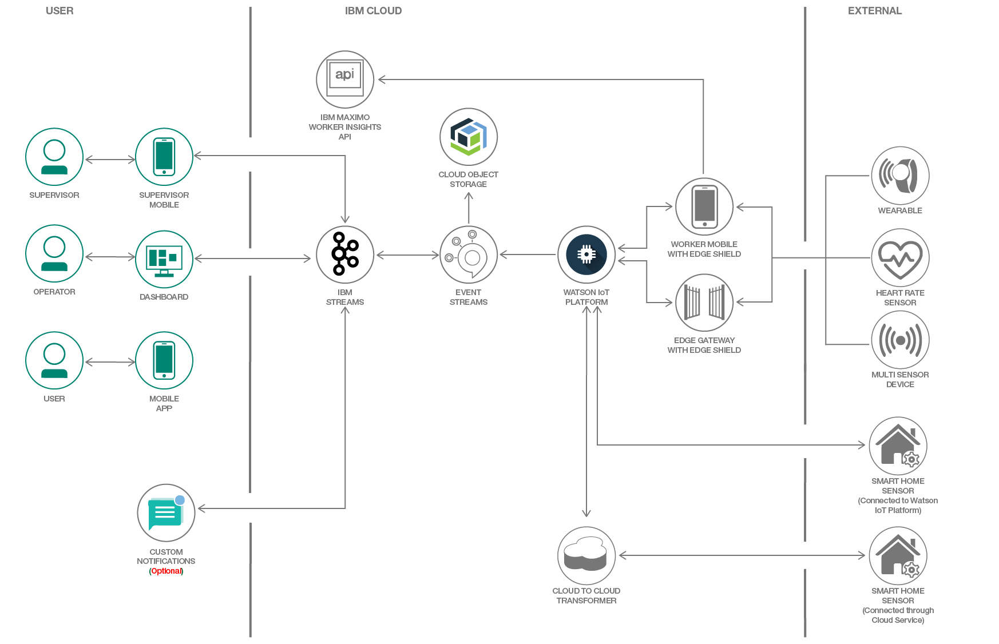

# 職場の状態を追跡して従業員の安全を守る

### Maximo Worker Insights を利用して、環境条件と従業員の生体条件をモニタリングする

English version: https://developer.ibm.com/patterns/./enabling-a-safer-workplace-with-iot-worker-insights
  ソースコード: https://github.com/IBM/worker-insights

###### 最新の英語版コンテンツは上記URLを参照してください。
last_updated: 2019-02-05

 ## 概要

この開発者コード・パターンでは、IBM Maximo&reg; Worker Insights を利用して、職場の安全条件をモニタリングするシステムを構成します。このシステムを実装するために、従業員が装着したウェアラブル・センサーからデータを収集して分析します。これらのセンサーは、環境条件 (温度、汚染物質)、従業員の生体条件 (心拍数、動き) を追跡できるとともに、特定のエリアへの近接性も追跡できます。

## 説明

このコード・パターンを完了すると、以下の方法がわかるようになります。

* Watson&trade; IoT Platform および IBM Event Streams サービスにセンサー・データをストリーミングする
* 履歴センサー・データをオブジェクト・ストア内に維持する
* データ・ストリームに対して分析を実行してイベントをトリガーする「シールド」を作成し、デプロイする

## フロー

1. 従業員がウェアラブル・デバイスを装着します。Bluetooth を介してウェアラブル・デバイスをクラウド対応ゲートウェイに接続します。
1. ウェアラブル・センサーのデータを Watson IoT Platform と Event Streams サービスに転送します。
1. Object Storage サービス内でロー・データと認識された「イベント」が保存されます。
1. シールドによってデータ・ストリームが分析されます。シールドは、エッジ・デバイス上またはクラウド内で実行できる JavaScript コード・スニペットです。
1. 検出されたイベントと危険性がダッシュボード/モバイル・アプリケーション内に表示されます。

## 手順

このコード・パターンを利用するには、[README](https://github.com/IBM/worker-insights/blob/master/README.md) 内で説明されている詳細を参照してください。
