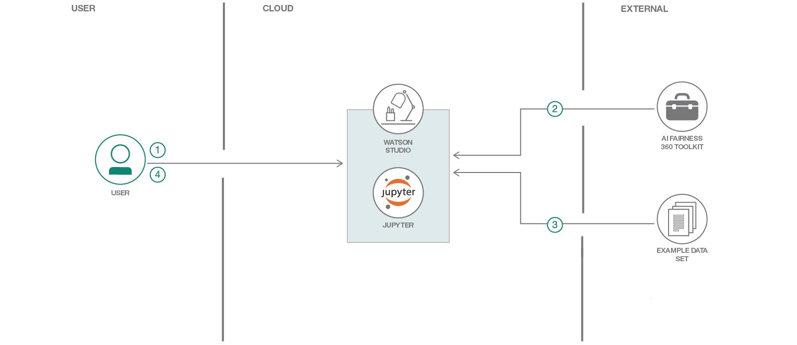

# 融資の公平さを確実にする

### バイアスの指標、説明、是正に対応する AI Fairness 360 ツールキットのデモンストレーション

English version: https://developer.ibm.com/patterns/ensuring-fairness-when-processing-loan-applications
  
ソースコード: https://github.com/IBM/ensure-loan-fairness-aif360

###### 最新の英語版コンテンツは上記URLを参照してください。
last_updated: 2018-09-19

 
## 概要

データ・サイエンティストたちが観測しているように、機械学習モデルのトレーニング中にある種のバイアスがモデルに取り込まれる可能性があります。トレーニング・ブロセスに伴うブラックボックスの特性を踏まえると、こうしたバイアスを根絶するのは困難です。そこで注目すべきなのが、[AI Fairness 360](https://github.com/IBM/AIF360) です。このツールキットはバイアスを識別して定量化する手段となるだけでなく、是正に向けた方向性も示してくれます。このコード・パターンでは、機械学習モデルをトレーニングするときにバイアスを識別、定量化するために AI Fairness 360 ツールキットがどのように役立つのかを説明します。

## 説明

機械学習モデルは、特定のインスタンスに対する予測を行います。例えば、融資申請を使用ケースとして取り上げると、申請者が融資を返済できるかどうかを機械学習モデルで予測します。モデルはこうした予測を、他のインスタンス (他の融資申請) と実際の結果 (それらの融資が返済されたかどうか) が含まれるトレーニング用データ・セットに基づいて行います。このようなデータ・セットを基に、機械学習アルゴリズムはパターンの発見 (一般化) を試み、新しいインスタンスに対する予測が必要になったときにそのパターンを使用できるようにします (例えば、あるパターンで「個人の給与額が 40,000 米ドルを超えていて、未払いの負債額が 5 米ドル未満であるか」を検出するといった具合です)。教師あり機械学習と呼ばれるこの手法は、多くのドメインで大きな効果を発揮してきました。

けれども、トレーニング用データ・セットから検出されたパターンがそれほど有効でなかったり、場合によっては違法であったりすることもあります。例えば、融資返済モデルによって、返済の予測には年齢が大きな役割を果たすと判断されたとします。トレーニング用データ・セットに含まれる、ある年齢グループの返済率が、他の年齢グループよりも高いためです。ここで浮上してくる問題は 2 つあります。1 つは、トレーニング用データ・セットが、すべての年齢グループを含めた実際の人口を表しているのかどうかという問題です。もう 1 つの問題として、データ・セットが実際の人口を表しているとしても、履歴データに基づく有効な予測であるかどうかに関わらず、年齢に基づいて決定するのは公正ではありません。

AI Fairness 360 は、公正さ (フェアネス) の指標とバイアス軽減機能によってこの問題に対処するように設計されています。フェアネス指標を使用すれば、機械学習ワークフロー内でのバイアスの有無を確認できます。そしてバイアス軽減機能を使用してワークフロー内のバイアスを克服することにより、より公正な結果を出すことができます。

このコード・パターンを完了すると、以下の方法がわかるようになります。

* AI Fairness 360 を使用して、元のデータを基にフェアネス指標を計算する
* 元のデータ・セットを変換して、バイアスを軽減する
* 変換後のトレーニング用データ・セットを基にフェアネス指標を計算する

## フロー

1. ユーザーが Watson Studio を操作して Jupyter Notebook を作成します。
1. Jupyter Notebook が AI Fairness 360 ツールキットをインポートします。
1. データが Jupyter Notebook にロードされます。
1. ユーザーが Jupyter Notebook を実行します。Jupyter Notebook が AI Fairness 360 を使用して機械学習モデルの公正さを評価します。

## 手順

このパターンの詳細な手順については、[README](https://github.com/IBM/ensure-loan-fairness-aif360/blob/master/README.md) を参照してください。手順の概要は以下のとおりです。

1. リポジトリーを複製します。
1. Jupyter Notebook を実行します。

Watson Studio 内で作業する場合:

1. Watson Studio に登録します。
1. ノートブックを作成します。
1. ノートブックを実行します。
