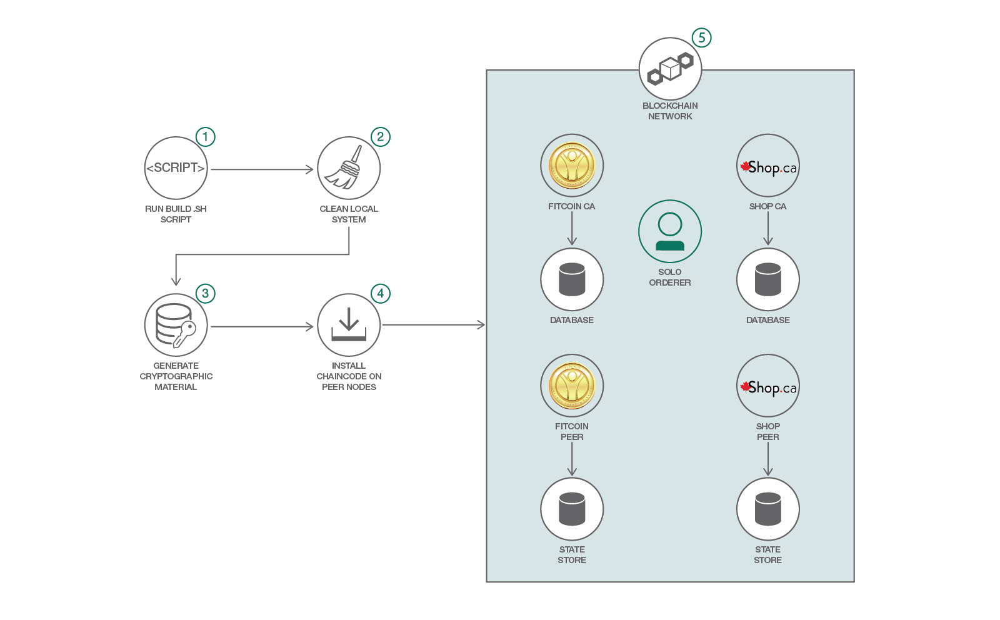

# Explore Hyperledger Fabric through a complete set of APIs

### Create and deploy a blockchain network using Hyperledger Fabric SDK for Node.js

English version: https://developer.ibm.com/patterns/explore-hyperledger-fabric-through-a-complete-set-of-apis
  
ソースコード: https://github.com/IBM/FabricNodeSDK-Starter

###### 最新の英語版コンテンツは上記URLを参照してください。
last_updated: 2018-07-03

 ## Summary

The Hyperledger Fabric SDK for Node.js is designed in an object-oriented programming style. Its modular construction enables application developers to plug in alternative implementations of key functions, such as crypto suites, state persistence store, and a logging utility. It provides an easy-to-use API to interact with a Hyperledger Fabric blockchain from a Node.js application. It provides a set of APIs to register and enroll new network clients, deploy new chaincodes to the network, and interact with existing chaincodes through chaincode function invocations and queries. This developer pattern demonstrates how to create and deploy the network.

## Description

This code pattern was updated to support Hyperledger Fabric V1.1.

If you have been putting off building a Hyperledger blockchain application because you didn't know where or how to start,  procrastinate no longer. This developer pattern will help you get the process started.

Developers often have different preferences in the way they build applications. Some like using a GUI that steps through the process of building applications, while others like to do it via a command-line interface. Hyperledger supports both approaches.

In this pattern, you will learn how to begin the process of building a Hyperledger blockchain application using the Hyperledger Fabric SDK API. The SDK supports Node and Python. This pattern focuses on the Node version. After you deploy the network, you will have created two certificate authorities, two peers, one orderer, and two CouchDB systems to hold the ledgers.

## Flow

1. Run a build script that launches the network in 3 steps.
1. Ensure that all old Docker images are removed so you build the network from a clean system.
1. Generate the cryptographic material. The Crypto configuration file (crypto-config.yaml) defines the identity of who is who. It tells peers and orderers what organization and domain they belong to. It then initializes a blockchain network or channel and services with an Orderer Genesis Block, which serves as the first chain block. Membership services are installed on each channel peer.
1. Install the chaincode on the peers, and build the Docker images of the orderer, peers, channel, and network.
1. Launch the network.
