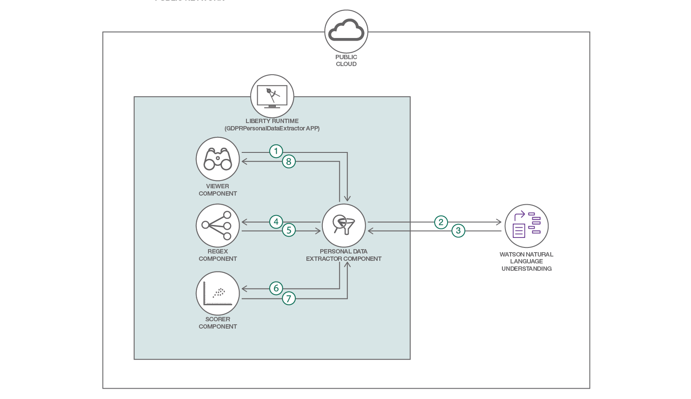

# 非構造化データから個人データの特徴を採取する

### Watson Natural Language Understanding と Watson Knowledge Studio を利用してカスタム・モデルを作成する

English version: https://developer.ibm.com/patterns/fingerprinting-personal-data-from-unstructured-text
  
ソースコード: https://github.com/IBM/gdpr-fingerprint-pii

###### 最新の英語版コンテンツは上記URLを参照してください。
last_updated: 2017-12-13

 ## 概要

非構造化データから個人データを識別しようとしたことはありますか？もしそうなら、それがどれほど骨のかかる作業になるかご存知のことでしょう。IBM Watson™ Natural Language Understanding を Watson Knowledge Studio と組み合わせると、非構造化ドキュメントからでも、必要な情報を効率的に識別できるようになります。さらに、Natural Language Understanding による識別結果は、正規表現を使用して増補することができます。したがって、識別された個人データにスコアを割り当て、スコアに基づいてデータを処理したり取り込んだりすることも可能です。

## 説明

この開発者向けパターンでは、Watson Knowledge Studio を利用してカスタム・モデルを作成し、そのモデルを使って非構造化ドキュメントから個人データを識別する方法を説明します。このパターンは個人データを識別するだけでなく、正規表現パーサーを使用して識別結果を増補します。

このコード・パターンをひととおり完了すると、以下の方法がわかるようになります。

* Watson Knowledge Studio を使用してカスタム・モデルを作成し、そのモデルを Natural Language Understanding (NLU) で使用して個人データを識別する
* 正規表現を使用して NLU の結果を増補することで、メタデータによる識別を可能にする
* 識別対象の個人データを構成し、それらの個人データのそれぞれに、スコアを割り当てるための重みを割り当てる
* より理解しやすい視覚化を目的に、ツリー構造でスコアおよび識別された個人データを表示する
* 出力を他のアプリケーションで使用する

## フロー

1. 閲覧者が入力テキストを個人データ・エクストラクターに渡します。
2. 個人データ・エクストラクターがテキストを NLU に渡します。
3. 入力テキストから個人データが抽出されます。NLU がカスタム・モデルを使用して応答を生成します。
4. 個人データ・エクストラクターが NLU 出力を正規表現コンポーネントに渡します。
5. 正規表現コンポーネントが、構成で指定された正規表現を使用して個人データを抽出します。抽出された個人データによって、NLU 出力が増補されます。
6. 増補された個人データがスコアリング・コンポーネントに渡されます。
7. スコアリング・コンポーネントが構成に従って、ドキュメント全体のスコアを割り当てます。その結果が、個人データ・エクストラクター・コンポーネントに返されます。
8. 個人データ・エクストラクター・コンポーネントからビューアー・コンポーネントにデータが渡されます。

## 手順

Find the detailed steps for this pattern in the [readme file](https://github.com/IBM/gdpr-fingerprint-pii/blob/master/README.md). The steps will show you how to:

1. Install the prerequisites.
2. Learn the concepts used.
3. Deploy the application.
4. Develop the Watson Knowledge Studio model.
5. Deploy the model to Watson Natural Language Understanding.
6. Verify that configuration parameters are correct.
7. Analyze the results.
8. Consume the output from other applications.