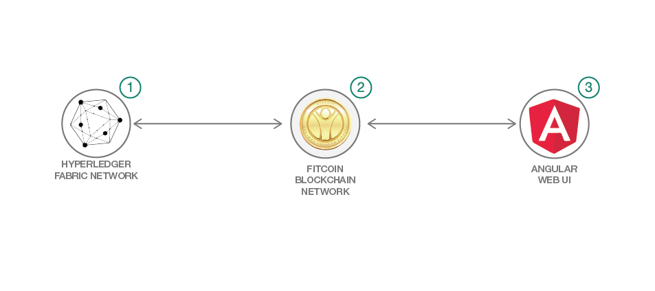

# ブロックチェーンを使用してフィットネス・クラブの報償を追跡する

### Hyperledger Fabric を使用してメンバー・リワードを追跡、記録する Web アプリを構築する

English version: https://developer.ibm.com/patterns/./fitness-club-rewards-points-iot-and-retail-integration
  ソースコード: https://github.com/IBM/Using-Blockchain-to-Track-fitness-Rewards

###### 最新の英語版コンテンツは上記URLを参照してください。
last_updated:	2018-10-27

 
## 概要

賞品と交換できる **Fitcoin** というデジタル・トークンを報償として与えることによってエクササイズに取り組むやる気をメンバーに起こさせる、IoT とブロックチェーンをベースとしたアプリケーションを構築する方法を学んでください。このアプリでは、IoT を使用してユーザーのアクティビティーを追跡すると同時に、完了したエクササイズごとに報償として Fitcoin を発行します。

## 説明

フィットネス・クラブが直面する最大の課題の 1 つとしては、メンバーの維持が挙げられます。新しいメンバーを獲得するよりも、既存のメンバーを維持するほうが決まって安上がりです。メンバーを維持するためにロイヤルティ・プログラムを提供しているフィットネス・クラブもありますが、多くの場合、それほど効果はありません。例えば数カ月分の会費を無料にするといった特典や、友達や家族に割引を適用できるといった特典を提示しても、十分なやる気を引き出せないからです。場合によっては、メンバーが友達にクラブを紹介すると報償を与えるだけのロイヤルティ・プログラムもあります。

こうしたプログラムをより効果的なものにするには、いくつかの方法があります。

* エクササイズに対して報償を与えることで、施設を使用する動機をメンバーに与える
* メンバーがより頻繁に、より価値のあるものと交換するために報償を使用できるようにする
* リワード・プログラムの可視性を高めて、メンバーの信頼を深める

Fitcoin を使用すれば、コミュニティーの構築という新しい特徴もロイヤルティ・プログラムに追加され、フィットネス・クラブが新しいメンバーを獲得できるようにもなります。アクティブなメンバーについては、報償ポイントを受け取るメンバー、ポイントを賞品と交換するメンバー、報償ポイントの履歴を確認するメンバーをシミュレーションできます。また、メンバーを非アクティブ化して、解約するメンバーをシミュレーションすることもできます (メンバーが解約しないことを願います)。このようにすれば、クラブを中心とした完全なエコシステムが構築されて、コミュニティー意識が生まれることになります。

## フロー

1. Hyperledger Fabric と Hyperledger Composer をインストールします。
1. Fitcoin ブロックチェーン・ネットワークを作成してデプロイします。
1. Fitcoin Angular Web アプリを作成して実行します。

## 手順

このコード・パターンの詳細な手順については、[README](https://github.com/IBM/Using-Blockchain-to-Track-fitness-Rewards/blob/master/README.md) を参照してください。
