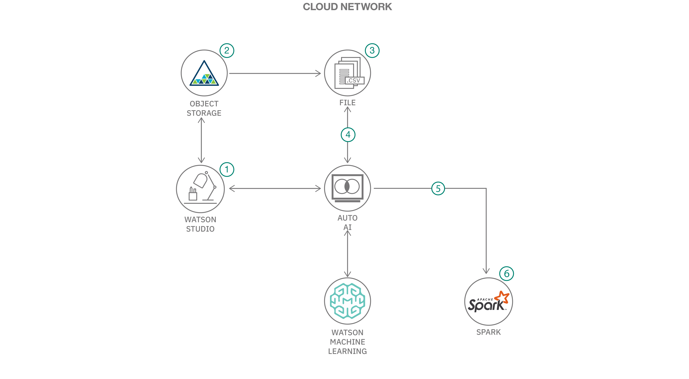

# AutoAI を利用した不正行為の予測

### AutoAI を利用して優れたモデルを大量かつ迅速に作成し、時間の節約、作業の軽減、医師決定プロセスの迅速化を実現する

English version: https://developer.ibm.com/patterns/./fraud-prediction-using-autoai
  ソースコード: https://github.com/IBM/predict-fraud-using-auto-ai

###### 最新の英語版コンテンツは上記URLを参照してください。
last_updated: 2019-10-17

 ## 概要

このコード・パターンは、さまざまなシナリオで使用できる予測システムの構築方法を説明するものです。このコード・パターンでは金銭的損失を減らし、リスクを軽減できるよう、不正な取引であるかどうかを予測するシステムに焦点を絞りますが、顧客離れの予測、需要と供給の予測などにも、これと同じ手法を適用できます。

## 説明

現在、オートメーションと人工知能 (AI) テクノロジーによってビジネスの変革が進んでいます。これらのテクノロジーは、医療や技術をはじめとする多くの分野での課題に対処すると同時に、働き方や職場自体の在り方も変革します。このコード・パターンでは、さまざまなシナリオで使用できる予測システムを構築する方法に注目します。このコード・パターンで構築するシステムは、金銭的損失を減らし、リスクを軽減できるよう、不正取引であるかどうかを予測するものですが、顧客離れの予測や需要と供給の予測などの他のシナリオにも、これと同じ手法を適用できます。予測モデルを作成するには、時間と尽力、そして結果を正確に予測できる効果的なシステムを作成するためのアルゴリズムの知識が必要です。そうとは言え、IBM がリリースした AutoAI を利用すれば、さまざまな要件に応じて予測モデルを作成するために必要なすべてのタスクを自動化できます。このコード・パターンで、AutoAI を使用して優れたモデルを大量かつ迅速に作成する方法を学んでください。これによって時間が節約され、作業が軽減されるだけでなく、意思決定プロセスにかかる時間を短縮できます。AutoAI は、IBM Cloud Pak&trade; for Data など、パブリック・クラウド内でもプライベート・クラウド内でも実行できます。

このコード・パターンを完了すると、以下の方法がわかるようになります。

* IBM Cloud 上でモデル作成サービスを迅速にセットアップする
* データを取り込んで AutoAI ツールを起動する
* AutoAI を利用してさまざまなモデルを作成し、モデルのパフォーマンスを評価する
* 最良のモデルを選択してデプロイを完了する
* REST を呼び出して、デプロイ済みのモデルを使用して予測を生成する
* AutoAI を利用したプロセスと手作業でモデルを作成するプロセスとを比較する

## フロー

1. Watson Studio にログインしてプロジェクトを作成し、AutoAI と Cloud Object Storage のインスタンスを起動します。
1. Object Storage に .csv データ・ファイルをアップロードします。
1. AutoAI を利用してモデル作成プロセスを開始し、パイプラインを作成します。
1. AutoAI で作成したさまざまなパイプラインを評価し、最良のモデルをデプロイ対象として選択します。
1. デプロイ済みモデルに対して REST 呼び出しを行い、正確な予測を生成します。

## 手順

このパターンの詳細な手順については、[README](https://github.com/IBM/predict-fraud-using-auto-ai/blob/master/README.md) を参照してください。手順の概要は以下のとおりです。

1. IBM Cloud でアカウントを作成します。
1. 新しい Watson Studio プロジェクトを作成します。
1. プロジェクトにデータを追加します。
1. アセットを AutoAI として追加します。
1. エクスペリメントを作成し、定義します。
1. .csv ファイルをインポートします。
1. エクスペリメントを実行します。
1. 結果を分析します。
1. IBM Cloud にモデルをデプロイします。
1. モデルをテストします。
