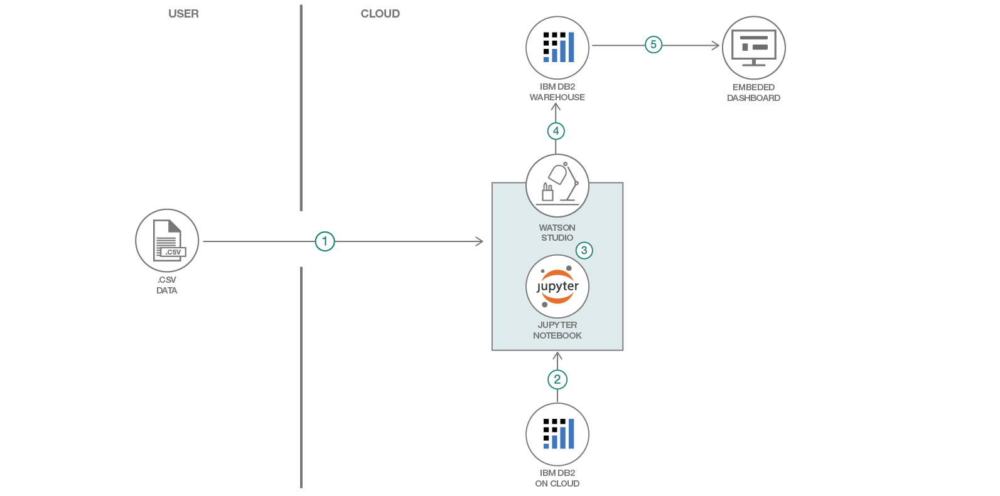

# 複数のデータ・ソースを基に洞察力を生み出す

### 企業のパフォーマンスに関する新たな洞察を発見する

English version: https://developer.ibm.com/patterns/generate-insights-from-multiple-data-sources-using-watson-studio
  ソースコード: https://github.com/IBM/generate-insights-from-multiple-data-sources

###### 最新の英語版コンテンツは上記URLを参照してください。
last_updated: '2019-02-19'

 
## 概要

このコード・パターンでは、Watson Studio を利用して Db2 on Cloud、CSV ファイル、Db2 Warehouse などの複数のデータ・ソースからのデータを統合し、統合されたデータから洞察を引き出します。データに基づいて物事を語る場合、トピックは 1 つでも、通常は複数のソースからデータを取得して統合しなければなりません。したがって分析を行う際は、複数のソースから取得したデータを結合する機能が不可欠となります。このパターンでは、例として少数のデータ・ソースからのデータを統合します。具体的には、Db2 on Cloud、CSV ファイル、Db2 Warehouse の 3 つのデータ・ソースです。この Watson Studio の力を利用した手法は、データ・セットのサイズを問わず、MySQL データベース、IBM Db2 Big SQL、Oracle データベース、PostgreSQL、Microsoft SQL Server などの他の多くのソースにも適用できます。

## 説明

このパターンではデータの統合手法を説明するために、ある時計製造会社での使用ケースを例に用います。この会社では、異なる場所 (マンチェスター、グラスゴー、マドリッド) にある 3 つの支社で合計 5 種類の時計を製造しています。この会社で使用している販売方法には、電話、店頭、オンラインの 3 種類があります。各支社の販売データはそれぞれ異なるデータ・ソース (Db2 on Cloud、Db2 Warehouse、CSV ファイル) 内に保管されています。このコード・パターンで説明する手順では、この 3 つすべてのデータ・ソースからのデータを統合し、単一のデータ・ソース (Db2 Warehouse) 内に格納します。そして、この統合されたデータを使用して洞察を引き出します。具体的には、データを組み込みダッシュボード上で視覚化し、最も売り上げが高い製品と最も業績の高い支社を解釈できるようにします。

このコード・パターンをひと通り完了すると、以下の方法がわかるようになります。

* 複数のデータ・ソースに接続してデータを取得する
* 複数のデータ・ソースから取得したデータを統合する
* 統合したデータを Db2 Warehouse に送信する
* Watson 組み込みダッシュボード上でデータを視覚化し、洞察を引き出す

## フロー

1. ローカル・ファイル (csv ファイル) からデータを抽出します。
1. Db2 on Cloud からデータを抽出します。
1. Watson Studio 内でデータを統合します。
1. データを Db2 Warehouse に送信します。
1. 組み込みダッシュボードを使用してデータを視覚化し、洞察を引き出します。

## 手順

詳細な手順については、[README](https://github.com/IBM/generate-insights-from-multiple-data-sources/blob/master/README.md) ファイルを参照してください。手順の概要は以下のとおりです。

1. リポジトリーを複製します。
1. IBM Cloud で Watson サービス・インスタンスを作成します。
1. ノートブックを作成します。
1. ローカル・システムからデータを追加します。
1. Db2 接続を追加します。
1. Db2 Warehouse 接続を追加します。
1. ノートブックを更新して資格情報と Db2 Warehouse テーブル名を反映させます。
1. ノートブックを実行します。
1. 組み込みダッシュボードのアナリティクスを使用してデータを視覚化し、洞察を引き出します。
