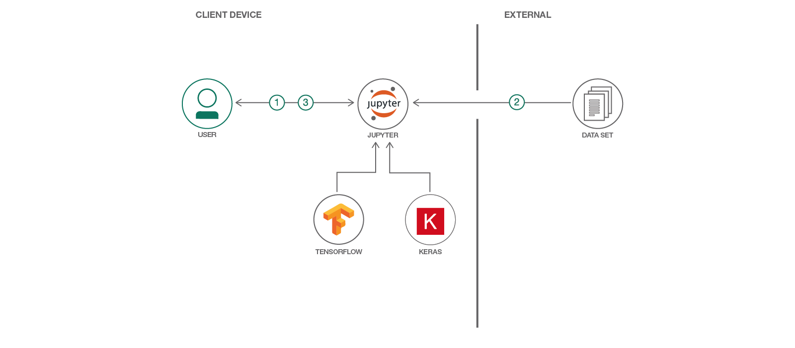

# 深層学習を使用してレストランのレビューを生成する

### ノートブック、Keras、TensorFlow を使用して、テキスト生成用の言語モデルを作成する

English version: https://developer.ibm.com/patterns/generate-restaurant-reviews-with-deep-learning
  
ソースコード: https://github.com/IBM/deep-learning-language-model

###### 最新の英語版コンテンツは上記URLを参照してください。
last_updated: 2019-03-28

 
## 概要

不正な製品レビューといった問題には、どのように対処すればよいでしょうか？その答えは、こうした不正なレビューを作成したモデルと同じ生成モデルを使用して対抗することです。このコード・パターンでは、Keras と TensorFlow を使用して、ノートブック内で深層学習言語モデルをトレーニングする方法を説明します。Yelp からダウンロードしたデータを使って、TensorFlow と Keras をインストールする方法、深層学習言語モデルをトレーニングする方法、そして新しいレストランのレビューを生成する方法を学んでください。このコード・パターンの範囲はテキストの生成について紹介することに限られていますが、ひと通りコード・パターンを完了することで、言語モデルの作成方法を学ぶための確固たる基礎を築くことができます。

## 説明

不正なレビューは、企業が日常的に対処しなければならない問題です。深層学習モデルを使用すると、あらゆるトピックに関するレビューを生成して、一見したところ本物のように見せかけることができます。このことは、人や物に損害をもたらす不正なレビューにしても当てはまります。このような不正なレビューに対抗するには、まったく同じ手法をとるという方法があります。有害なアクティビティーに使用されたのと同じモデルを基に、そのモデルの拡張として新しいモデルを作成することで、不正なレビューに対抗することができます。

この開発者向けコード・パターンでは、Keras と TensorFlow を使用して、ノートブック内で深層学習言語モデルをトレーニングする方法を説明します。初期トレーニング・セットとしては、Kaggle 上で公開されている Yelp レビュー関連のデータ・セットを流用します。前提条件をインストールしてノートブックを実行すると、初期トレーニング・セットに含まれるレビューに基づいて生成されたレストラン・レビューが表示されます。このコード・パターンは、深層学習と不正の検出に関心を持つデータ・サイエンティストやデータ愛好家、あるいは深層学習、TensorFlow、または Keras の入門者を対象に作成されています。

このコード・パターンをひと通り完了すると、以下の方法がわかるようになります。

* Keras と TensorFlow をインストールして使用する
* Jupyter Notebook を実行する
* 再帰型ニューラル・ネットワーク (RNN) 言語モデルを作成する

## フロー

1. 前提条件、Keras、TensorFlow をインストールした後、ノートブックを実行します。
1. トレーニング・データを使用して言語モデルをトレーニングします。
1. モデルに基づいて新しいテキストが生成されて、ユーザーに表示されます。

## 手順

このパターンの詳細な手順については、[README](https://github.com/IBM/deep-learning-language-model/blob/master/README.md) を参照してください。手順の概要は以下のとおりです。

1. TensorFlow と Keras をダウンロードしてインストールします。
1. リポジトリーを複製します。
1. モデルをトレーニングします。
1. 結果を分析します。
