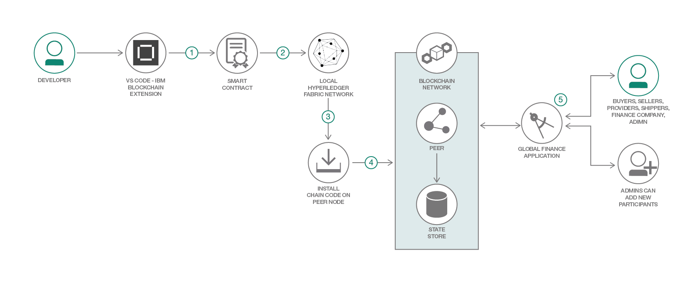

# IBM Blockchain Platform の VS Code 拡張機能を使用して、国際金融対応のブロックチェーン・アプリケーションを作成する

### ブロックチェーンの使用ケースで、国際金融対応の Node.js スマート・コントラクトと Web アプリをデプロイする

English version: https://developer.ibm.com/patterns/./global-financing-use-case-for-blockchain
  ソースコード: https://github.com/IBM/global-financing-blockchain

###### 最新の英語版コンテンツは上記URLを参照してください。
last_updated: 2018-12-19

 
## 概要

ブロックチェーン・テクノロジーを使用したこの Global Finance アプリケーションは、ネットワークのさまざまなメンバー (買い手、売り手、プロバイダー、配送業者、金融会社) が特定の注文に対して行ったアクションを追跡します。追跡対象のアクションには次が含まれます。

* 買い手による発注
* 売り手による商品プロバイダーへの連絡
* 配送業者による商品の配送
* 金融会社による売り手への決済処理

このコード・パターンでは、アプリケーションで前述のアクションを追跡する方法を説明します。さらに、業種を問わずに当てはまる紛争解決についても取り上げます。このコード・パターンで取り上げる使用ケースでは、Node.js スマート・コントラクトと Node.js Web アプリケーションを採用しています。

## 説明

このコード・パターンでは、IBM Blockchain Platform の VS Code 拡張機能を使用して Node.js スマート・コントラクトをパッケージ化する方法を説明します。これにより、この拡張機能を使用して Hyperledger Fabric ネットワークのローカル・インスタンスをセットアップし、そのネットワーク上にパッケージ化されたコントラクトをインストールしてインスタンス化できます。その後は、コード・パターンに従って、ネットワークとやり取りする Node.js Web アプリケーションを開発できます。ここで開発するアプリケーションでは、国際金融の使用ケースを説明するために、ネットワーク上のさまざまなメンバーを対象とした各種のビューを作成します。

このコード・パターンを完了すると、以下の方法がわかるようになります。

* Node.js スマート・コントラクトを開発する
* IBM Blockchain Platform の VS Code 拡張機能を使用してスマート・コントラクトをパッケージ化し、Hyperledger Fabric のローカル・インスタンスにデプロイする
* デプロイされた Fabric ネットワークとやり取りする Node.js ブロックチェーン Web アプリケーションを開発する

## フロー

開発者が IBM Blockchain Platform の VS Code 拡張機能を使用して、次の作業を行います。

1. スマート・コントラクトをパッケージ化します。
1. ローカル Hyperledger Fabric ネットワークを起動します。
1. ピア・ノード上にチェーンコードをインストールします。
1. ピア・ノード上でチェーンコードをインスタンス化します。
1. Global Finance アプリケーションで、fabric-network npm ライブラリーを使用した API 呼び出しを介して Hyperledger Fabric ネットワークとやり取りします。管理者は、このアプリケーションを使用して新しい参加者を作成することもできます。

## 手順

詳細な手順については、[README file](https://github.com/IBM/global-financing-blockchain/blob/master/README.md) ファイルを参照してください。手順の概要は以下のとおりです。

1. リポジトリーを複製します。
1. VS Code 拡張機能を使用して、基本的な Fabric ネットワーク上にスマート・コントラクトをセットアップします。
1. アプリケーションを実行します。
