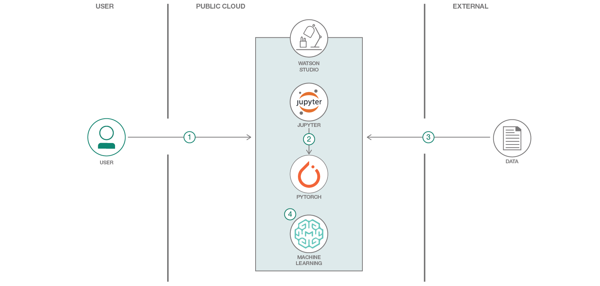

# Watson Studio と PyTorchを使用して、手書きの数字を認識するプログラムを作成する

### トレーニング済み PyTorch モデルを使用して、画像から手書きの数字を予測する

English version: https://developer.ibm.com/patterns/handwritten-digit-recognizer-in-watson-studio-and-pytorch
  ソースコード: 'https://github.com/IBM/pytorch-on-watson-studio'

###### 最新の英語版コンテンツは上記URLを参照してください。
last_updated: '2018-11-19'

 
## 概要

手書きの数字を認識するのは人間にとってわけのないことですが、機械にとっては簡単なタスクではありません。けれども機械学習の進化により、最近では、こうしたタスクに機械でも対応できるようになっています。例えば、小切手を数秒でスキャンできるモバイル・バンキング・アプリや、数千件もの契約書から数分で金額を抽出できる会計ソフトウェアが登場しています。こうした仕組みを知りたいと思ったら、このコード・パターンに従ってください。ここでは Watson Studio と PyTorch を使用して、手書きの数字を認識するシンプルなプログラムを作成する手順を説明します。

## 説明

このコード・パターンでは、IBM Watson Studio 内で Jupyter ノートブックを使用してインストール済みの最適化された PyTorch 環境にアクセスします。この環境で利用するのは、Watson Machine Learning サービスの Python クライアント・ライブラリーです。Python クライアント・ライブラリーの中核となっている一連の REST API を使用すれば、トレーニング・ジョブの送信、ステータスのモニタリング、モデルの保管およびデプロイといったさまざまなタスクに対応できます。

このコード・パターンを完了すると、以下の方法がわかるようになります。

* Watson Studio 内でプロジェクトを作成し、そのプロジェクト内で Jupyter ノートブックを使用する
* Cloud Object Storage の Python クライアントを使用して、バケットを作成し、作成したバケットにデータをアップロードする
* PyTorch トレーニング・ジョブを Watson Machine Learning サービスに送信する
* トレーニング済み PyTorch モデルを使用して、画像から手書きの数字を予測する

## フロー

1. IBM Watson Studio にログインします。
1. Watson Studio 内で Jupyter ノートブックを実行します。
1. PyTorch を使用して、データをダウンロードし、処理します。
1. Watson Machine Learning サービスを利用して、モデルをトレーニングし、デプロイします。

## 手順

詳細な手順については、[README](https://github.com/IBM/pytorch-on-watson-studio/blob/master/README.md) ファイルを参照してください。手順の概要は以下のとおりです。

1. Watson Studio に登録します。
1. 新規プロジェクトを作成します。
1. ノートブックを作成します。
1. Watson Machine Learning サービス・インスタンスを作成します。
1. Watson Object Storage インスタンスの HMAC 資格情報を作成します。
1. ノートブックを実行します。
