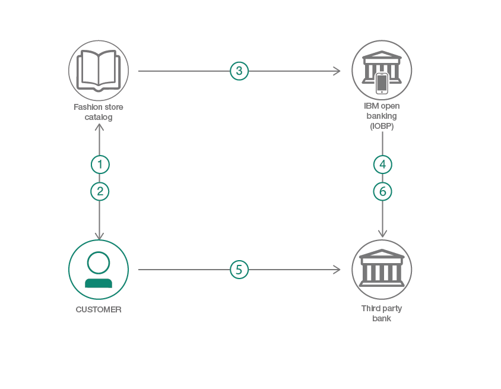

# 銀行口座からの決済処理を統合した商業用サイトを作成する

### IBM Open Banking Platform を利用して、セキュアな決済処理に対応するファッション・リテール・サイトを作成する

English version: https://developer.ibm.com/patterns/ibm-open-banking-platform
  
ソースコード: https://github.com/IBM/fashion-store

###### 最新の英語版コンテンツは上記URLを参照してください。
last_updated: 2018-10-18

 
## 概要

安全な決済処理を統合した商業用サイトを作成するのは複雑な作業です。加えて、自分の取引銀行の口座から直接支払いたいという顧客にも対応するとなると、ますます複雑な作業になってきますが、IBM Open Banking Platform を利用すれば、こうした作業に迅速、簡単に対応することができます。このコード・パターンで作成するアプリケーションでは、IBM Open Banking Platform をファッション小売店のサイトに統合して、このプラットフォームのシンプルな決済 API の利点を紹介します。Open Banking Platform を統合すれば、顧客は清算する時点で、セキュリティーが確保された安全な形で自分の銀行口座から直接支払いを行って購入を完了することができます。

## 説明

想像してください。あなたは、銀行でデジタル・プラットフォームの敏しょう性を利用したいと思っています。けれども、レガシー・システムの置き換えまたはパブリック・クラウドへの直接移行に伴うリスクは負いたくありません。あなたに必要なのは、デジタル化を加速化するもの、または法規制やコンプライアンスへの準拠なのかもしれません。あるいは単に、新たなデジタル・チャネルと収益源を手に入れる機会に目を光らせているだけなのかもしれません。いずれにしても、あなたの取引先は、購入時に自分の銀行口座から安全かつ簡単に直接支払いたいという顧客のニーズに対応したいと望んでいることは確かです。金融機関が主要業務をクラウドに移行するプロセスを加速させるには、特定の事前定義された業界標準に基づいて作成された、IBM Open Banking Platform という SaaS スイートを利用できます。

このコード・パターンでは、ファッション小売店の商業用サイト (「Here and Now」) を例に、IBM Open Banking Platform の決済 API を統合したサイトを作成する方法を説明します。また、作成したサイトを Node.js と React.js で作成した Web アプリケーションを使用してデモンストレーションします。このアプリケーションで紹介するシナリオは、顧客がファッション小売店のサイトで商品を購入する際に、自分の銀行口座から直接支払いを行うというものです。このシナリオには以下の 3 つの主要なセクションがあります。

1. 顧客がストア・カタログを表示して商品を調べ、購入する商品を選びます。
1. 清算する前に最終確認を行えるよう、買い物カゴに、顧客が選んだすべての商品が表示されます。
1. 清算が終わると、顧客は支払い方法を選択し、選択した方法のシステム・フローに従って購入を完了します。

このコード・パターンで対象としているのは、Open Banking Platform を利用して、決済処理を統合したアプリケーションを構築しようとしている開発者です。このコード・パターンを完了すると、以下の方法がわかるようになります。

* 購入できる商品のカタログを表示するオンライン・ストアを作成する
* 決済 API とやり取りする Node.js Web アプリケーションを作成する

## フロー

1. 顧客がショッピング・カタログを表示して、購入したい商品を買い物カゴに入れます。
1. 顧客が買い物カゴの中身を確認し、清算と支払いのプロセスを進めます。
1. 決済開始リクエストが IBM Open Banking Platform に送信されて、トランザクションが起動されます。
1. IBM Open Banking Platform は顧客の銀行口座を対象とする一括払いを開始します。
1. 顧客がトランザクションを承認するために、銀行の認証ページ上で資格情報を入力します。
1. 認証が正常に完了すると、顧客の銀行口座からの決済が実行依頼されます。

## 手順

このパターンの詳細な手順については、[README](https://github.com/IBM/fashion-store/blob/master/README.md) を参照してください。
