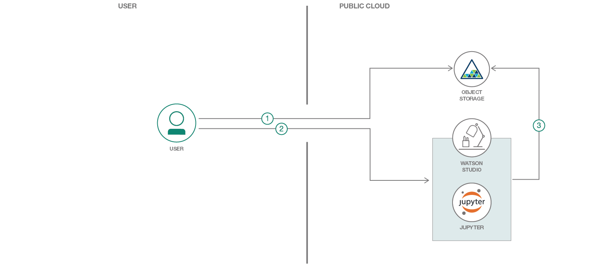

# 畳み込みニューラル・ネットワークを使用した画像分析

### Keras を使用して、ユーザーが送信した申請書の画像を分析する

English version: https://developer.ibm.com/patterns/./image-classification-using-cnn-in-keras
  ソースコード: https://github.com/IBM/image-classification-using-cnn-and-keras

###### 最新の英語版コンテンツは上記URLを参照してください。
last_updated: 2018-09-07

 ## 概要

ハイパフォーマンスの画像分類手法に興味があるとしたら、この開発者コード・パターンはまさにうってつけです。このパターンでは Jupyter Notebook 内で Python Keras ライブラリーを使用し、IBM Cloud Object Storage に取り込まれたデータを使って、画像を分類する機械学習モデルを作成します。

## 説明

顧客のローン申請書といったドキュメントを処理している組織は数多くあります。ローン申請書の場合、顧客は申請の処理に必要となる証明書類も提出します。例えば、身元や住所を確認するため証明書類です。一般に、申請書は証明書類と一緒にスキャンされて組織のシステムに取り込まれてから、その後の申請処理が進められます。スキャンされた一連の書類が取り込まれる際は、後続の処理を進められるように、システムで申請書を識別しなければなりません。そこで、このコード・パターンでは画像を分類して申請書を識別する方法を説明します。

このパターンで例として取り上げているのは、購入契約とレンタル契約の申請です。こうした契約のために提出される典型的な申請書には、納税者番号 (PAN) カード、運転免許証、パスポート、そして申請書自体があります。このコード・パターンでは、これらの各種ドキュメントの中から申請書を識別します。

そのために利用するのは、Python、Jupyter Notebook、Keras ライブラリーに含まれる畳み込みニューラル・ネットワーク、および IBM Cloud Object Storage です。

## フロー

1. ユーザーがテスト画像を IBM Cloud Object Storage にアップロードします。
2. ユーザーが Jupyter Notebook 内で、アップロードしたテスト画像を処理する IBM Cloud Object Storage の資格情報を追加します。その上で、Jupyter Notebook を実行します。
3. Jupyter Notebook が IBM Cloud Object Storage から画像をプルし、トレーニング済みの機械学習モデルを使って画像を分類します。

## 手順

詳細な手順については、[README](https://github.com/IBM/image-classification-using-cnn-and-keras/blob/master/README.md) を参照してください。
