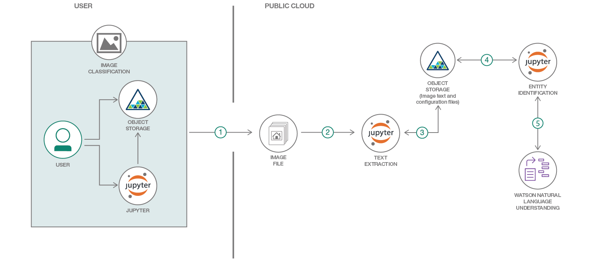

# ドキュメントの画像に含まれる情報を識別する

### OCR を使用してテキストを抽出し、Jupyter Notebook を使用してドキュメントからエンティティーを抽出する

English version: https://developer.ibm.com/patterns/image-recognition-and-information-extraction-from-image-documents-using-keras-and-watson-nlu
  
ソースコード: https://github.com/IBM/image-recognition-and-information-extraction-from-image-documents

###### 最新の英語版コンテンツは上記URLを参照してください。
last_updated: 2018-09-13

 ## 概要

ハイパフォーマンスの画像分類手法に興味があるとしたら、このコード・パターンはまさにうってつけです。このコード・パターンでは、光学式文字認識 (OCR) を使用してテキストを抽出し、Jupyter Notebook で IBM Watson&trade; Natural Language Understanding API を使用してドキュメントからエンティティーを抽出します。さらに、構成ファイルを使用して、文法上の分類を階層化し、構成可能にします。

## 説明

「[畳み込みニューラル・ネットワークを使用した画像分析](https://developer.ibm.com/jp/patterns/image-classification-using-cnn-in-keras/)」で説明した使用ケースを復習しましょう。私たちが注目した使用ケースは、申請書を関係書類と一緒に送信するというものです。レンタル契約や購入契約に関しては、契約の申請書だけでなく、ID やパスポートなどの身元を裏付ける書類が必要です。こうした書類を記入済みの申請書と一緒に送信して、デジタル処理によってスキャンして保管します。申請書の処理を進めるには、保管した関係書類を認識して分類し、関連する情報を申請書から取得する必要があります。この処理を手作業で行うとなると手間がかかるだけでなく、間違いが起こりやすくなります。このコード・パターンでは処理システムによって、スキャンされた画像から情報を抽出して識別する方法を説明します。

このコード・パターンで取り上げる情報処理の側面は次のとおりです。

* 画像を分類して、申請書を振り分ける
* 申請書からテキストを抽出する
* 申請書に含まれるエンティティー (情報) を識別し、構成ファイルを使用して申請書の目的を判別する

このコード・パターンをひととおり完了すると、以下の方法がわかるようになります。

* OCR を使用してテキストを抽出する
* IBM Watson Natural Language Understanding API と Jupyter Notebook を使用してドキュメントからエンティティーを抽出する
* 構成ファイルを使用して、文法上の分類を階層化し、構成可能にする
* 構成ファイルに含まれる文法上の分類と正規表現パターンの組み合わせを使用して、情報を抽出する

このコード・パターンでは Python、Jupyter Notebook、Python NLTK、Watson Natural Language Understanding API、IBM Cloud Object Storage を使用します。

## フロー

1. コード・パターンが申請書の画像を識別します。
2. Watson Studio 内で Jupyter Notebook に含まれる Python コードを実行して、画像からテキストを抽出します。
3. 抽出したテキストを IBM Cloud Object Storage 内に保管します。
4. Jupyter Notebook 内で実行される Python コードによって、IBM Cloud Object Storage からテキストをプルします。
5. Watson Natural Language Understanding サービスを利用して、テキストからエンティティーを抽出します。

## 手順

詳細な手順については、[README](https://github.com/IBM/image-recognition-and-information-extraction-from-image-documents/blob/master/README.md) を参照してください。
